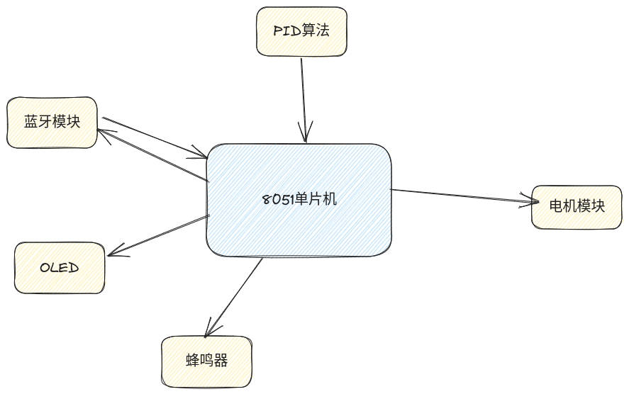
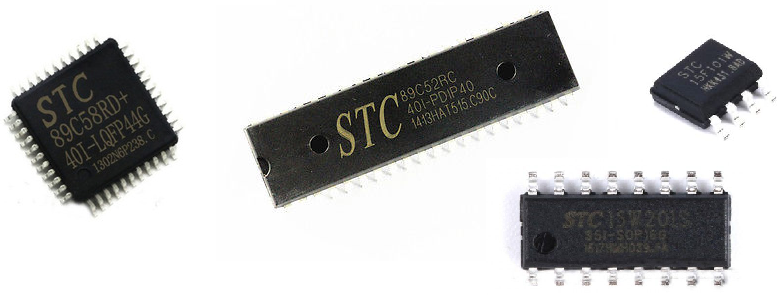
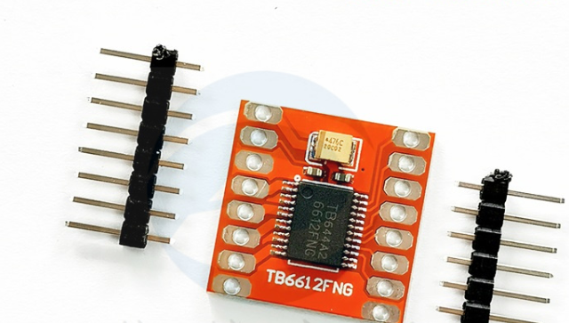
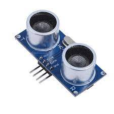
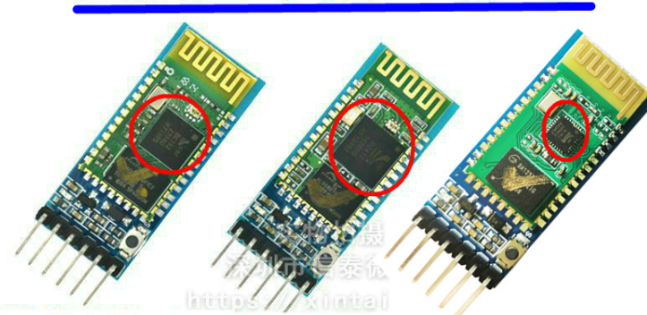
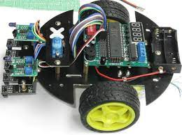

---
title: 8051单片机智能小车项目
author: 尚硅谷研究院
date: '版本: V1.0'
...

# 项目简介

本项目是一个基于8051单片机的智能小车，通过驱动电机控制小车的运动，OLED显示小车的状态，超声波传感器检测障碍物，蓝牙模块实现远程控制，蜂鸣器和LED灯提供用户反馈。

# 市场产品和前景

随着科技的发展，智能小车在很多领域都有广泛的应用，如物流、家庭清洁、教育等。在市场上，智能小车的需求越来越大。未来，随着AI、物联网等技术的发展，智能小车的市场前景十分广阔。

# 项目架构图

# 项目模块

本项目的架构主要包括以下模块：

- 8051单片机：作为系统的核心，控制其他所有模块。

- 驱动电机：控制小车的运动。

- OLED：显示小车的状态。

- 超声波传感器：检测前方是否有障碍物。

- 蓝牙模块：实现小车的远程控制。

- 蜂鸣器和LED灯：提供用户反馈。

# 项目实现功能

设计智能小车时，首先需要确定小车的功能需求和性能需求。在此基础上，可以选择适当的硬件平台和软件平台，以满足各种需求。

设计思路主要包括以下几个方面：

- 动力系统：选择合适的驱动电机和控制算法，使小车可以灵活地运动。
- 感知系统：使用超声波传感器检测前方是否有障碍物，以防止碰撞。
- 控制系统：使用8051单片机作为控制核心，设计合适的控制算法，实现小车的自主运动和远程控制。

本项目主要使用了以下技术：

- 8051单片机编程：用于实现小车的控制功能。
- C语言：用于编写单片机程序。
- 蓝牙通信：用于实现小车的远程控制。

# 项目技能

通过本项目，可以体现出以下个人技能：

- 单片机编程能力：通过设计和实现小车的控制系统，展示了8051单片机编程的能力。
- 硬件接口设计能力：通过设计和实现小车的动力系统和感知系统，展示了硬件接口设计的能力。
- 网络通信能力：通过设计和实现小车的远程控制功能，展示了对蓝牙通信协议的理解和应用能力。

# 项目成品

