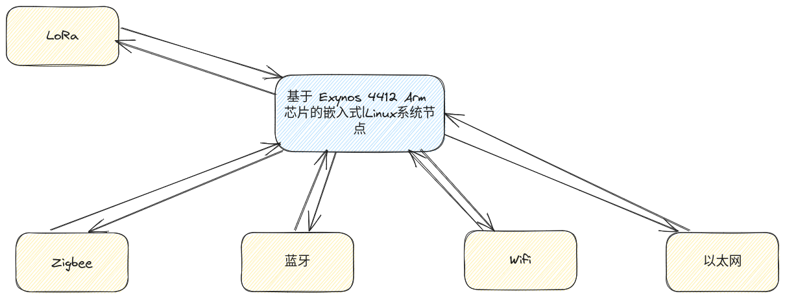
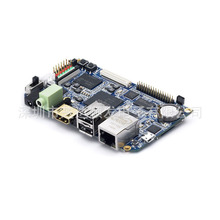
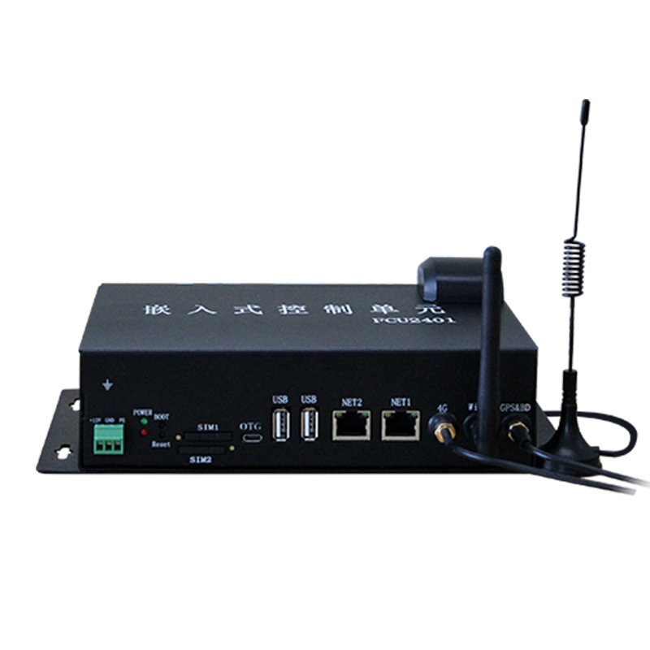

---
title: 基于嵌入式linux系统的智能网关项目
author: 尚硅谷研究院
date: '版本: V1.0'
...

# 项目简介

本项目是一个基于嵌入式Linux系统的智能网关，它是智能家居系统中的核心组件。智能网关不仅可以连接各种智能设备，实现设备间的数据交换和控制，还可以连接互联网，实现远程控制和数据分析。

# 市场产品和前景

随着物联网和智能家居的发展，智能网关在市场上的需求越来越大。它可以实现各种智能设备的联网，提高设备的使用便利性和效率。未来，智能网关将在更多领域发挥重要作用，比如智能城市、工业4.0、医疗健康等。

# 项目架构说明

架构图

智能网关主要包括以下模块：

- Zigbee通讯模块：用于与支持Zigbee协议的设备进行通信。
- WiFi通讯模块：用于与支持WiFi的设备进行通信，以及连接互联网。
- 以太网通讯模块：用于与支持以太网的设备进行通信。
- 存储器：用于存储系统数据和用户数据。

这些模块通过嵌入式Linux系统进行协调和控制，实现数据的接收、处理和发送。

# 项目模块

带有各种通信模块的 ARM Linux 开发板

# 设计思路

设计智能网关时，首先需要确定支持的通讯协议和接口类型，然后选择合适的硬件平台和操作系统。在硬件设计阶段，需要考虑到各个模块之间的接口匹配和电源设计。在软件设计阶段，需要设计通讯协议栈、设备驱动、数据处理算法等。

# 所用的技术栈

本项目主要使用了以下技术：

- 嵌入式Linux系统：作为操作系统，负责硬件资源管理和程序运行。
- Zigbee/WiFi/以太网通讯技术：用于设备间的数据通信。
- C语言：用于编写设备驱动和应用程序。

# 项目中可以体现的个人技能

通过本项目，我可以展示以下个人技能：

- 嵌入式硬件和软件设计能力：通过设计和实现各种通讯模块和存储器，展示了我在嵌入式硬件和软件设计方面的专业技能。
- 系统集成能力：通过将各个模块集成到一个系统中，展示了我在系统集成方面的能力。
- 网络编程能力：通过设计和实现网络通讯协议栈，展示了我在网络编程方面的专业技能。
- 问题解决能力：通过解决项目中遇到的各种问题，展示了我在问题解决方面的能力。

# 项目成品

