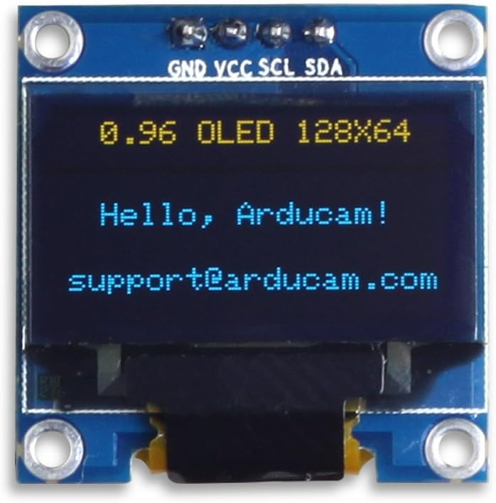

---
title: 两轮平衡小车项目
author: 尚硅谷研究院
date: '版本: V1.0'
...

# 项目简介

两轮平衡小车是一种基于自动控制理论的智能机器人，它可以在不稳定的环境中保持自身平衡，同时进行前进、后退和转向等操作。这种小车的原理是通过内部的陀螺仪和加速度传感器监测车体的倾斜角度，并通过控制系统对电机进行反馈控制，从而实现车体的平衡。

# 市场产品和前景

两轮平衡小车在市场上有广泛的应用，例如自动巡逻、快递送货、家庭服务等。随着科技的发展，两轮平衡小车的市场前景十分广阔。它们不仅可以提高生产效率，减少人力成本，而且还可以作为教育和科研的工具，培养学生的创新能力和实践能力。

# 项目架构说明

架构图

本项目主要使用的技术包括STM32F103C8T6微控制器、MPU6050六轴陀螺仪/加速度计、蓝牙模块和OLED显示模块。

- STM32F103C8T6：作为主控制器，负责数据处理和控制指令的发送。
- MPU6050：用于检测车体的倾斜角度和加速度。
- 蓝牙模块：用于接收用户的控制指令。
- OLED模块：用于实时显示车体的状态信息。

# 项目模块

STM32F103C8T6

蓝牙模块

电机

六轴陀螺仪

平衡车体

OLED屏幕

# 设计思路

设计过程主要包括以下几个步骤：

- 硬件设计：选择合适的硬件设备，并进行硬件连接。
- 软件设计：编写 PID 控制算法，实现数据采集、处理和反馈控制。
- 系统调试：通过调整控制参数，优化系统性能。

# 所用的技术栈

- 嵌入式系统设计
- STM32微控制器编程
- MPU6050数据处理
- 蓝牙通信技术
- OLED显示技术

# 项目中可以体现的个人技能

通过这个项目，我可以展示以下技能：

- 硬件选择和连接：根据项目需求选择合适的硬件，并进行硬件连接。
- 嵌入式编程：使用C语言进行STM32微控制器编程。
- 传感器数据处理：理解和应用MPU6050数据处理算法。
- 无线通信：理解和应用蓝牙通信技术。
- 显示技术：使用OLED模块进行数据显示。
- 系统调试和优化：通过调整控制参数，优化系统性能。

# 项目成品

