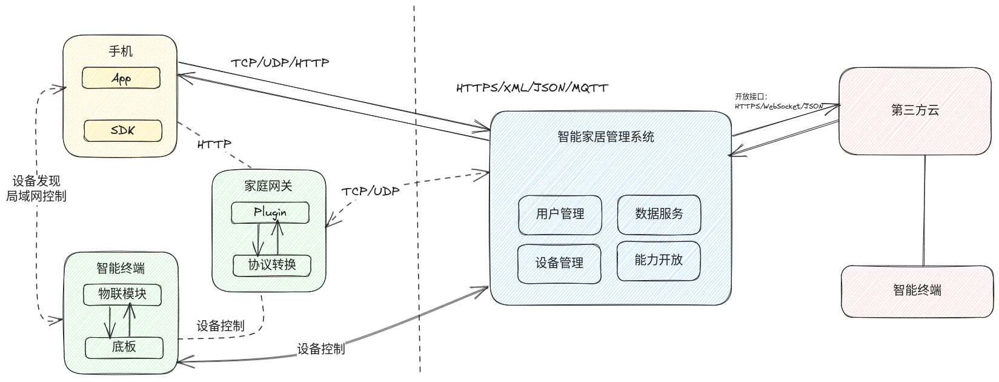
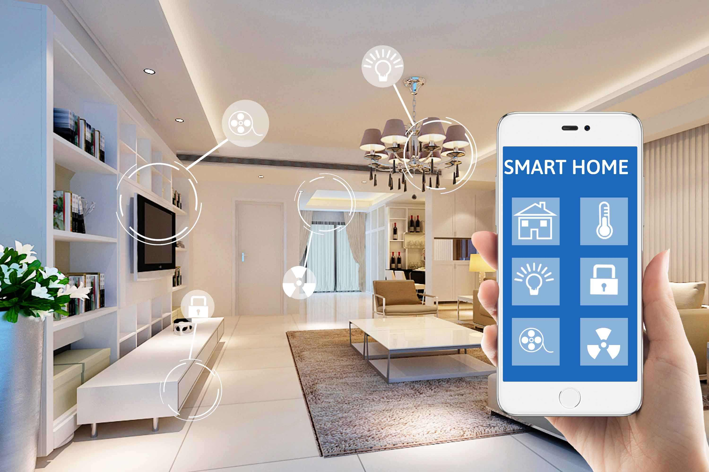

---
title: 智能家居项目
author: 尚硅谷研究院
date: '版本: V1.0'
...

# 项目简介

智能家居项目是一个集成了各种智能设备的系统，包括智能网关、智能窗帘、智能音箱、智能电视、智能灯、智能马桶、智能体重秤、智能温湿度计、智能门锁以及智能摄像头等。这个系统的目标是通过互联网技术和物联网技术，实现家居环境的自动化和智能化。

# 市场产品和前景

随着科技的发展，人们对生活质量的要求也在不断提高。智能家居作为一种新型的生活方式，正在逐渐改变我们的生活。在市场上，智能家居产品的种类越来越多，功能也越来越强大。未来，随着5G、AI等技术的发展，智能家居的市场前景十分广阔。

# 项目架构说明

架构图

本项目的架构主要包括以下部分：

- 智能网关：作为系统的核心，负责连接各种智能设备和互联网。该部分由嵌入式Linux实现。
- 智能设备：包括智能窗帘、智能音箱、智能电视、智能灯、智能马桶、智能体重秤、智能温湿度计、智能门锁以及智能摄像头等。这些设备由单片机或Android实现，通过WiFi或Zigbee等方式与智能网关进行通信。

# 设计思路

在设计智能家居系统时，首先需要明确系统的功能需求和性能需求。在此基础上，可以选择适当的硬件平台和软件平台，以满足各种需求。

智能家居系统的设计重点在于设备间的互联互通和数据的处理。因此，设计思路主要包括以下几个方面：

- 设备连接：选择合适的通信协议和接口，使各个设备可以通过智能网关进行连接。
- 数据处理：设计有效的数据处理算法，提取有用的信息，实现设备的智能控制。
- 用户界面：设计友好的用户界面，使用户可以方便地控制各个设备。

# 所用的技术栈

本项目主要使用了以下技术：

- 嵌入式Linux：用于实现智能网关的功能。
- 单片机编程：用于实现各种智能设备的功能。
- Android开发：用于实现智能电视的功能。
- WiFi和Zigbee通信：用于实现设备间的连接。

# 项目中可以体现的个人技能

通过本项目，可以体现出以下个人技能：

- 嵌入式系统开发能力：通过设计和实现智能网关，展示了嵌入式Linux系统开发的能力。
- 单片机编程能力：通过设计和实现各种智能设备，展示了单片机编程的能力。
- Android开发能力：通过设计和实现智能电视，展示了Android开发的能力。
- 网络通信能力：通过设计和实现设备间的连接，展示了对WiFi和Zigbee通信的理解和应用能力。
- 数据处理能力：通过设计有效的数据处理算法，展示了数据处理和分析的能力。

# 项目成品

