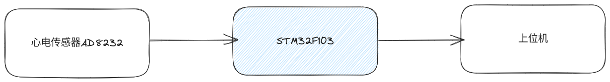
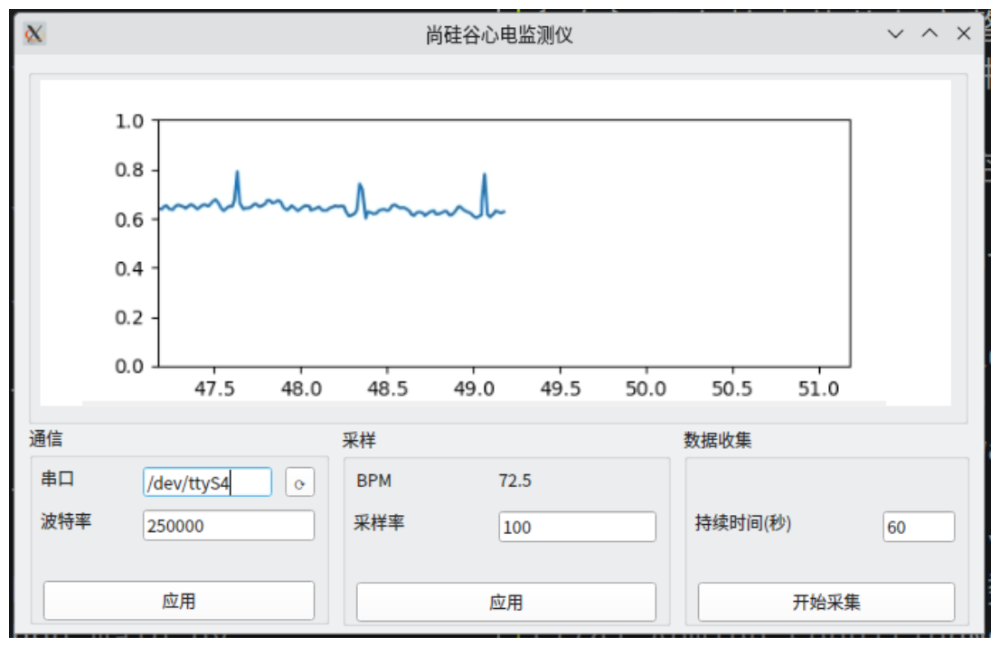

---
title: 心电监测仪项目
author: 尚硅谷研究院
date: '版本: V1.0'
...

# 项目简介

心电监测仪是一种医疗设备，用于实时记录和分析人体心脏的电生理活动。这种设备对于监测心律失常、评估心脏功能以及指导心脏病治疗等方面具有重要意义。心电监测仪可以帮助医生及时发现患者的心脏问题，为诊断和治疗提供关键信息。此外，心电监测仪在运动健康、家庭护理和远程医疗等领域也有广泛应用。

# 市场产品和前景

市场上的心电监测仪产品种类丰富，包括便携式心电仪、家用心电仪、多导联心电图机等。这些产品根据使用场景和需求，具有不同的特点和优势。

1. 便携式心电仪：轻便、易用，适合个人使用和家庭护理。用户可以随时随地进行心电信号的监测，及时了解自己的心脏健康状况。
2. 家用心电仪：功能较为全面，适合家庭长期监测。除了实时记录心电信号外，还可以保存数据、设置报警等。
3. 多导联心电图机：功能强大，适合医疗机构使用。通过多个导联同时记录心电信号，可提供更为详细的心脏信息，有助于医生进行诊断和治疗。

随着科技的发展和人们对健康的重视程度不断提高，心电监测仪市场呈现出良好的发展前景。未来，智能化、远程医疗和个性化定制等方向将成为心电监测仪产品创新的重要趋势。

# 项目架构图

我们使用 AD8232 心电传感器采集血氧数据，然后将数据发送到 STM32F103 单片机，然后由单片机将数据显示在上位机的图形化界面中。

# 项目模块

1. STM32F103 开发板

2. AD8232 心电传感器模块

# 项目实现功能

- 熟悉STM32开发板
- 熟悉 ADC 的原理以及使用
- 熟悉 DMA 的原理以及使用
- 熟悉滤波器的实现
- 熟悉串口协议
- 编写上位机图形化界面显示和分析数据

# 项目技能

- C语言编程
- Python语言编程
- AD8232基础知识
- ADC模数转换器的使用
- FIR(有限冲激响应)滤波器的实现
- DMA(直接内存访问)的使用
- 串口通信程序的编写
- PyQt5编写上位机图形化界面

# 项目成品

上位机

下位机

