---
title: '使用 STM32 开发心电监测仪'
author: '尚硅谷研究院'
date: '版本: V1.0'
...

# 项目需求和技术选型

## 硬件选型

我们的需求是制作一个心电监测仪。心电监测仪需要以下一些硬件设备：

- 导联线：导联线负责从人体采集微弱的电压信号。如果想要采集精确的人体电压信号，可以选择12导联这样的导联线，当然价格是非常感人的。只是想理解原理的话，可以选择便宜的单导联线。
- 电压传感器：负责读取导联线所产生的电压信号。我们可以选择 ADI 公司的 AD8232 芯片。可以采集电压信号并输出。
- 单片机：我们选择最常用的 STM32F103 系列的单片机。这款单片机上面自带了 ADC 功能。可以将 AD8232 输出的模拟电压信号转换成离散的数字信号。方便我们进一步将数字信号值通过串口传递到上位机上去。
- 个人电脑：编写上位机软件，接收单片机通过串口发送过来的数据，并做进一步处理（可视化，滤波，等等）。

想要做更好的心电监测仪产品，需要更好的导联线。由于 STM32 自带的 ADC 的精度和采样率可能不符合要求，可以选择外置的 ADC 芯片，例如 TI 公司生产的 ADS1298 系列的 ADC 芯片。

## 软件选型

- STM32CubeMX：用来产生样板代码。
- Clion/VSCode/Keil：用来开发单片机程序。
- PyQt5：用来在上位机开发程序。

# 心电监测仪项目架构图

## 硬件架构图

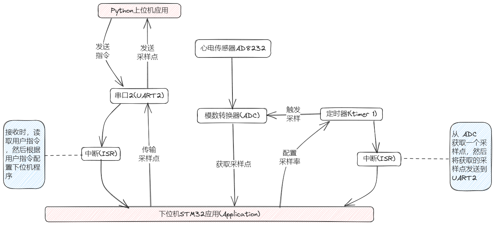

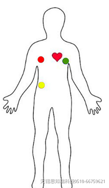

## 软件架构图

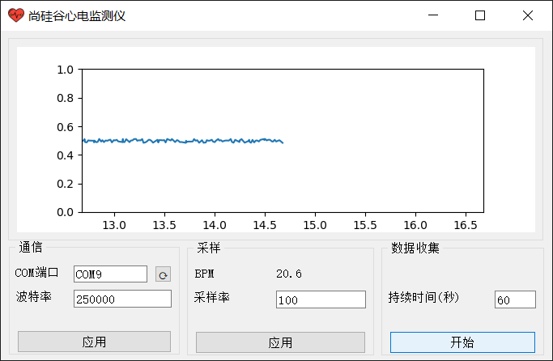

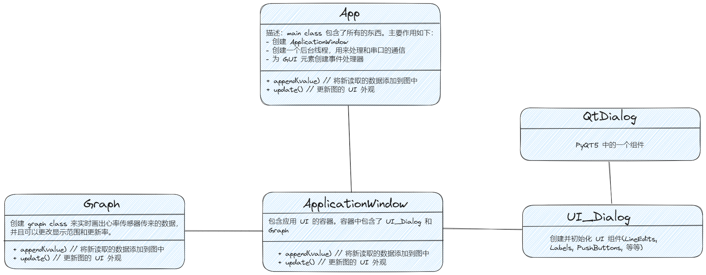

# 构建开发工具链

传统的 STM32 开发工具一般使用 Keil MDK-ARM IDE 来进行。但 Keil IDE 的编码体验不是很好（只支持 Windows 平台，代码高亮和不全都不好，经常误报错误和警告）。所以我们自己搭建一套开发体验（代码补全，高亮，提示，代码格式化等等）丝滑的工具链。选用的工具如下：

- STM32CubeMX：用来产生包含了 ST 官方 HAL 库的样板代码。非常的方便，基本上是开发 STM32 单片机程序的必备工具。[下载链接](https://www.st.com/zh/development-tools/stm32cubemx.html#overview)
- Clion：JetBrains 公司提供的 C\C++ IDE。[下载链接](https://www.jetbrains.com/clion/)
- openocd：开源的单片机程序烧写工具。[下载链接](https://gnutoolchains.com/arm-eabi/openocd/)。下载完解压之后，注意将 `bin` 文件夹的绝对路径添加到环境变量中。打开 PowerShell ，然后输入 `openocd -v` 确认安装成功。
- gcc-arm-none-eabi：开源的 ARM 指令集编译器。[下载链接](https://developer.arm.com/-/media/Files/downloads/gnu-rm/10.3-2021.10/gcc-arm-none-eabi-10.3-2021.10-win32.exe?rev=29bb46cfa0434fbda93abb33c1d480e6&hash=B2C5AAE07841929A0D0BF460896D6E52)。安装完之后，找到安装路径。然后将 `bin` 文件夹的绝对路径添加到环境变量中。打开 PowerShell ，然后输入 `arm-none-eabi-gcc.exe -v` 确认安装成功。
- Anaconda：Python集成工具包。用来编写 PC 端的上位机程序。[下载链接](https://www.anaconda.com/download)

## 使用 STM32CubeMX 创建 STM32F103 项目

1. 打开 STM32CubeMX

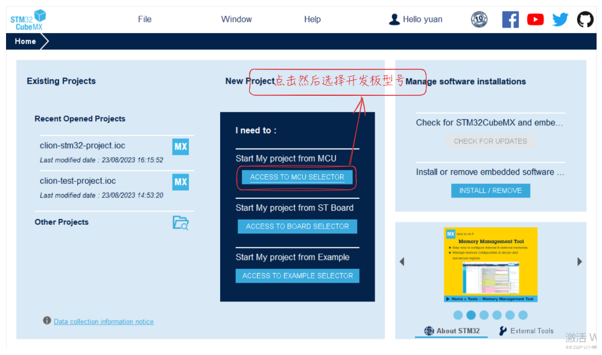

2. 选择要使用的芯片

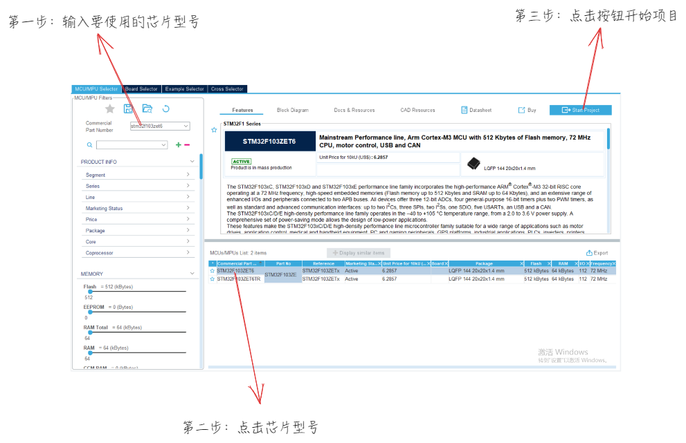

3. 配置 STM32 的系统设置以及一些外设

首先设置单片机的时钟源。

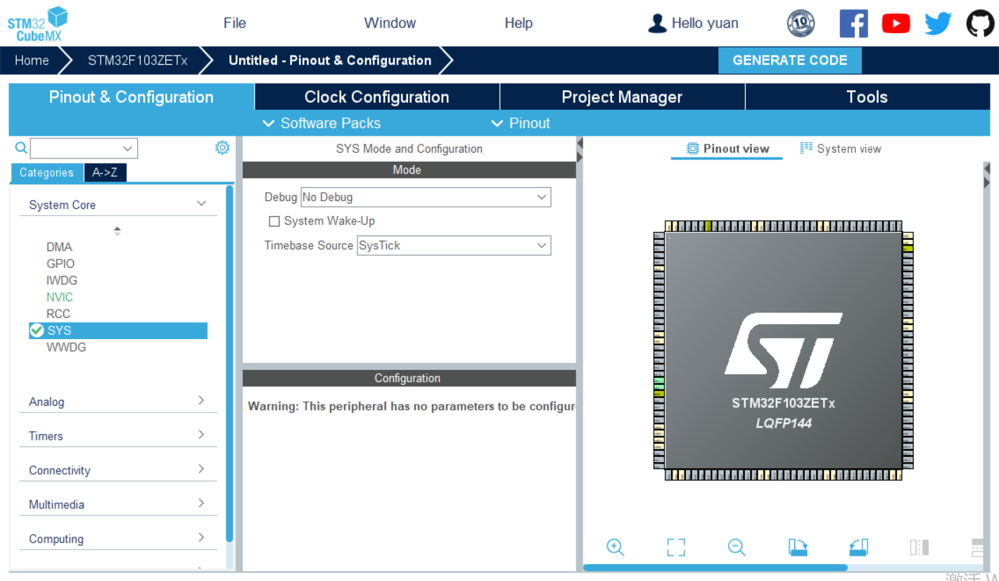

`Timebase Source` 我们选择 `SysTick` 。

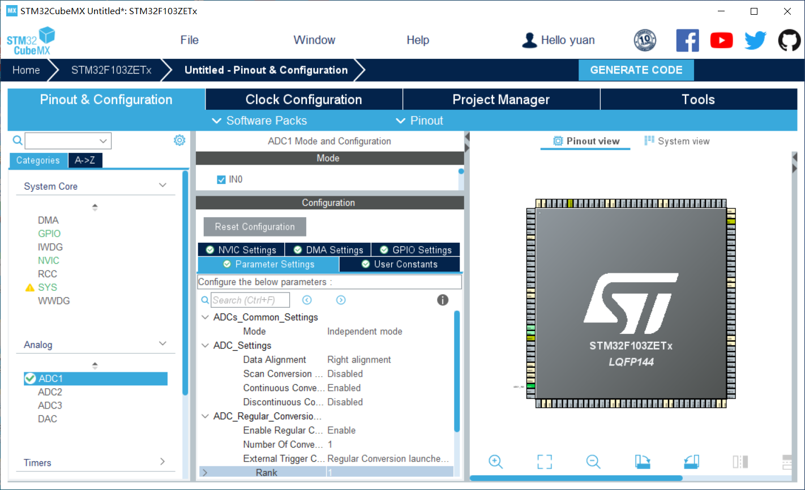

接下来我们设置模数转换器相关功能，我们选择 STM32 自带的 `ADC1` 的第 0 个通道 `IN0` 。

`Parameter Settings` 如图所示。

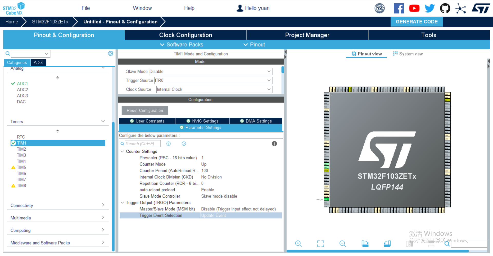

接下来我们配置定时器，我们选用 STM32 提供的定时器1，也就是 `TIM1` 。

参数设置如图所示。

接下来我们配置串口通信相关功能，我们使用 STM32 的 USART2 串口。

打开中断，并将波特率设置为 250000 。

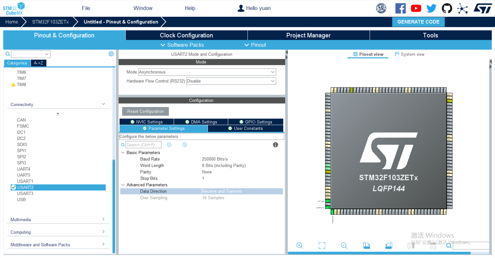

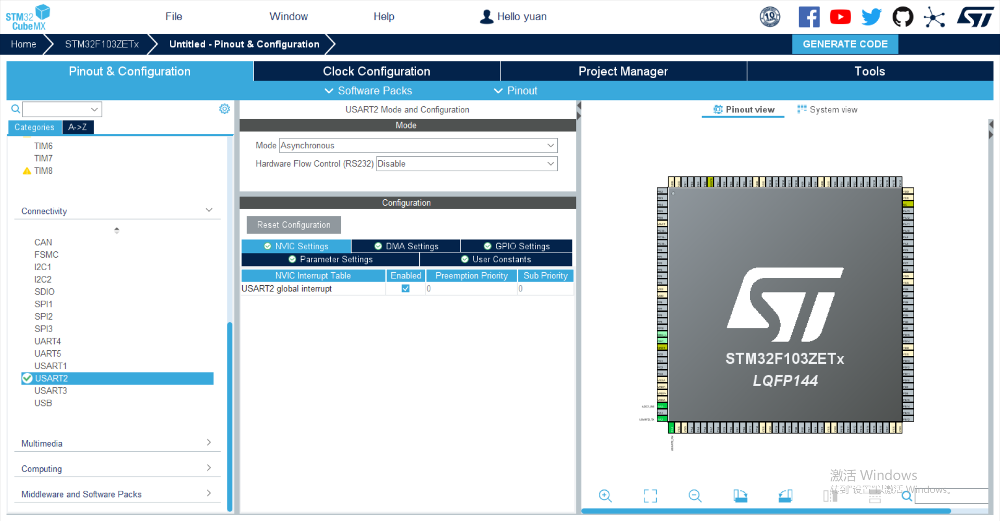

然后将相关的 GPIO PIN 打开并设置 PIN 的各种特性（输入，输出等）。

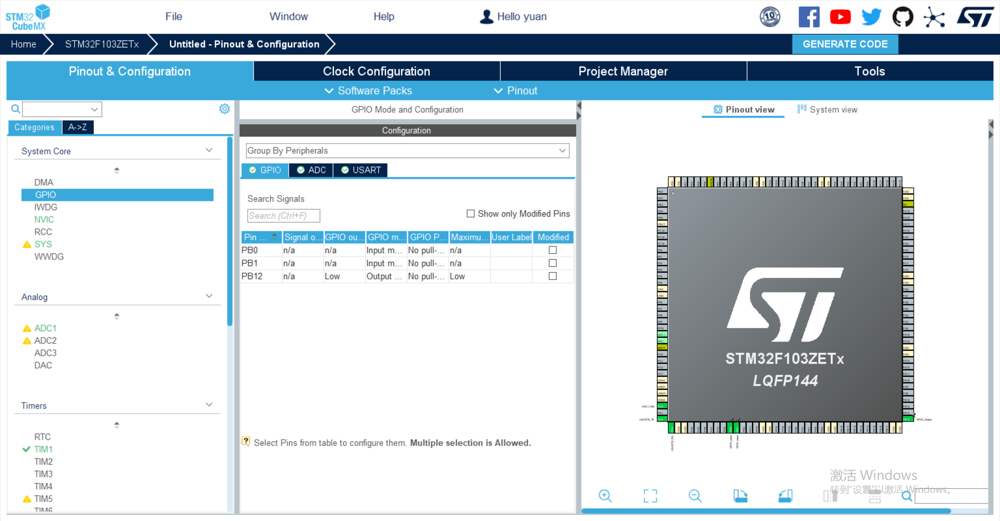

最后我们配置 STM32 的时钟树。

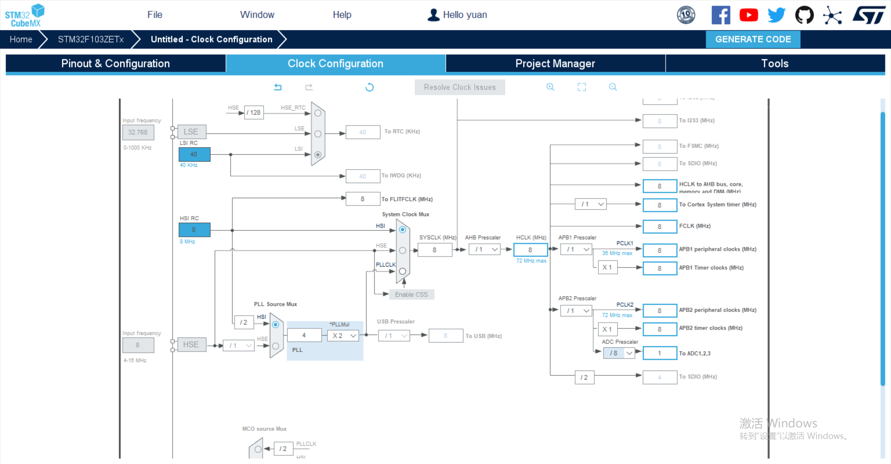

主要是将 `ADC Prescaler` 设置为 `/8` 。

4. 创建项目

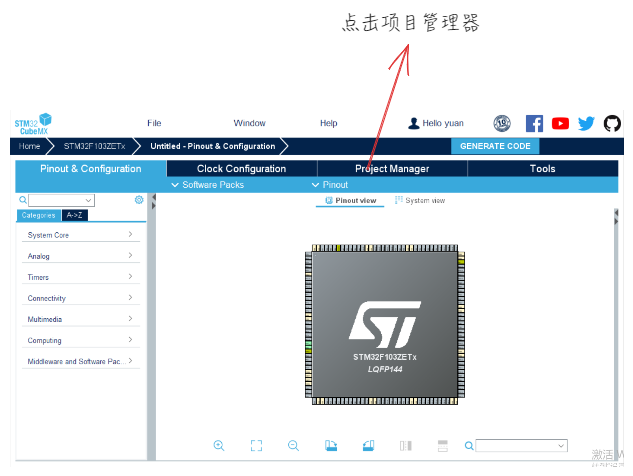

然后输入项目名称，并创建项目

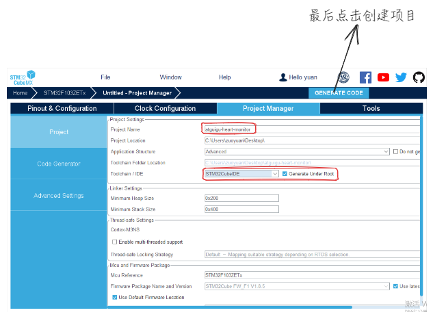

5. 关闭 STM32CubeMX

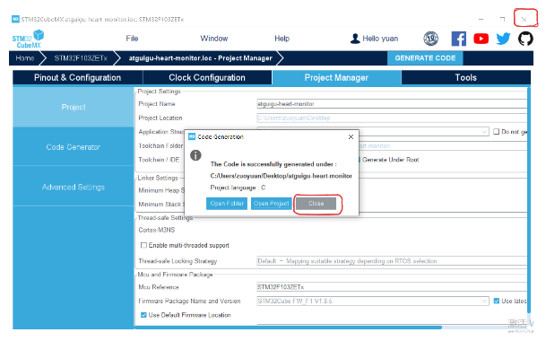

## 编写烧写工具配置文件

我们使用的仿真器是 `cmsis-dap` 协议的仿真器。

在路径 `解压openocd的绝对路径\openocd-20230712\OpenOCD-20230712-0.12.0\share\openocd\scripts\board` 文件夹中新建文件 `stm32f1discovery.cfg` 文件，在里面写入以下内容：

```cfg
source [find interface/cmsis-dap.cfg]

transport select swd

# 待烧写单片机是 stm32f1x 型号
source [find target/stm32f1x.cfg]

# 设置调试器,最大速度为24MHz
adapter speed 12000
```

## 使用 Clion 打开 STM32CubeMX 创建的项目

使用 Clion 打开创建的项目中的 `.ioc` 文件，注意要 **作为项目打开** 。

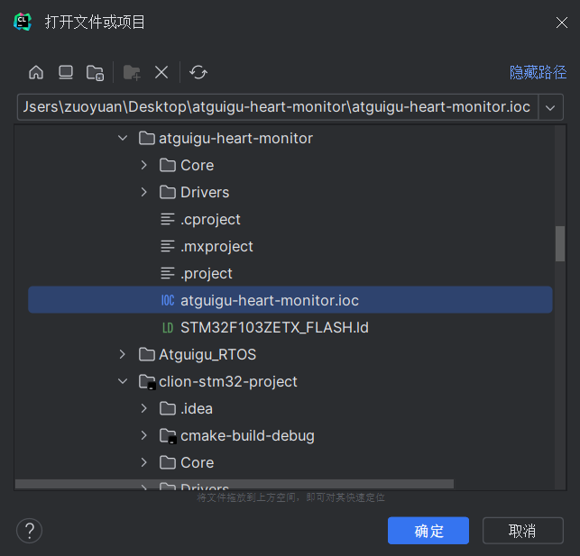

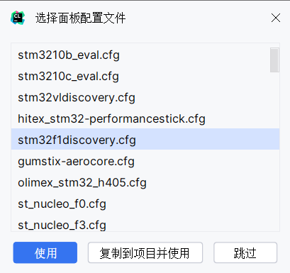

此时会弹出选择 openocd 配置文件的面板，选择 `stm32f1discovery.cfg` 。

还有两个特别重要的地方需要配置，也就是 openocd 、编译工具链 的配置。

首先检查一下 openocd 和 stm32cubemx 的路径是否正确。

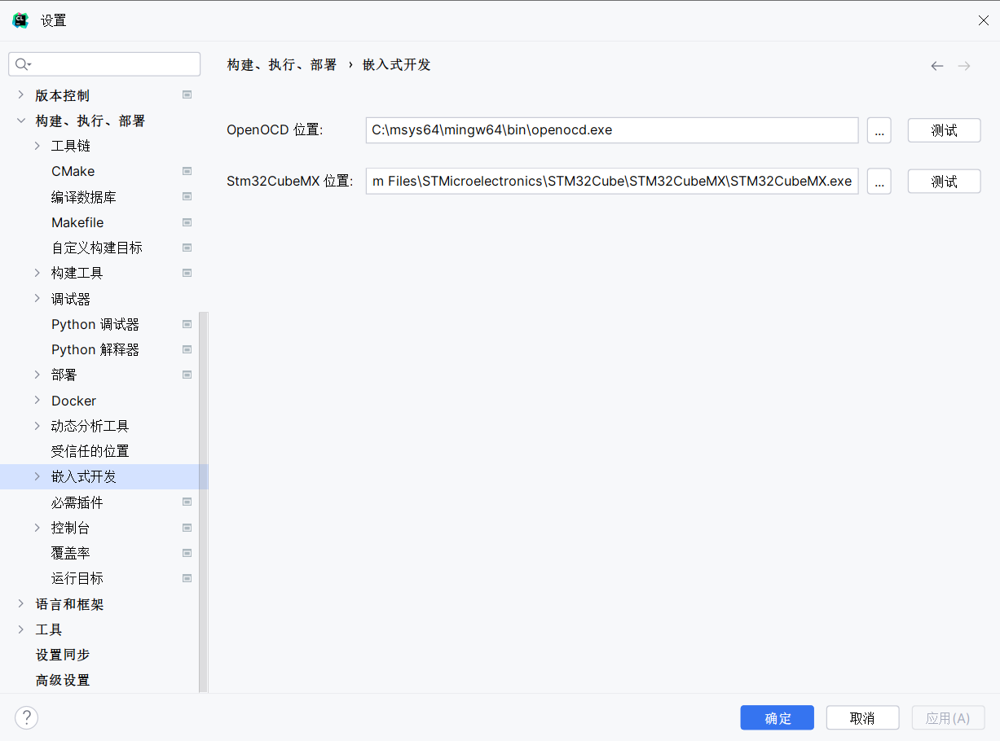

然后新建一个名为 **系统** 的工具链，主要要确保 `arm-none-eabi-gcc` 和 `arm-none-eabi-g++` 的路径是正确的。

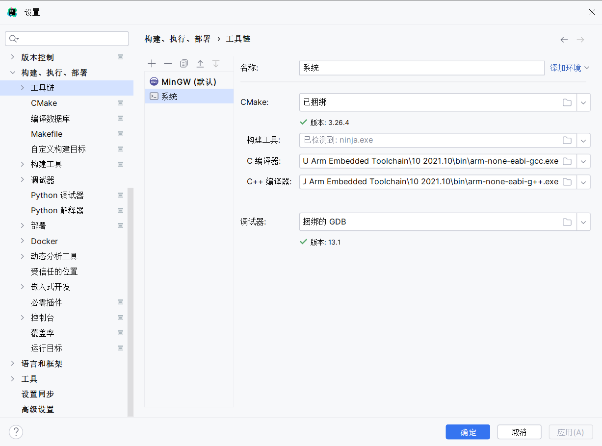

最后将 `CMake` 选项卡的工具链设置为 **系统** 。

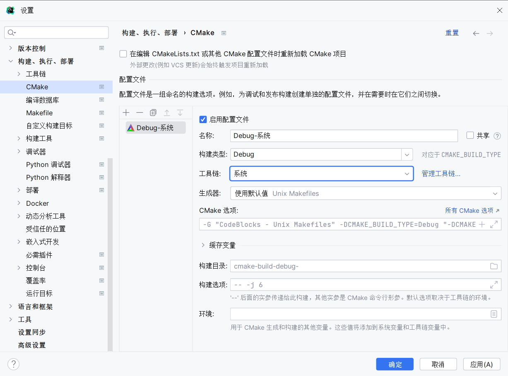

然后就可以愉快的写代码了。点击运行看一下样板代码是否可以烧写成功。

# 心电监测仪项目代码编写

## 下位机代码编写

根据我们的一系列配置，stm32cubemx 帮助我们生成了大部分代码，如果有某些配置我们设置错了，可以直接在代码中改动。接下来我们将要写的代码去掉注释，贴在下面，可以和自动生成的代码对比，我们修改了哪些内容。

我们首先编写初始化 STM32 各种外设的代码。`stm32f1xx_hal_msp.c` 代码内容如下：

```c
#include "main.h"

void HAL_MspInit(void) {
    __HAL_RCC_AFIO_CLK_ENABLE();
    __HAL_RCC_PWR_CLK_ENABLE();

    __HAL_AFIO_REMAP_SWJ_NOJTAG();
}

void HAL_ADC_MspInit(ADC_HandleTypeDef *hadc) {
    GPIO_InitTypeDef GPIO_InitStruct = {0};
    if (hadc->Instance == ADC1) {
        /* Peripheral clock enable */
        __HAL_RCC_ADC1_CLK_ENABLE();
        __HAL_RCC_GPIOA_CLK_ENABLE();
        /**ADC1 GPIO Configuration
        PA0-WKUP     ------> ADC1_IN0
        */
        GPIO_InitStruct.Pin = GPIO_PIN_0;
        GPIO_InitStruct.Mode = GPIO_MODE_ANALOG;
        HAL_GPIO_Init(GPIOA, &GPIO_InitStruct);

        HAL_NVIC_SetPriority(ADC1_2_IRQn, 0, 0);
        HAL_NVIC_EnableIRQ(ADC1_2_IRQn);
    }
}

void HAL_ADC_MspDeInit(ADC_HandleTypeDef *hadc) {
    if (hadc->Instance == ADC1) {
        __HAL_RCC_ADC1_CLK_DISABLE();
        HAL_GPIO_DeInit(GPIOA, GPIO_PIN_0);
        HAL_NVIC_DisableIRQ(ADC1_2_IRQn);
    }
}

void HAL_TIM_Base_MspInit(TIM_HandleTypeDef *htim_base) {
    if (htim_base->Instance == TIM1) {
        __HAL_RCC_TIM1_CLK_ENABLE();
        HAL_NVIC_SetPriority(TIM1_UP_IRQn, 0, 0);
        HAL_NVIC_EnableIRQ(TIM1_UP_IRQn);
    }
}

void HAL_TIM_Base_MspDeInit(TIM_HandleTypeDef *htim_base) {
    if (htim_base->Instance == TIM1) {
        __HAL_RCC_TIM1_CLK_DISABLE();
        HAL_NVIC_DisableIRQ(TIM1_UP_IRQn);
    }
}

void HAL_UART_MspInit(UART_HandleTypeDef *huart) {
    GPIO_InitTypeDef GPIO_InitStruct = {0};
    if (huart->Instance == USART2) {
        __HAL_RCC_USART2_CLK_ENABLE();

        __HAL_RCC_GPIOA_CLK_ENABLE();
        /**USART2 GPIO Configuration
        PA2     ------> USART2_TX
        PA3     ------> USART2_RX
        */
        GPIO_InitStruct.Pin = GPIO_PIN_2;
        GPIO_InitStruct.Mode = GPIO_MODE_AF_PP;
        GPIO_InitStruct.Speed = GPIO_SPEED_FREQ_HIGH;
        HAL_GPIO_Init(GPIOA, &GPIO_InitStruct);

        GPIO_InitStruct.Pin = GPIO_PIN_3;
        GPIO_InitStruct.Mode = GPIO_MODE_INPUT;
        GPIO_InitStruct.Pull = GPIO_NOPULL;
        HAL_GPIO_Init(GPIOA, &GPIO_InitStruct);

        /* USART2 interrupt Init */
        HAL_NVIC_SetPriority(USART2_IRQn, 0, 0);
        HAL_NVIC_EnableIRQ(USART2_IRQn);
    }
}

void HAL_UART_MspDeInit(UART_HandleTypeDef *huart) {
    if (huart->Instance == USART2) {
        __HAL_RCC_USART2_CLK_DISABLE();

        /**USART2 GPIO Configuration
        PA2     ------> USART2_TX
        PA3     ------> USART2_RX
        */
        HAL_GPIO_DeInit(GPIOA, GPIO_PIN_2 | GPIO_PIN_3);

        HAL_NVIC_DisableIRQ(USART2_IRQn);
    }
}
```

然后编写中断函数的代码，代码文件为 `stm32f1xx_it.c` ，内容如下：

```c
#include "main.h"
#include "stm32f1xx_it.h"

extern ADC_HandleTypeDef hadc1;
extern TIM_HandleTypeDef htim1;
extern UART_HandleTypeDef huart2;

void NMI_Handler(void) {
}

void HardFault_Handler(void) {
    while (1) {
    }
}

void MemManage_Handler(void) {
    while (1) {
    }
}

void BusFault_Handler(void) {
    while (1) {
    }
}

void UsageFault_Handler(void) {
    while (1) {
    }
}

void SVC_Handler(void) {
}

void DebugMon_Handler(void) {
}

void PendSV_Handler(void) {
}

// 外设中断
void ADC1_2_IRQHandler(void) {
    HAL_ADC_IRQHandler(&hadc1);
}
```

最后我们编写 `main.c` 文件，里面包含了业务逻辑的代码。

```c
#include "main.h"
#include "string.h"
#include "stdlib.h"
#include "stdio.h"

ADC_HandleTypeDef hadc1;

TIM_HandleTypeDef htim1;

UART_HandleTypeDef huart2;

void SystemClock_Config(void);

static void MX_GPIO_Init(void);

static void MX_ADC1_Init(void);

static void MX_TIM1_Init(void);

static void MX_USART2_UART_Init(void);


// 全局变量的定义
uint32_t sample;
char TxBuffer[8];
char param_s[7];
int param;
char RxBuffer[8];
int RxIndex = 0;
char c;

int ticks = 0;
int isSending = 0;
int duration = 0;
int takeSample = 0;
int command_flag = 0;

// 系统时钟频率我们使用的是：8MHz
void configureSamplingRate(int sampling_rate) {
    volatile int prescaler = 128 / sampling_rate + 1;
    volatile int load = 8388608 / (sampling_rate * prescaler);
    __HAL_TIM_SET_PRESCALER(&htim1, prescaler);
    __HAL_TIM_SET_AUTORELOAD(&htim1, load);
}

void TIM1_UP_IRQHandler() {
    HAL_TIM_IRQHandler(&htim1);
    if (!isSending) return;
    else if (ticks > 1000 * duration) {
        ticks = 0;
        isSending = 0;
    }
    takeSample = 1;
}

void SysTick_Handler(void) {
    HAL_IncTick();
    if (isSending) ticks++;
}

void USART2_IRQHandler(void) {
    HAL_UART_IRQHandler(&huart2);
    int result = HAL_UART_Receive(&huart2, (uint8_t *) &c, 1, 500);
    if (result == HAL_OK) {
        if (c != 0x0A)
            RxBuffer[RxIndex++] = c;
        else
            command_flag = 1;
    }
}

void process_command() {
    __HAL_UART_DISABLE_IT(&huart2, UART_IT_RXNE);
    strcpy(param_s, RxBuffer + 1);
    param = atoi(param_s);
    char command = RxBuffer[0];
    __HAL_UART_ENABLE_IT(&huart2, UART_IT_RXNE);
    switch (command) {
        case 's':
            configureSamplingRate(param);
            break;
        case 'c':
            isSending = 1;
            duration = param;
            break;
        default:
            break;
    }
    memset(RxBuffer, 0, 8);
    RxIndex = 0;
}

int main(void) {
    HAL_Init();

    SystemClock_Config();

    HAL_SYSTICK_Config(8192);

    MX_GPIO_Init();
    MX_ADC1_Init();
    MX_TIM1_Init();
    MX_USART2_UART_Init();

    HAL_TIM_Base_Start_IT(&htim1);
    configureSamplingRate(100);
    HAL_ADC_Start(&hadc1);

    __HAL_UART_ENABLE_IT(&huart2, UART_IT_RXNE);

    while (1) {
        if (takeSample) {
            HAL_TIM_Base_Stop_IT(&htim1);
            takeSample = 0;
            HAL_TIM_Base_Start_IT(&htim1);
            sample = HAL_ADC_GetValue(&hadc1);
            sprintf(TxBuffer, "%04lu\n", (unsigned long) sample);
            HAL_UART_Transmit(&huart2, (uint8_t *) TxBuffer, sizeof(TxBuffer), HAL_MAX_DELAY);
        }
        if (command_flag) {
            process_command();
            command_flag = 0;
        }
        if (!isSending) {
            HAL_GPIO_WritePin(GPIOB, GPIO_PIN_12, 1);    //turn off
            HAL_TIM_Base_Stop(&htim1);
            HAL_ADC_Stop(&hadc1);
            HAL_SuspendTick();
            HAL_PWR_EnterSLEEPMode(PWR_LOWPOWERREGULATOR_ON, PWR_SLEEPENTRY_WFI);
            HAL_ResumeTick();
            SystemClock_Config();
            HAL_TIM_Base_Start(&htim1);
            HAL_ADC_Start(&hadc1);
            HAL_GPIO_WritePin(GPIOB, GPIO_PIN_12, 0);    //turn on
        }
    }
}

/**
  * @brief System Clock Configuration
  * @retval None
  */
void SystemClock_Config(void) {
    RCC_OscInitTypeDef RCC_OscInitStruct = {0};
    RCC_ClkInitTypeDef RCC_ClkInitStruct = {0};
    RCC_PeriphCLKInitTypeDef PeriphClkInit = {0};

    /** Initializes the RCC Oscillators according to the specified parameters
    * in the RCC_OscInitTypeDef structure.
    */
    RCC_OscInitStruct.OscillatorType = RCC_OSCILLATORTYPE_HSI;
    RCC_OscInitStruct.HSIState = RCC_HSI_ON;
    RCC_OscInitStruct.HSICalibrationValue = RCC_HSICALIBRATION_DEFAULT;
    RCC_OscInitStruct.PLL.PLLState = RCC_PLL_NONE;
    if (HAL_RCC_OscConfig(&RCC_OscInitStruct) != HAL_OK) {
        Error_Handler();
    }

    /** Initializes the CPU, AHB and APB buses clocks
    */
    RCC_ClkInitStruct.ClockType = RCC_CLOCKTYPE_HCLK | RCC_CLOCKTYPE_SYSCLK
                                  | RCC_CLOCKTYPE_PCLK1 | RCC_CLOCKTYPE_PCLK2;
    RCC_ClkInitStruct.SYSCLKSource = RCC_SYSCLKSOURCE_HSI;
    RCC_ClkInitStruct.AHBCLKDivider = RCC_SYSCLK_DIV1;
    RCC_ClkInitStruct.APB1CLKDivider = RCC_HCLK_DIV1;
    RCC_ClkInitStruct.APB2CLKDivider = RCC_HCLK_DIV1;

    if (HAL_RCC_ClockConfig(&RCC_ClkInitStruct, FLASH_LATENCY_0) != HAL_OK) {
        Error_Handler();
    }
    PeriphClkInit.PeriphClockSelection = RCC_PERIPHCLK_ADC;
    PeriphClkInit.AdcClockSelection = RCC_ADCPCLK2_DIV8;
    if (HAL_RCCEx_PeriphCLKConfig(&PeriphClkInit) != HAL_OK) {
        Error_Handler();
    }
}

/**
  * @brief ADC1 Initialization Function
  * @param None
  * @retval None
  */
static void MX_ADC1_Init(void) {
    ADC_ChannelConfTypeDef sConfig = {0};

    /** Common config
    */
    hadc1.Instance = ADC1;
    hadc1.Init.ScanConvMode = ADC_SCAN_DISABLE;
    hadc1.Init.ContinuousConvMode = ENABLE;
    hadc1.Init.DiscontinuousConvMode = DISABLE;
    hadc1.Init.ExternalTrigConv = ADC_SOFTWARE_START;
    hadc1.Init.DataAlign = ADC_DATAALIGN_RIGHT;
    hadc1.Init.NbrOfConversion = 1;
    if (HAL_ADC_Init(&hadc1) != HAL_OK) {
        Error_Handler();
    }

    /** Configure Regular Channel
    */
    sConfig.Channel = ADC_CHANNEL_0;
    sConfig.Rank = ADC_REGULAR_RANK_1;
    sConfig.SamplingTime = ADC_SAMPLETIME_1CYCLE_5;
    if (HAL_ADC_ConfigChannel(&hadc1, &sConfig) != HAL_OK) {
        Error_Handler();
    }
}

/**
  * @brief TIM1 Initialization Function
  * @param None
  * @retval None
  */
static void MX_TIM1_Init(void) {
    TIM_ClockConfigTypeDef sClockSourceConfig = {0};
    TIM_MasterConfigTypeDef sMasterConfig = {0};

    htim1.Instance = TIM1;
    htim1.Init.Prescaler = 1;
    htim1.Init.CounterMode = TIM_COUNTERMODE_UP;
    htim1.Init.Period = 100;
    htim1.Init.ClockDivision = TIM_CLOCKDIVISION_DIV1;
    htim1.Init.RepetitionCounter = 0;
    htim1.Init.AutoReloadPreload = TIM_AUTORELOAD_PRELOAD_ENABLE;
    if (HAL_TIM_Base_Init(&htim1) != HAL_OK) {
        Error_Handler();
    }
    sClockSourceConfig.ClockSource = TIM_CLOCKSOURCE_INTERNAL;
    if (HAL_TIM_ConfigClockSource(&htim1, &sClockSourceConfig) != HAL_OK) {
        Error_Handler();
    }

    sMasterConfig.MasterOutputTrigger = TIM_TRGO_RESET;
    sMasterConfig.MasterSlaveMode = TIM_MASTERSLAVEMODE_DISABLE;
    if (HAL_TIMEx_MasterConfigSynchronization(&htim1, &sMasterConfig) != HAL_OK) {
        Error_Handler();
    }
}

/**
  * @brief USART2 Initialization Function
  * @param None
  * @retval None
  */
static void MX_USART2_UART_Init(void) {
    huart2.Instance = USART2;
    huart2.Init.BaudRate = 250000;
    huart2.Init.WordLength = UART_WORDLENGTH_8B;
    huart2.Init.StopBits = UART_STOPBITS_1;
    huart2.Init.Parity = UART_PARITY_NONE;
    huart2.Init.Mode = UART_MODE_TX_RX;
    huart2.Init.HwFlowCtl = UART_HWCONTROL_NONE;
    huart2.Init.OverSampling = UART_OVERSAMPLING_16;
    if (HAL_UART_Init(&huart2) != HAL_OK) {
        Error_Handler();
    }
}

/**
  * @brief GPIO Initialization Function
  * @param None
  * @retval None
  */
static void MX_GPIO_Init(void) {
    GPIO_InitTypeDef GPIO_InitStruct = {0};

    /* GPIO Ports Clock Enable */
    __HAL_RCC_GPIOB_CLK_ENABLE();

    /*Configure GPIO pin Output Level */
    HAL_GPIO_WritePin(GPIOB, GPIO_PIN_12, GPIO_PIN_RESET);

    /*Configure GPIO pins : PB0 PB1 */
    GPIO_InitStruct.Pin = GPIO_PIN_0 | GPIO_PIN_1;
    GPIO_InitStruct.Mode = GPIO_MODE_INPUT;
    GPIO_InitStruct.Pull = GPIO_NOPULL;
    HAL_GPIO_Init(GPIOB, &GPIO_InitStruct);

    /*Configure GPIO pin : PB12 */
    GPIO_InitStruct.Pin = GPIO_PIN_12;
    GPIO_InitStruct.Mode = GPIO_MODE_OUTPUT_PP;
    GPIO_InitStruct.Pull = GPIO_NOPULL;
    GPIO_InitStruct.Speed = GPIO_SPEED_FREQ_LOW;
    HAL_GPIO_Init(GPIOB, &GPIO_InitStruct);
}

/**
  * @brief  This function is executed in case of error occurrence.
  * @retval None
  */
void Error_Handler(void) {
}
```

## 上位机代码编写

首先打开 `Anaconda PowerShell Prompt` 程序，然后在终端中输入

```bash
pip install pyserial
```

安装 Python 的串口程序包。然后就可以写代码了。

首先编写 `ui.py`

```py
# -*- coding: utf-8 -*-

# Form implementation generated from reading ui file 'design.ui'
#
# Created by: PyQt5 UI code generator 5.14.2
#
# WARNING! All changes made in this file will be lost!


from PyQt5 import QtCore, QtGui, QtWidgets


class Ui_Dialog(object):
    def setupUi(self, Dialog):
        Dialog.setObjectName("Dialog")
        Dialog.resize(681, 407)
        icon = QtGui.QIcon()
        icon.addPixmap(QtGui.QPixmap("icon.ico"),
                       QtGui.QIcon.Normal, QtGui.QIcon.Off)
        Dialog.setWindowIcon(icon)
        self.communicationGroupBox = QtWidgets.QGroupBox(Dialog)
        self.communicationGroupBox.setGeometry(QtCore.QRect(10, 260, 211, 141))
        self.communicationGroupBox.setObjectName("communicationGroupBox")
        self.portLineEdit = QtWidgets.QLineEdit(self.communicationGroupBox)
        self.portLineEdit.setGeometry(QtCore.QRect(80, 30, 91, 21))
        self.portLineEdit.setObjectName("portLineEdit")
        self.portRefreshButton = QtWidgets.QPushButton(
            self.communicationGroupBox)
        self.portRefreshButton.setGeometry(QtCore.QRect(180, 30, 21, 21))
        self.portRefreshButton.setObjectName("portRefreshButton")
        self.portLabel = QtWidgets.QLabel(self.communicationGroupBox)
        self.portLabel.setGeometry(QtCore.QRect(8, 30, 55, 16))
        self.portLabel.setObjectName("portLabel")
        self.communicationApplyButton = QtWidgets.QPushButton(
            self.communicationGroupBox)
        self.communicationApplyButton.setGeometry(
            QtCore.QRect(10, 110, 191, 28))
        self.communicationApplyButton.setObjectName("communicationApplyButton")
        self.baudRateLineEdit = QtWidgets.QLineEdit(self.communicationGroupBox)
        self.baudRateLineEdit.setGeometry(QtCore.QRect(80, 60, 121, 22))
        self.baudRateLineEdit.setObjectName("baudRateLineEdit")
        self.baudRateLineEdit.setText("250000")
        self.baudRateLabel = QtWidgets.QLabel(self.communicationGroupBox)
        self.baudRateLabel.setGeometry(QtCore.QRect(8, 60, 61, 16))
        self.baudRateLabel.setObjectName("baudRateLabel")
        self.communicationErrorLabel = QtWidgets.QLabel(
            self.communicationGroupBox)
        self.communicationErrorLabel.setGeometry(QtCore.QRect(10, 90, 191, 16))
        self.communicationErrorLabel.setText("")
        self.communicationErrorLabel.setObjectName("communicationErrorLabel")
        self.communicationErrorLabel.setStyleSheet(
            'QLabel#communicationErrorLabel {color: red}')
        self.samplingGroupBox = QtWidgets.QGroupBox(Dialog)
        self.samplingGroupBox.setGeometry(QtCore.QRect(230, 261, 231, 141))
        self.samplingGroupBox.setObjectName("samplingGroupBox")
        self.samplingRateLineEdit = QtWidgets.QLineEdit(self.samplingGroupBox)
        self.samplingRateLineEdit.setGeometry(QtCore.QRect(110, 60, 111, 22))
        self.samplingRateLineEdit.setObjectName("samplingRateLineEdit")
        self.samplingRateLineEdit.setText("100")
        self.samplingRateLabel = QtWidgets.QLabel(self.samplingGroupBox)
        self.samplingRateLabel.setGeometry(QtCore.QRect(8, 60, 91, 16))
        self.samplingRateLabel.setObjectName("samplingRateLabel")
        self.samplingApplyButton = QtWidgets.QPushButton(self.samplingGroupBox)
        self.samplingApplyButton.setGeometry(QtCore.QRect(10, 110, 211, 28))
        self.samplingApplyButton.setObjectName("samplingApplyButton")
        self.BPMlabel = QtWidgets.QLabel(self.samplingGroupBox)
        self.BPMlabel.setGeometry(QtCore.QRect(10, 30, 91, 16))
        self.BPMlabel.setObjectName("BPMlabel")
        self.BPMValue = QtWidgets.QLabel(self.samplingGroupBox)
        self.BPMValue.setGeometry(QtCore.QRect(110, 30, 91, 16))
        self.BPMValue.setObjectName("BPMValue")
        self.samplingErrorLabel = QtWidgets.QLabel(self.samplingGroupBox)
        self.samplingErrorLabel.setGeometry(QtCore.QRect(10, 90, 211, 16))
        self.samplingErrorLabel.setText("")
        self.samplingErrorLabel.setObjectName("samplingErrorLabel")
        self.samplingErrorLabel.setStyleSheet(
            'QLabel#samplingErrorLabel {color: red}')
        self.dataCollectionGroupBox = QtWidgets.QGroupBox(Dialog)
        self.dataCollectionGroupBox.setGeometry(
            QtCore.QRect(470, 261, 201, 141))
        self.dataCollectionGroupBox.setObjectName("dataCollectionGroupBox")
        self.durationLineEdit = QtWidgets.QLineEdit(
            self.dataCollectionGroupBox)
        self.durationLineEdit.setGeometry(QtCore.QRect(140, 60, 51, 22))
        self.durationLineEdit.setObjectName("durationLineEdit")
        self.durationLineEdit.setText("60")
        self.durationLabel = QtWidgets.QLabel(self.dataCollectionGroupBox)
        self.durationLabel.setGeometry(QtCore.QRect(8, 60, 121, 16))
        self.durationLabel.setObjectName("durationLabel")
        self.dataCollectionStartButton = QtWidgets.QPushButton(
            self.dataCollectionGroupBox)
        self.dataCollectionStartButton.setGeometry(
            QtCore.QRect(10, 110, 181, 28))
        self.dataCollectionStartButton.setObjectName(
            "dataCollectionStartButton")
        self.dataCollectionErrorLabel = QtWidgets.QLabel(
            self.dataCollectionGroupBox)
        self.dataCollectionErrorLabel.setGeometry(
            QtCore.QRect(10, 90, 181, 16))
        self.dataCollectionErrorLabel.setText("")
        self.dataCollectionErrorLabel.setObjectName("dataCollectionErrorLabel")
        self.dataCollectionErrorLabel.setStyleSheet(
            'QLabel#dataCollectionErrorLabel {color: red}')
        self.graphGroupBox = QtWidgets.QGroupBox(Dialog)
        self.graphGroupBox.setGeometry(QtCore.QRect(9, 9, 661, 251))
        self.graphGroupBox.setTitle("")
        self.graphGroupBox.setObjectName("graphGroupBox")

        self.retranslateUi(Dialog)
        QtCore.QMetaObject.connectSlotsByName(Dialog)

        Dialog.setWindowIcon(QtGui.QIcon('icon.ico'))

    def retranslateUi(self, Dialog):
        _translate = QtCore.QCoreApplication.translate
        Dialog.setWindowTitle(_translate("Dialog", "Heart Monitor"))
        self.communicationGroupBox.setTitle(
            _translate("Dialog", "Communication"))
        self.portLabel.setText(_translate("Dialog", "COM Port"))
        self.portRefreshButton.setText(_translate("Dialog", "⟳"))
        self.communicationApplyButton.setText(_translate("Dialog", "Apply"))
        self.baudRateLabel.setText(_translate("Dialog", "Baud Rate"))
        self.portRefreshButton.setText(_translate("Dialog", "⟳"))
        self.samplingGroupBox.setTitle(_translate("Dialog", "Sampling"))
        self.samplingRateLabel.setText(_translate("Dialog", "Sampling Rate"))
        self.samplingApplyButton.setText(_translate("Dialog", "Apply"))
        self.BPMlabel.setText(_translate("Dialog", "BPM"))
        self.BPMValue.setText(_translate("Dialog", "20.6"))
        self.dataCollectionGroupBox.setTitle(
            _translate("Dialog", "Data Collection"))
        self.durationLabel.setText(_translate("Dialog", "Duration (seconds)"))
        self.dataCollectionStartButton.setText(_translate("Dialog", "Start"))
```

然后编写 `appWindow.py` 文件

```py
from matplotlib.figure import Figure
import time
import numpy as np
from matplotlib.backends.qt_compat import QtCore, QtWidgets
from matplotlib.backends.backend_qt5agg import (
    FigureCanvas, NavigationToolbar2QT as NavigationToolbar)
from ui import Ui_Dialog


class Graph():
    def __init__(self):
        self.startingTime = time.time()
        self.timeData = []
        self.data = []
        self.canvas = FigureCanvas(Figure(figsize=(6.4, 2.3)))
        self.ax = self.canvas.figure.subplots()
        self.line, = self.ax.plot(self.timeData, self.data)
        self.ax.set_ylim(0, 1)
        self.updateRate = 24
        self.lastUpdate = time.time()
        self.timeRange = 2      #shows only the last 5 seconds

    def append(self, value):
        self.data.append(value)
        self.timeData.append(time.time()-self.startingTime)
        if time.time() - self.startingTime - self.timeData[0] > self.timeRange:
            self.data.pop(0)
            self.timeData.pop(0)
        if (time.time() - self.lastUpdate > 1/self.updateRate):
            self.updateGraph()
            self.lastUpdate = time.time()
    
    def updateGraph(self):
        self.line.set_xdata(self.timeData)
        self.line.set_ydata(self.data)
        self.ax.set_xlim(self.timeData[-1] - self.timeRange, self.timeData[-1] + self.timeRange)
        self.canvas.figure.canvas.draw()

        

class ApplicationWindow(QtWidgets.QMainWindow):
    def __init__(self):
        super().__init__()
        self.ui = Ui_Dialog()
        self.ui.setupUi(self)
        
        gwidget = QtWidgets.QWidget(self.ui.graphGroupBox)
        self.graph = Graph()        
        layout = QtWidgets.QVBoxLayout(gwidget)
        layout.addWidget(self.graph.canvas)
        

    def appendValue(self, value):
        self.graph.append(value)
```

最后编写主窗口程序 `main.py`

```py
from appWindow import ApplicationWindow
import sys, time, serial
from matplotlib.backends.qt_compat import QtWidgets, QtGui
from threading import Thread, Event
import csv
from serial.tools import list_ports

def backgroundThread(app, appWindow):
    while True:
        if app.serial is None:
            continue
        try:
            val = app.serial.readline().decode()[3:-1]
            val = int(val) / 4096
            appWindow.appendValue(val)
            # print(val)
        except:
            print("Not a valid number!")
                
class App():
    def __init__(self):   

        #communication
        self.serial = None

        qapp = QtWidgets.QApplication(sys.argv)
        self.appWindow = ApplicationWindow()

        self._setupEventHandlers()
        self._refreshPortHandler()

        thread = Thread(target=backgroundThread, args=(self, self.appWindow,))
        thread.daemon = True
        thread.start()

        self.appWindow.show()
        sys.exit(qapp.exec_())

    def _communicationHandler(self, port, baudRate):
        val = 0
        try:
            val = int(baudRate)
        except:
            self.appWindow.ui.communicationErrorLabel.setText(
                "ERROR: Non numerical value!")
            return
        if val <= 0:
            self.appWindow.ui.communicationErrorLabel.setText(
                "ERROR: Non positive value!")
            return
        try:
            self.serial.close()
        except:
            "Opening a new port.."
        self.serial = serial.Serial(port=port, baudrate=baudRate)
        self.appWindow.ui.communicationErrorLabel.setText("")
        print('Communication settings changed!')

    def _refreshPortHandler(self):
        ports = list(list_ports.comports())
        port = '' if (len(ports) == 0) else ports[0][0]
        self.appWindow.ui.portLineEdit.setText(port)

    def _setSamplingRateHandler(self, rate):
        val = 0
        try:
            val = int(rate)
        except:
            self.appWindow.ui.samplingErrorLabel.setText("ERROR: Non numerical value!")
            return
        if val <= 0:
            self.appWindow.ui.samplingErrorLabel.setText(
                "ERROR: Non positive value!")
            return
        self.serial.write(f's{rate}\n'.encode())
        self.appWindow.ui.samplingErrorLabel.setText("")
        print('Command for setting sampling rate sent!')

    def _startCollectingHandler(self, duration):
        val = 0
        try:
            val = int(duration)
        except:
            self.appWindow.ui.dataCollectionErrorLabel.setText(
                "ERROR: Non numerical value!")
            return
        if val <= 0:
            self.appWindow.ui.dataCollectionErrorLabel.setText(
                "ERROR: Non positive value!")
            return
        self.serial.write(f'c{duration}\n'.encode())
        self.appWindow.ui.dataCollectionErrorLabel.setText("")
        print('Command for collecting data sent!')
        

    # def _getSelectedBaudRate(self):

    def _setupEventHandlers(self):
        self.appWindow.ui.dataCollectionStartButton.clicked.connect(
            lambda : self._startCollectingHandler(self.appWindow.ui.durationLineEdit.text())
        )
        self.appWindow.ui.communicationApplyButton.clicked.connect(
            lambda : self._communicationHandler(self.appWindow.ui.portLineEdit.text(), self.appWindow.ui.baudRateLineEdit.text())
        )
        self.appWindow.ui.portRefreshButton.clicked.connect(
            self._refreshPortHandler
        )
        self.appWindow.ui.samplingApplyButton.clicked.connect(
            lambda : self._setSamplingRateHandler(self.appWindow.ui.samplingRateLineEdit.text())
        )


if __name__ == "__main__":
    App()
```

然后在终端中运行

```bash
python main.py
```

就可以运行上位机程序了。

# 程序优化：将 ADC 采集的数据通过 DMA 的方式写入内存

下位机代码只需要很少的改动就可以添加 DMA 的功能。

`stm32f1xx_it.c` 文件如下：

```c
#include "main.h"
#include "stm32f1xx_it.h"

/* External variables --------------------------------------------------------*/
extern DMA_HandleTypeDef hdma_adc1;

/******************************************************************************/
/*           Cortex-M3 Processor Interruption and Exception Handlers          */
/******************************************************************************/
/**
  * @brief This function handles Non maskable interrupt.
  */
void NMI_Handler(void) {
}

/**
  * @brief This function handles Hard fault interrupt.
  */
void HardFault_Handler(void) {
    while (1) {
    }
}

/**
  * @brief This function handles Memory management fault.
  */
void MemManage_Handler(void) {
    while (1) {
    }
}

/**
  * @brief This function handles Prefetch fault, memory access fault.
  */
void BusFault_Handler(void) {
    while (1) {
    }
}

/**
  * @brief This function handles Undefined instruction or illegal state.
  */
void UsageFault_Handler(void) {
    while (1) {
    }
}

/**
  * @brief This function handles System service call via SWI instruction.
  */
void SVC_Handler(void) {
}

/**
  * @brief This function handles Debug monitor.
  */
void DebugMon_Handler(void) {
}

/**
  * @brief This function handles Pendable request for system service.
  */
void PendSV_Handler(void) {
}

/******************************************************************************/
/* STM32F1xx Peripheral Interrupt Handlers                                    */
/* Add here the Interrupt Handlers for the used peripherals.                  */
/* For the available peripheral interrupt handler names,                      */
/* please refer to the startup file (startup_stm32f1xx.s).                    */
/******************************************************************************/

/**
  * @brief This function handles DMA1 channel1 global interrupt.
  */
void DMA1_Channel1_IRQHandler(void) {
    HAL_DMA_IRQHandler(&hdma_adc1);
}
```

`stm32f1xx_hal_msp.c` 如下：

```c
#include "main.h"

extern DMA_HandleTypeDef hdma_adc1;

void HAL_MspInit(void) {
    __HAL_RCC_AFIO_CLK_ENABLE();
    __HAL_RCC_PWR_CLK_ENABLE();
}

/**
* @brief ADC MSP Initialization
* This function configures the hardware resources used in this example
* @param hadc: ADC handle pointer
* @retval None
*/
void HAL_ADC_MspInit(ADC_HandleTypeDef *hadc) {
    GPIO_InitTypeDef GPIO_InitStruct = {0};
    if (hadc->Instance == ADC1) {
        /* Peripheral clock enable */
        __HAL_RCC_ADC1_CLK_ENABLE();

        __HAL_RCC_GPIOA_CLK_ENABLE();
        /**ADC1 GPIO Configuration
        PA0-WKUP     ------> ADC1_IN0
        */
        GPIO_InitStruct.Pin = GPIO_PIN_0;
        GPIO_InitStruct.Mode = GPIO_MODE_ANALOG;
        HAL_GPIO_Init(GPIOA, &GPIO_InitStruct);

        /* ADC1 DMA Init */
        /* ADC1 Init */
        hdma_adc1.Instance = DMA1_Channel1;
        hdma_adc1.Init.Direction = DMA_PERIPH_TO_MEMORY;
        hdma_adc1.Init.PeriphInc = DMA_PINC_DISABLE;
        hdma_adc1.Init.MemInc = DMA_MINC_ENABLE;
        hdma_adc1.Init.PeriphDataAlignment = DMA_PDATAALIGN_WORD;
        hdma_adc1.Init.MemDataAlignment = DMA_MDATAALIGN_WORD;
        hdma_adc1.Init.Mode = DMA_CIRCULAR;
        hdma_adc1.Init.Priority = DMA_PRIORITY_LOW;
        if (HAL_DMA_Init(&hdma_adc1) != HAL_OK) {
            Error_Handler();
        }

        __HAL_LINKDMA(hadc, DMA_Handle, hdma_adc1);
    }

}

/**
* @brief ADC MSP De-Initialization
* This function freeze the hardware resources used in this example
* @param hadc: ADC handle pointer
* @retval None
*/
void HAL_ADC_MspDeInit(ADC_HandleTypeDef *hadc) {
    if (hadc->Instance == ADC1) {
        /* Peripheral clock disable */
        __HAL_RCC_ADC1_CLK_DISABLE();

        /**ADC1 GPIO Configuration
        PA0-WKUP     ------> ADC1_IN0
        */
        HAL_GPIO_DeInit(GPIOA, GPIO_PIN_0);

        /* ADC1 DMA DeInit */
        HAL_DMA_DeInit(hadc->DMA_Handle);
    }
}

/**
* @brief TIM_Base MSP Initialization
* This function configures the hardware resources used in this example
* @param htim_base: TIM_Base handle pointer
* @retval None
*/
void HAL_TIM_Base_MspInit(TIM_HandleTypeDef *htim_base) {
    if (htim_base->Instance == TIM1) {
        __HAL_RCC_TIM1_CLK_ENABLE();
        HAL_NVIC_SetPriority(TIM1_UP_IRQn, 0, 0);
        HAL_NVIC_EnableIRQ(TIM1_UP_IRQn);
    }

}

/**
* @brief TIM_Base MSP De-Initialization
* This function freeze the hardware resources used in this example
* @param htim_base: TIM_Base handle pointer
* @retval None
*/
void HAL_TIM_Base_MspDeInit(TIM_HandleTypeDef *htim_base) {
    if (htim_base->Instance == TIM1) {
        __HAL_RCC_TIM1_CLK_DISABLE();
        HAL_NVIC_DisableIRQ(TIM1_UP_IRQn);
    }

}

/**
* @brief UART MSP Initialization
* This function configures the hardware resources used in this example
* @param huart: UART handle pointer
* @retval None
*/
void HAL_UART_MspInit(UART_HandleTypeDef *huart) {
    GPIO_InitTypeDef GPIO_InitStruct = {0};
    if (huart->Instance == USART2) {
        __HAL_RCC_USART2_CLK_ENABLE();

        __HAL_RCC_GPIOA_CLK_ENABLE();
        /**USART2 GPIO Configuration
        PA2     ------> USART2_TX
        PA3     ------> USART2_RX
        */
        GPIO_InitStruct.Pin = GPIO_PIN_2;
        GPIO_InitStruct.Mode = GPIO_MODE_AF_PP;
        GPIO_InitStruct.Speed = GPIO_SPEED_FREQ_HIGH;
        HAL_GPIO_Init(GPIOA, &GPIO_InitStruct);

        GPIO_InitStruct.Pin = GPIO_PIN_3;
        GPIO_InitStruct.Mode = GPIO_MODE_INPUT;
        GPIO_InitStruct.Pull = GPIO_NOPULL;
        HAL_GPIO_Init(GPIOA, &GPIO_InitStruct);

        HAL_NVIC_SetPriority(USART2_IRQn, 0, 0);
        HAL_NVIC_EnableIRQ(USART2_IRQn);
    }

}

/**
* @brief UART MSP De-Initialization
* This function freeze the hardware resources used in this example
* @param huart: UART handle pointer
* @retval None
*/
void HAL_UART_MspDeInit(UART_HandleTypeDef *huart) {
    if (huart->Instance == USART2) {
        /* Peripheral clock disable */
        __HAL_RCC_USART2_CLK_DISABLE();

        /**USART2 GPIO Configuration
        PA2     ------> USART2_TX
        PA3     ------> USART2_RX
        */
        HAL_GPIO_DeInit(GPIOA, GPIO_PIN_2 | GPIO_PIN_3);
        HAL_NVIC_DisableIRQ(USART1_IRQn);
    }

}
```

`main.c` 如下：

```c
#include "main.h"
#include "stdio.h"
#include "string.h"
#include "stdlib.h"

uint32_t dma_buffer[1];

ADC_HandleTypeDef hadc1;
DMA_HandleTypeDef hdma_adc1;
TIM_HandleTypeDef htim1;
UART_HandleTypeDef huart2;

/* Private function prototypes -----------------------------------------------*/
void SystemClock_Config(void);

static void MX_GPIO_Init(void);

static void MX_DMA_Init(void);

static void MX_ADC1_Init(void);

static void MX_TIM1_Init(void);

static void MX_USART2_UART_Init(void);

uint32_t sample;
char TxBuffer[8];
char param_s[7];
int param;
char RxBuffer[8];
int RxIndex = 0;
char c;

// systick
int ticks = 0;
int isSending = 0;
int duration = 0;
int takeSample = 0;
int dmaDone = 0;
int command_flag = 0;

void configureSamplingRate(int sampling_rate) {
    //	(2^23/sampling rate)/2^16 = 2^7/sampling rate +1 in case integer division rounds down
    volatile int prescaler = 128 / sampling_rate + 1;
    //	#clocks / prescaler = (2^23/sampling rate) / prescaler
    volatile int load = 8388608 / (sampling_rate * prescaler);
    __HAL_TIM_SET_PRESCALER(&htim1, prescaler);
    __HAL_TIM_SET_AUTORELOAD(&htim1, load);
}

void TIM1_UP_IRQHandler() {
    HAL_TIM_IRQHandler(&htim1);
    if (!isSending)
        return;
    else if (ticks > 1000 * duration) {
        ticks = 0;
        isSending = 0;
    }
    takeSample = 1; // SET flag to true
}

void SysTick_Handler(void) {
    HAL_IncTick();
    if (isSending)
        ticks++;
}

void USART2_IRQHandler(void) {
    HAL_UART_IRQHandler(&huart2);
    int result = HAL_UART_Receive(&huart2, (uint8_t *) &c, 1, 500);
    if (result == HAL_OK) {
        if (c != 0x0A) { // newline
            RxBuffer[RxIndex++] = c;
        } else {
            command_flag = 1;
        }
    }
}

void process_command() {
    __HAL_UART_DISABLE_IT(&huart2, UART_IT_RXNE);
    strcpy(param_s, RxBuffer + 1);
    param = atoi(param_s);
    char command = RxBuffer[0];
    __HAL_UART_ENABLE_IT(&huart2, UART_IT_RXNE);
    switch (command) {
        case 's':
            configureSamplingRate(param);
            break;
        case 'c':
            isSending = 1;
            duration = param;
        default:
            break;
    }
    memset(RxBuffer, 0, 8);
    RxIndex = 0;
}

/**
  * @brief  The application entry point.
  * @retval int
  */
int main(void) {
    /* Reset of all peripherals, Initializes the Flash interface and the Systick. */
    HAL_Init();

    SystemClock_Config();

    HAL_SYSTICK_Config(8192);

    /* Initialize all configured peripherals */
    MX_GPIO_Init();
    MX_DMA_Init();
    MX_ADC1_Init();
    MX_TIM1_Init();
    MX_USART2_UART_Init();
    /* USER CODE BEGIN 2 */

    HAL_TIM_Base_Start_IT(&htim1);
    configureSamplingRate(100);
    HAL_ADC_Start(&hadc1);

    __HAL_UART_ENABLE_IT(&huart2, UART_IT_RXNE);

    //HAL_ADC_Start_DMA(&hadc1, dma_buffer, 1);

    /* Infinite loop */
    /* USER CODE BEGIN WHILE */
    while (1) {
        if (takeSample) {
            HAL_TIM_Base_Stop_IT(&htim1);
            takeSample = 0;
            HAL_ADC_Start_DMA(&hadc1, dma_buffer, 1);
            HAL_TIM_Base_Start_IT(&htim1);
        }
        if (dmaDone) {
            sprintf(TxBuffer, "%04lu\n", (unsigned long) dma_buffer[0]);
            HAL_UART_Transmit(&huart2, (uint8_t *) TxBuffer, sizeof(TxBuffer), HAL_MAX_DELAY);
            dmaDone = 0;
        }
        if (command_flag) {
            process_command();
            command_flag = 0;
        }
        if (!isSending) {
            HAL_GPIO_WritePin(GPIOB, GPIO_PIN_12, 1); // turn off
            HAL_TIM_Base_Stop(&htim1);
            HAL_ADC_Stop(&hadc1);
            HAL_SuspendTick();
            HAL_PWR_EnterSLEEPMode(PWR_LOWPOWERREGULATOR_ON, PWR_SLEEPENTRY_WFI);
            HAL_ResumeTick();
            SystemClock_Config();
            HAL_TIM_Base_Start(&htim1);
            HAL_ADC_Start(&hadc1);
            HAL_GPIO_WritePin(GPIOB, GPIO_PIN_12, 0); // turn on
        }
        /* USER CODE BEGIN 3 */
    }
    /* USER CODE END 3 */
}

/**
  * @brief System Clock Configuration
  * @retval None
  */
void SystemClock_Config(void) {
    RCC_OscInitTypeDef RCC_OscInitStruct = {0};
    RCC_ClkInitTypeDef RCC_ClkInitStruct = {0};
    RCC_PeriphCLKInitTypeDef PeriphClkInit = {0};

    /** Initializes the RCC Oscillators according to the specified parameters
    * in the RCC_OscInitTypeDef structure.
    */
    RCC_OscInitStruct.OscillatorType = RCC_OSCILLATORTYPE_HSI;
    RCC_OscInitStruct.HSIState = RCC_HSI_ON;
    RCC_OscInitStruct.HSICalibrationValue = RCC_HSICALIBRATION_DEFAULT;
    RCC_OscInitStruct.PLL.PLLState = RCC_PLL_NONE;
    if (HAL_RCC_OscConfig(&RCC_OscInitStruct) != HAL_OK) {
        Error_Handler();
    }

    /** Initializes the CPU, AHB and APB buses clocks
    */
    RCC_ClkInitStruct.ClockType = RCC_CLOCKTYPE_HCLK | RCC_CLOCKTYPE_SYSCLK
                                  | RCC_CLOCKTYPE_PCLK1 | RCC_CLOCKTYPE_PCLK2;
    RCC_ClkInitStruct.SYSCLKSource = RCC_SYSCLKSOURCE_HSI;
    RCC_ClkInitStruct.AHBCLKDivider = RCC_SYSCLK_DIV1;
    RCC_ClkInitStruct.APB1CLKDivider = RCC_HCLK_DIV1;
    RCC_ClkInitStruct.APB2CLKDivider = RCC_HCLK_DIV1;

    if (HAL_RCC_ClockConfig(&RCC_ClkInitStruct, FLASH_LATENCY_0) != HAL_OK) {
        Error_Handler();
    }
    PeriphClkInit.PeriphClockSelection = RCC_PERIPHCLK_ADC;
    PeriphClkInit.AdcClockSelection = RCC_ADCPCLK2_DIV8;
    if (HAL_RCCEx_PeriphCLKConfig(&PeriphClkInit) != HAL_OK) {
        Error_Handler();
    }
}

/**
  * @brief ADC1 Initialization Function
  * @param None
  * @retval None
  */
static void MX_ADC1_Init(void) {
    ADC_ChannelConfTypeDef sConfig = {0};

    /** Common config
    */
    hadc1.Instance = ADC1;
    hadc1.Init.ScanConvMode = ADC_SCAN_ENABLE;
    hadc1.Init.ContinuousConvMode = DISABLE;
    hadc1.Init.DiscontinuousConvMode = DISABLE;
    hadc1.Init.ExternalTrigConv = ADC_SOFTWARE_START;
    hadc1.Init.DataAlign = ADC_DATAALIGN_RIGHT;
    hadc1.Init.NbrOfConversion = 1;
    if (HAL_ADC_Init(&hadc1) != HAL_OK) {
        Error_Handler();
    }

    /** Configure Regular Channel
    */
    sConfig.Channel = ADC_CHANNEL_0;
    sConfig.Rank = ADC_REGULAR_RANK_1;
    sConfig.SamplingTime = ADC_SAMPLETIME_1CYCLE_5;
    if (HAL_ADC_ConfigChannel(&hadc1, &sConfig) != HAL_OK) {
        Error_Handler();
    }
}

/**
  * @brief TIM1 Initialization Function
  * @param None
  * @retval None
  */
static void MX_TIM1_Init(void) {
    TIM_ClockConfigTypeDef sClockSourceConfig = {0};
    TIM_MasterConfigTypeDef sMasterConfig = {0};

    htim1.Instance = TIM1;
    htim1.Init.Prescaler = 0;
    htim1.Init.CounterMode = TIM_COUNTERMODE_UP;
    htim1.Init.Period = 100;
    htim1.Init.ClockDivision = TIM_CLOCKDIVISION_DIV1;
    htim1.Init.RepetitionCounter = 0;
    htim1.Init.AutoReloadPreload = TIM_AUTORELOAD_PRELOAD_ENABLE;
    if (HAL_TIM_Base_Init(&htim1) != HAL_OK) {
        Error_Handler();
    }
    sClockSourceConfig.ClockSource = TIM_CLOCKSOURCE_INTERNAL;
    if (HAL_TIM_ConfigClockSource(&htim1, &sClockSourceConfig) != HAL_OK) {
        Error_Handler();
    }
    sMasterConfig.MasterOutputTrigger = TIM_TRGO_RESET;
    sMasterConfig.MasterSlaveMode = TIM_MASTERSLAVEMODE_DISABLE;
    if (HAL_TIMEx_MasterConfigSynchronization(&htim1, &sMasterConfig) != HAL_OK) {
        Error_Handler();
    }
}

/**
  * @brief USART2 Initialization Function
  * @param None
  * @retval None
  */
static void MX_USART2_UART_Init(void) {
    huart2.Instance = USART2;
    huart2.Init.BaudRate = 250000;
    huart2.Init.WordLength = UART_WORDLENGTH_8B;
    huart2.Init.StopBits = UART_STOPBITS_1;
    huart2.Init.Parity = UART_PARITY_NONE;
    huart2.Init.Mode = UART_MODE_TX_RX;
    huart2.Init.HwFlowCtl = UART_HWCONTROL_NONE;
    huart2.Init.OverSampling = UART_OVERSAMPLING_16;
    if (HAL_UART_Init(&huart2) != HAL_OK) {
        Error_Handler();
    }
}

/**
  * Enable DMA controller clock
  */
static void MX_DMA_Init(void) {
    /* DMA controller clock enable */
    __HAL_RCC_DMA1_CLK_ENABLE();

    /* DMA interrupt init */
    /* DMA1_Channel1_IRQn interrupt configuration */
    HAL_NVIC_SetPriority(DMA1_Channel1_IRQn, 0, 0);
    HAL_NVIC_EnableIRQ(DMA1_Channel1_IRQn);
}

/**
  * @brief GPIO Initialization Function
  * @param None
  * @retval None
  */
static void MX_GPIO_Init(void) {
    GPIO_InitTypeDef GPIO_InitStruct = {0};

    __HAL_RCC_GPIOB_CLK_ENABLE();

    /*Configure GPIO pin Output Level */
    HAL_GPIO_WritePin(GPIOB, GPIO_PIN_12, GPIO_PIN_RESET);

    /*Configure GPIO pins : PB0 PB1 */
    GPIO_InitStruct.Pin = GPIO_PIN_0 | GPIO_PIN_1;
    GPIO_InitStruct.Mode = GPIO_MODE_INPUT;
    GPIO_InitStruct.Pull = GPIO_NOPULL;
    HAL_GPIO_Init(GPIOB, &GPIO_InitStruct);

    /*Configure GPIO pin : PB12 */
    GPIO_InitStruct.Pin = GPIO_PIN_12;
    GPIO_InitStruct.Mode = GPIO_MODE_OUTPUT_PP;
    GPIO_InitStruct.Pull = GPIO_NOPULL;
    GPIO_InitStruct.Speed = GPIO_SPEED_FREQ_LOW;
    HAL_GPIO_Init(GPIOB, &GPIO_InitStruct);
}

void HAL_ADC_ConvCpltCallback(ADC_HandleTypeDef *hadc) {
    dmaDone = 1;
}

/**
  * @brief  This function is executed in case of error occurrence.
  * @retval None
  */
void Error_Handler(void) {
    /* USER CODE BEGIN Error_Handler_Debug */
    /* User can add his own implementation to report the HAL error return state */
    __disable_irq();
    while (1) {
    }
    /* USER CODE END Error_Handler_Debug */
}

#ifdef  USE_FULL_ASSERT
/**
  * @brief  Reports the name of the source file and the source line number
  *         where the assert_param error has occurred.
  * @param  file: pointer to the source file name
  * @param  line: assert_param error line source number
  * @retval None
  */
void assert_failed(uint8_t *file, uint32_t line)
{
  /* USER CODE BEGIN 6 */
  /* User can add his own implementation to report the file name and line number,
     ex: printf("Wrong parameters value: file %s on line %d\r\n", file, line) */
  /* USER CODE END 6 */
}
#endif /* USE_FULL_ASSERT */
```

# 将心电数据采集到上位机以后，进行滤波

由于人的心跳频率范围在 50Hz ~ 200Hz 之间，而单导联采集的信号包含了 50Hz 的工频噪声，所以可以在上位机将噪声滤除。

我们使用 50Hz ~ 200Hz 的带通滤波器来对信号进行滤波。Python 代码如下：

```py
import numpy as np
import matplotlib.pyplot as plt

data_list = []

with open("data.txt", "r") as f:
    for line in f.readlines():
        data_list.append(float(line))

y = np.array(data_list)

x = np.linspace(0, 1000, 1000)

plt.plot(x,y[:1000])

from scipy.signal import butter, filtfilt

# 信号采样率和截止频率
sampling_rate = 2000
cutoff_freq = 50

# 设计高通滤波器
nyquist_freq = sampling_rate / 2
normalized_cutoff_freq = cutoff_freq / nyquist_freq
b, a = butter(4, [0.05, 0.2], btype='bandpass', analog=False)

# 应用滤波器
filtered_signal = filtfilt(b, a, y[:1000])

plt.plot(x, filtered_signal)
```

滤波前的信号图：

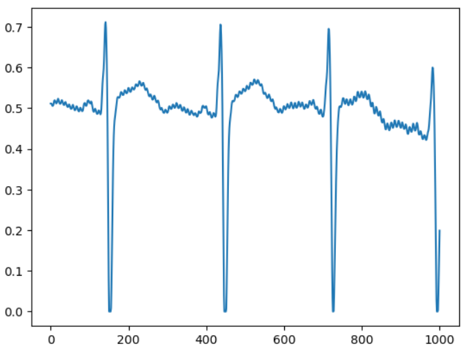

滤波后的信号图：

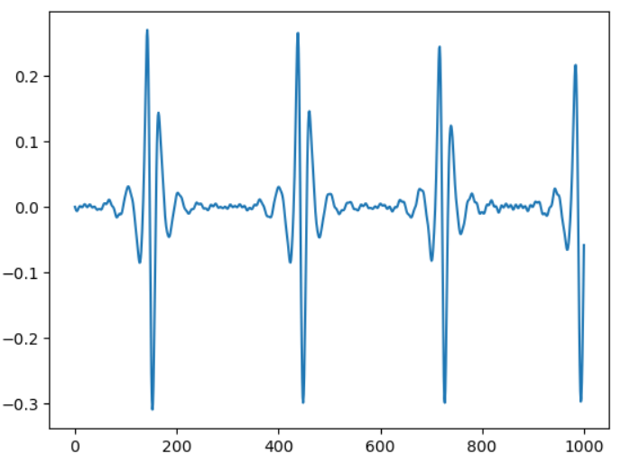