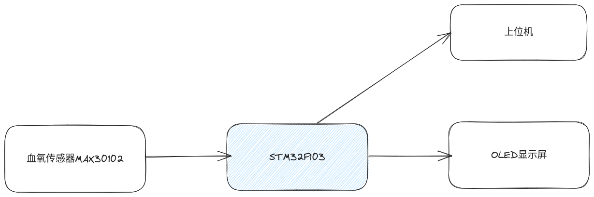
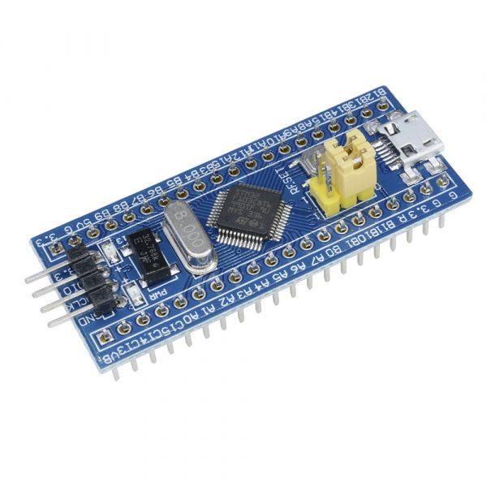
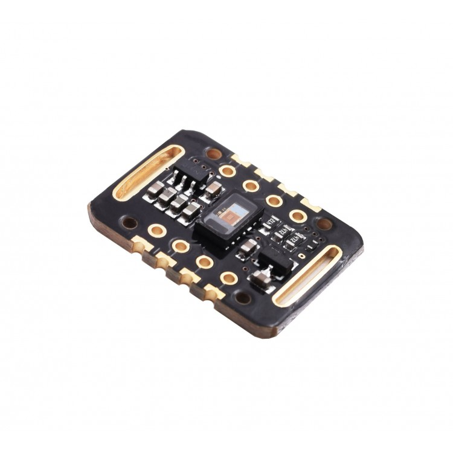
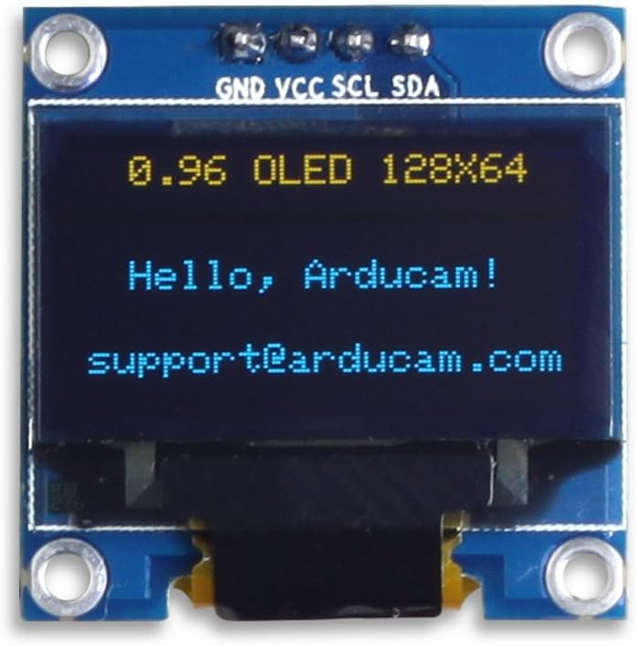
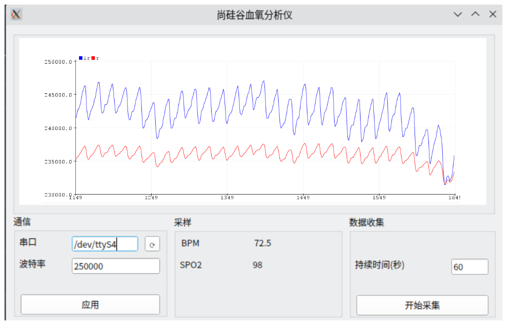

---
title: 血氧监测仪项目
author: 尚硅谷研究院
date: '版本: V1.0'
...

# 项目简介

血氧监测仪是一种医疗设备，用于实时测量人体血液中的氧气饱和度和脉搏率。这种设备对于监测患者的血氧水平以及评估心肺功能至关重要。血氧监测仪可以帮助医生及时了解患者的生命体征，为治疗提供重要的参考依据。此外，血氧监测仪在家庭护理、运动健康和高原地区等多个领域也有广泛应用。

# 市场产品和前景

市场上的血氧监测仪产品种类繁多，包括指夹式血氧仪、手持式血氧仪、耳夹式血氧仪等。这些产品根据使用场景和需求，具有不同的特点和优势。

1. 指夹式血氧仪：便携、易用，适合家庭护理和个人使用。通过将设备夹在手指上，用户可以快速获取血氧饱和度和脉搏率数据。

2. 手持式血氧仪：功能强大，适合医疗机构使用。除了测量血氧饱和度和脉搏率外，还可以记录数据、设置报警等。

3. 耳夹式血氧仪：适用于特殊人群（如新生儿）或特殊场景（如手术室）。通过夹在耳朵上进行测量，以减少干扰和提高准确性。

随着人们对健康的关注度不断提高，血氧监测仪市场前景广阔。预计未来几年，市场规模将持续增长，新产品和技术也将不断涌现。此外，随着物联网技术的发展，智能化、远程监测等功能有望成为血氧监测仪的新趋势，为用户带来更便捷、更高效的体验。

# 项目架构图

我们使用 MAX30102 血氧传感器采集血氧数据，然后将数据发送到 STM32F103 单片机，然后由单片机将数据显示在外置的OLED显示屏和上位机。

# 项目模块

1. STM32F103 开发板

2. MAX30102 血氧传感器模块

3. OLED 12864 显示屏模块

# 项目实现功能

- 熟悉STM32开发板
- 熟悉 IIC 协议
- 熟悉 SPI 协议
- 熟悉串口协议
- 编写针对MAX30102血氧传感器的驱动程序
- 编写针对 OLED 12864 显示屏的驱动程序
- 编写上位机图形化界面显示和分析数据

# 项目技能

- C语言编程
- Python语言编程
- MAX30102基础知识和模块驱动程序的编写
- OLED基础知识和模块驱动程序的编写
- 在单片机中进行数字信号处理(求平均值，滤波)
- 串口通信程序的编写
- PyQt5编写上位机图形化界面

# 项目成品

上位机

下位机

