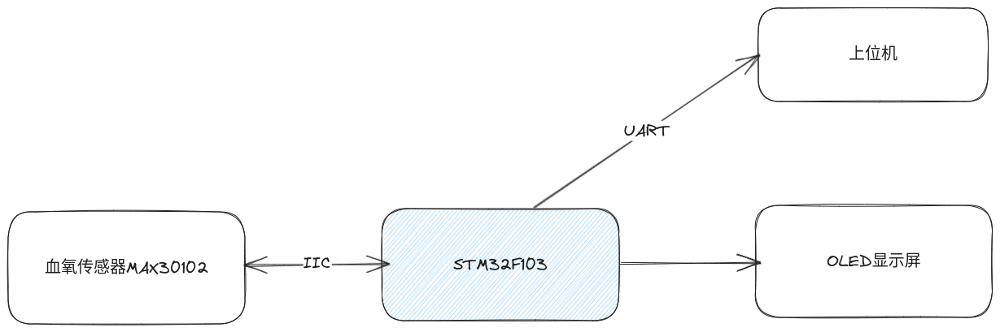

---
title: '血氧监测仪项目'
author: '尚硅谷研究院'
date: '版本: V1.0'
...

# 项目需求和技术选型

## 硬件选型

我们的需求是制作一个血氧监测仪。血氧监测仪需要以下一些硬件设备：

- 指压血氧传感器：用来采集血氧信号，我们选择最常用的MAX30102传感器。
- 单片机：我们选择最常用的 STM32F103 系列的单片机。用来读写MAX30102传感器。
- OLED: 用来显示被测人员的血氧数据。我们选择最常用的 12864 OLED 显示屏。

## 软件选型

- STM32CubeMX：用来产生样板代码。
- Clion/VSCode/Keil：用来开发单片机程序。

# 项目架构图



# 工具链

传统的 STM32 开发工具一般使用 Keil MDK-ARM IDE 来进行。但 Keil IDE 的编码体验非常糟糕（只支持 Windows 平台，代码高亮和补全都不好，经常误报错误和警告）。所以我们自己搭建一套开发体验（代码补全，高亮，提示，代码格式化等等）丝滑的工具链。选用的工具如下：

- STM32CubeMX：用来产生包含了 ST 官方 HAL 库的样板代码。非常的方便，基本上是开发 STM32 单片机程序的必备工具。[下载链接](https://www.st.com/zh/development-tools/stm32cubemx.html#overview)
- Clion/Visual Studio Code：用于开发单片机程序。
- openocd：开源的单片机程序烧写工具。[下载链接](https://gnutoolchains.com/arm-eabi/openocd/)。下载完解压之后，注意将 `bin` 文件夹的绝对路径添加到环境变量中。打开 PowerShell ，然后输入 `openocd -v` 确认安装成功。
- gcc-arm-none-eabi：开源的 ARM 指令集编译器。[下载链接](https://developer.arm.com/-/media/Files/downloads/gnu-rm/10.3-2021.10/gcc-arm-none-eabi-10.3-2021.10-win32.exe?rev=29bb46cfa0434fbda93abb33c1d480e6&hash=B2C5AAE07841929A0D0BF460896D6E52)。安装完之后，找到安装路径。然后将 `bin` 文件夹的绝对路径添加到环境变量中。打开 PowerShell ，然后输入 `arm-none-eabi-gcc.exe -v` 确认安装成功。

# 项目代码编写

## 使用 STM32CubeMX 生成的配置中断和外设初始化的代码

中断配置代码

`Core/Src/stm32f1xx_it.c`

```c
#include "main.h"
#include "stm32f1xx_it.h"

#include "max30102_for_stm32_hal.h"
extern max30102_t max30102;

/******************************************************************************/
/*           Cortex-M3 Processor Interruption and Exception Handlers          */
/******************************************************************************/
/**
 * @brief This function handles Non maskable interrupt.
 */
void NMI_Handler(void)
{
}

/**
 * @brief This function handles Hard fault interrupt.
 */
void HardFault_Handler(void)
{
  while (1)
  {
  }
}

/**
 * @brief This function handles Memory management fault.
 */
void MemManage_Handler(void)
{
  while (1)
  {
  }
}

/**
 * @brief This function handles Prefetch fault, memory access fault.
 */
void BusFault_Handler(void)
{
  while (1)
  {
  }
}

/**
 * @brief This function handles Undefined instruction or illegal state.
 */
void UsageFault_Handler(void)
{
  while (1)
  {
  }
}

/**
 * @brief This function handles System service call via SWI instruction.
 */
void SVC_Handler(void)
{
}

/**
 * @brief This function handles Debug monitor.
 */
void DebugMon_Handler(void)
{
}

/**
 * @brief This function handles Pendable request for system service.
 */
void PendSV_Handler(void)
{
}

/**
 * @brief This function handles System tick timer.
 */
void SysTick_Handler(void)
{
  HAL_IncTick();
}

/******************************************************************************/
/* STM32F1xx Peripheral Interrupt Handlers                                    */
/* Add here the Interrupt Handlers for the used peripherals.                  */
/* For the available peripheral interrupt handler names,                      */
/* please refer to the startup file (startup_stm32f1xx.s).                    */
/******************************************************************************/

/**
 * @brief This function handles EXTI line0 interrupt.
 */
void EXTI9_5_IRQHandler(void)
{
  max30102_on_interrupt(&max30102);
  HAL_GPIO_EXTI_IRQHandler(GPIO_PIN_9);
}
```

外设代码

`Core/Src/stm32f1xx_hal_msp.c`

```c
#include "main.h"

/**
 * Initializes the Global MSP.
 */
void HAL_MspInit(void)
{
  __HAL_RCC_AFIO_CLK_ENABLE();
  __HAL_RCC_PWR_CLK_ENABLE();
}

/**
 * @brief I2C MSP Initialization
 * This function configures the hardware resources used in this example
 * @param hi2c: I2C handle pointer
 * @retval None
 */
void HAL_I2C_MspInit(I2C_HandleTypeDef *hi2c)
{
  GPIO_InitTypeDef GPIO_InitStruct = {0};
  if (hi2c->Instance == I2C1)
  {
    __HAL_RCC_GPIOB_CLK_ENABLE();
    /**I2C1 GPIO Configuration
    PB6     ------> I2C1_SCL
    PB7     ------> I2C1_SDA
    */
    GPIO_InitStruct.Pin = GPIO_PIN_6 | GPIO_PIN_7;
    GPIO_InitStruct.Mode = GPIO_MODE_AF_OD;
    GPIO_InitStruct.Speed = GPIO_SPEED_FREQ_HIGH;
    HAL_GPIO_Init(GPIOB, &GPIO_InitStruct);

    /* Peripheral clock enable */
    __HAL_RCC_I2C1_CLK_ENABLE();
  }
}

/**
 * @brief I2C MSP De-Initialization
 * This function freeze the hardware resources used in this example
 * @param hi2c: I2C handle pointer
 * @retval None
 */
void HAL_I2C_MspDeInit(I2C_HandleTypeDef *hi2c)
{
  if (hi2c->Instance == I2C1)
  {
    /* Peripheral clock disable */
    __HAL_RCC_I2C1_CLK_DISABLE();

    /**I2C1 GPIO Configuration
    PB6     ------> I2C1_SCL
    PB7     ------> I2C1_SDA
    */
    HAL_GPIO_DeInit(GPIOB, GPIO_PIN_6);

    HAL_GPIO_DeInit(GPIOB, GPIO_PIN_7);
  }
}

/**
 * @brief UART MSP Initialization
 * This function configures the hardware resources used in this example
 * @param huart: UART handle pointer
 * @retval None
 */
void HAL_UART_MspInit(UART_HandleTypeDef *huart)
{
  GPIO_InitTypeDef GPIO_InitStruct = {0};
  if (huart->Instance == USART2)
  {
    /* Peripheral clock enable */
    __HAL_RCC_USART2_CLK_ENABLE();

    __HAL_RCC_GPIOA_CLK_ENABLE();
    /**USART2 GPIO Configuration
    PA2     ------> USART2_TX
    PA3     ------> USART2_RX
    */
    GPIO_InitStruct.Pin = GPIO_PIN_2;
    GPIO_InitStruct.Mode = GPIO_MODE_AF_PP;
    GPIO_InitStruct.Speed = GPIO_SPEED_FREQ_HIGH;
    HAL_GPIO_Init(GPIOA, &GPIO_InitStruct);

    GPIO_InitStruct.Pin = GPIO_PIN_3;
    GPIO_InitStruct.Mode = GPIO_MODE_INPUT;
    GPIO_InitStruct.Pull = GPIO_NOPULL;
    HAL_GPIO_Init(GPIOA, &GPIO_InitStruct);
  }
}

/**
 * @brief UART MSP De-Initialization
 * This function freeze the hardware resources used in this example
 * @param huart: UART handle pointer
 * @retval None
 */
void HAL_UART_MspDeInit(UART_HandleTypeDef *huart)
{
  if (huart->Instance == USART2)
  {
    /* Peripheral clock disable */
    __HAL_RCC_USART2_CLK_DISABLE();

    /**USART2 GPIO Configuration
    PA2     ------> USART2_TX
    PA3     ------> USART2_RX
    */
    HAL_GPIO_DeInit(GPIOA, GPIO_PIN_2 | GPIO_PIN_3);
  }
}
```

## MAX30102驱动的编写

先来编写驱动程序的头文件，定义了一些宏定义和函数原型。

`Core/Inc/max30102_for_stm32_hal.h`

```c
#ifndef MAX30102_FOR_STM32_HAL_H
#define MAX30102_FOR_STM32_HAL_H

#include "main.h"
#include <stdint.h>
#include <string.h>
#include <stdlib.h>
#include <string.h>

#define MAX30102_I2C_ADDR 0x57
#define MAX30102_I2C_TIMEOUT 1000

#define MAX30102_BYTES_PER_SAMPLE 6
#define MAX30102_SAMPLE_LEN_MAX 32

#define MAX30102_INTERRUPT_STATUS_1 0x00
#define MAX30102_INTERRUPT_STATUS_2 0x01
#define MAX30102_INTERRUPT_ENABLE_1 0x02
#define MAX30102_INTERRUPT_ENABLE_2 0x03
#define MAX30102_INTERRUPT_A_FULL 7
#define MAX30102_INTERRUPT_PPG_RDY 6
#define MAX30102_INTERRUPT_ALC_OVF 5
#define MAX30102_INTERRUPT_DIE_TEMP_RDY 1

#define MAX30102_FIFO_WR_PTR 0x04
#define MAX30102_OVF_COUNTER 0x05
#define MAX30102_FIFO_RD_PTR 0x06

#define MAX30102_FIFO_DATA 0x07

#define MAX30102_FIFO_CONFIG 0x08
#define MAX30102_FIFO_CONFIG_SMP_AVE 5
#define MAX30102_FIFO_CONFIG_ROLL_OVER_EN 4
#define MAX30102_FIFO_CONFIG_FIFO_A_FULL 0

#define MAX30102_MODE_CONFIG 0x09
#define MAX30102_MODE_SHDN 7
#define MAX30102_MODE_RESET 6
#define MAX30102_MODE_MODE 0

#define MAX30102_SPO2_CONFIG 0x0a
#define MAX30102_SPO2_ADC_RGE 5
#define MAX30102_SPO2_SR 2
#define MAX30102_SPO2_LEW_PW 0

#define MAX30102_LED_IR_PA1 0x0c
#define MAX30102_LED_RED_PA2 0x0d

#define MAX30102_MULTI_LED_CTRL_1 0x11
#define MAX30102_MULTI_LED_CTRL_SLOT2 4
#define MAX30102_MULTI_LED_CTRL_SLOT1 0
#define MAX30102_MULTI_LED_CTRL_2 0x12
#define MAX30102_MULTI_LED_CTRL_SLOT4 4
#define MAX30102_MULTI_LED_CTRL_SLOT3 0

#define MAX30102_DIE_TINT 0x1f
#define MAX30102_DIE_TFRAC 0x20
#define MAX30102_DIE_TFRAC_INCREMENT 0.0625f
#define MAX30102_DIE_TEMP_CONFIG 0x21
#define MAX30102_DIE_TEMP_EN 1

typedef enum max30102_mode_t
{
    max30102_heart_rate = 0x02,
    max30102_spo2 = 0x03,
    max30102_multi_led = 0x07
} max30102_mode_t;

typedef enum max30102_smp_ave_t
{
    max30102_smp_ave_1,
    max30102_smp_ave_2,
    max30102_smp_ave_4,
    max30102_smp_ave_8,
    max30102_smp_ave_16,
    max30102_smp_ave_32,
} max30102_smp_ave_t;

typedef enum max30102_sr_t
{
    max30102_sr_50,
    max30102_sr_100,
    max30102_sr_200,
    max30102_sr_400,
    max30102_sr_800,
    max30102_sr_1000,
    max30102_sr_1600,
    max30102_sr_3200
} max30102_sr_t;

typedef enum max30102_led_pw_t
{
    max30102_pw_15_bit,
    max30102_pw_16_bit,
    max30102_pw_17_bit,
    max30102_pw_18_bit
} max30102_led_pw_t;

typedef enum max30102_adc_t
{
    max30102_adc_2048,
    max30102_adc_4096,
    max30102_adc_8192,
    max30102_adc_16384
} max30102_adc_t;

typedef enum max30102_multi_led_ctrl_t
{
    max30102_led_off,
    max30102_led_red,
    max30102_led_ir
} max30102_multi_led_ctrl_t;

typedef struct max30102_t
{
    I2C_HandleTypeDef *_ui2c;
    uint32_t _ir_samples[32];
    uint32_t _red_samples[32];
    uint8_t _interrupt_flag;
} max30102_t;

void max30102_plot(uint32_t ir_sample, uint32_t red_sample);

void max30102_init(max30102_t *obj, I2C_HandleTypeDef *hi2c);
void max30102_write(max30102_t *obj, uint8_t reg, uint8_t *buf, uint16_t buflen);
void max30102_read(max30102_t *obj, uint8_t reg, uint8_t *buf, uint16_t buflen);

void max30102_reset(max30102_t *obj);

void max30102_set_a_full(max30102_t *obj, uint8_t enable);
void max30102_set_ppg_rdy(max30102_t *obj, uint8_t enable);
void max30102_set_alc_ovf(max30102_t *obj, uint8_t enable);
void max30102_set_die_temp_rdy(max30102_t *obj, uint8_t enable);
void max30102_set_die_temp_en(max30102_t *obj, uint8_t enable);

void max30102_on_interrupt(max30102_t *obj);
uint8_t max30102_has_interrupt(max30102_t *obj);
void max30102_interrupt_handler(max30102_t *obj);

void max30102_shutdown(max30102_t *obj, uint8_t shdn);

void max30102_set_mode(max30102_t *obj, max30102_mode_t mode);
void max30102_set_sampling_rate(max30102_t *obj, max30102_sr_t sr);

void max30102_set_led_pulse_width(max30102_t *obj, max30102_led_pw_t pw);
void max30102_set_adc_resolution(max30102_t *obj, max30102_adc_t adc);

void max30102_set_led_current_1(max30102_t *obj, float ma);
void max30102_set_led_current_2(max30102_t *obj, float ma);
void max30102_set_multi_led_slot_1_2(max30102_t *obj, max30102_multi_led_ctrl_t slot1, max30102_multi_led_ctrl_t slot2);
void max30102_set_multi_led_slot_3_4(max30102_t *obj, max30102_multi_led_ctrl_t slot3, max30102_multi_led_ctrl_t slot4);

void max30102_set_fifo_config(max30102_t *obj, max30102_smp_ave_t smp_ave, uint8_t roll_over_en, uint8_t fifo_a_full);
void max30102_clear_fifo(max30102_t *obj);
void max30102_read_fifo(max30102_t *obj);

void max30102_read_temp(max30102_t *obj, int8_t *temp_int, uint8_t *temp_frac);

#endif
```

然后编写头文件对应的 C 语言代码。

`Core/Src/max30102_for_stm32_hal.c`

```c
#include "max30102_for_stm32_hal.h"
#include <stdio.h>

#ifdef __cplusplus
extern "C"
{
#endif

/**
 * @brief Built-in plotting function. Called during an interrupt to print/plot the current sample.
 * @note Override this in your main.c if you do not use printf() for printing.
 * @param ir_sample
 * @param red_sample
 */
__weak void max30102_plot(uint32_t ir_sample, uint32_t red_sample)
{
    UNUSED(ir_sample);
    UNUSED(red_sample);
}

/**
 * @brief MAX30102 initiation function.
 *
 * @param obj Pointer to max30102_t object instance.
 * @param hi2c Pointer to I2C object handle
 */
void max30102_init(max30102_t *obj, I2C_HandleTypeDef *hi2c)
{
    obj->_ui2c = hi2c;
    obj->_interrupt_flag = 0;
    memset(obj->_ir_samples, 0, MAX30102_SAMPLE_LEN_MAX * sizeof(uint32_t));
    memset(obj->_red_samples, 0, MAX30102_SAMPLE_LEN_MAX * sizeof(uint32_t));
}

/**
 * @brief Write buffer of buflen bytes to a register of the MAX30102.
 *
 * @param obj Pointer to max30102_t object instance.
 * @param reg Register address to write to.
 * @param buf Pointer containing the bytes to write.
 * @param buflen Number of bytes to write.
 */
void max30102_write(max30102_t *obj, uint8_t reg, uint8_t *buf, uint16_t buflen)
{
    uint8_t *payload = (uint8_t *)malloc((buflen + 1) * sizeof(uint8_t));
    *payload = reg;
    if (buf != NULL && buflen != 0)
        memcpy(payload + 1, buf, buflen);
    HAL_I2C_Master_Transmit(obj->_ui2c, MAX30102_I2C_ADDR << 1, payload, buflen + 1, MAX30102_I2C_TIMEOUT);
    free(payload);
}

/**
 * @brief Read buflen bytes from a register of the MAX30102 and store to buffer.
 *
 * @param obj Pointer to max30102_t object instance.
 * @param reg Register address to read from.
 * @param buf Pointer to the array to write to.
 * @param buflen Number of bytes to read.
 */
void max30102_read(max30102_t *obj, uint8_t reg, uint8_t *buf, uint16_t buflen)
{
    uint8_t reg_addr = reg;
    HAL_I2C_Master_Transmit(obj->_ui2c, MAX30102_I2C_ADDR << 1, &reg_addr, 1, MAX30102_I2C_TIMEOUT);
    HAL_I2C_Master_Receive(obj->_ui2c, MAX30102_I2C_ADDR << 1, buf, buflen, MAX30102_I2C_TIMEOUT);
}

/**
 * @brief Reset the sensor.
 *
 * @param obj Pointer to max30102_t object instance.
 */
void max30102_reset(max30102_t *obj)
{
    uint8_t val = 0x40;
    max30102_write(obj, MAX30102_MODE_CONFIG, &val, 1);
}

/**
 * @brief Enable A_FULL interrupt.
 *
 * @param obj Pointer to max30102_t object instance.
 * @param enable Enable (1) or disable (0).
 */
void max30102_set_a_full(max30102_t *obj, uint8_t enable)
{
    uint8_t reg = 0;
    max30102_read(obj, MAX30102_INTERRUPT_ENABLE_1, &reg, 1);
    reg &= ~(0x01 << MAX30102_INTERRUPT_A_FULL);
    reg |= ((enable & 0x01) << MAX30102_INTERRUPT_A_FULL);
    max30102_write(obj, MAX30102_INTERRUPT_ENABLE_1, &reg, 1);
}

/**
 * @brief Enable PPG_RDY interrupt.
 *
 * @param obj Pointer to max30102_t object instance.
 * @param enable Enable (1) or disable (0).
 */
void max30102_set_ppg_rdy(max30102_t *obj, uint8_t enable)
{
    uint8_t reg = 0;
    max30102_read(obj, MAX30102_INTERRUPT_ENABLE_1, &reg, 1);
    reg &= ~(0x01 << MAX30102_INTERRUPT_PPG_RDY);
    reg |= ((enable & 0x01) << MAX30102_INTERRUPT_PPG_RDY);
    max30102_write(obj, MAX30102_INTERRUPT_ENABLE_1, &reg, 1);
}

/**
 * @brief Enable ALC_OVF interrupt.
 *
 * @param obj Pointer to max30102_t object instance.
 * @param enable Enable (1) or disable (0).
 */
void max30102_set_alc_ovf(max30102_t *obj, uint8_t enable)
{
    uint8_t reg = 0;
    max30102_read(obj, MAX30102_INTERRUPT_ENABLE_1, &reg, 1);
    reg &= ~(0x01 << MAX30102_INTERRUPT_ALC_OVF);
    reg |= ((enable & 0x01) << MAX30102_INTERRUPT_ALC_OVF);
    max30102_write(obj, MAX30102_INTERRUPT_ENABLE_1, &reg, 1);
}

/**
 * @brief Enable DIE_TEMP_RDY interrupt.
 *
 * @param obj Pointer to max30102_t object instance.
 * @param enable Enable (1) or disable (0).
 */
void max30102_set_die_temp_rdy(max30102_t *obj, uint8_t enable)
{
    uint8_t reg = (enable & 0x01) << MAX30102_INTERRUPT_DIE_TEMP_RDY;
    max30102_write(obj, MAX30102_INTERRUPT_ENABLE_2, &reg, 1);
}

/**
 * @brief Enable temperature measurement.
 *
 * @param obj Pointer to max30102_t object instance.
 * @param enable Enable (1) or disable (0).
 */
void max30102_set_die_temp_en(max30102_t *obj, uint8_t enable)
{
    uint8_t reg = (enable & 0x01) << MAX30102_DIE_TEMP_EN;
    max30102_write(obj, MAX30102_DIE_TEMP_CONFIG, &reg, 1);
}

/**
 * @brief Set interrupt flag on interrupt. To be called in the corresponding external interrupt handler.
 *
 * @param obj Pointer to max30102_t object instance.
 */
void max30102_on_interrupt(max30102_t *obj)
{
    obj->_interrupt_flag = 1;
}

/**
 * @brief Check whether the interrupt flag is active.
 *
 * @param obj Pointer to max30102_t object instance.
 * @return uint8_t Active (1) or inactive (0).
 */
uint8_t max30102_has_interrupt(max30102_t *obj)
{
    return obj->_interrupt_flag;
}

/**
 * @brief Read interrupt status registers (0x00 and 0x01) and perform corresponding tasks.
 *
 * @param obj Pointer to max30102_t object instance.
 */
void max30102_interrupt_handler(max30102_t *obj)
{
    uint8_t reg[2] = {0x00};
    // Interrupt flag in registers 0x00 and 0x01 are cleared on read
    max30102_read(obj, MAX30102_INTERRUPT_STATUS_1, reg, 2);

    if ((reg[0] >> MAX30102_INTERRUPT_A_FULL) & 0x01)
    {
        // FIFO almost full
        max30102_read_fifo(obj);
    }

    if ((reg[0] >> MAX30102_INTERRUPT_PPG_RDY) & 0x01)
    {
        // New FIFO data ready
    }

    if ((reg[0] >> MAX30102_INTERRUPT_ALC_OVF) & 0x01)
    {
        // Ambient light overflow
    }

    if ((reg[1] >> MAX30102_INTERRUPT_DIE_TEMP_RDY) & 0x01)
    {
        // Temperature data ready
        int8_t temp_int;
        uint8_t temp_frac;
        max30102_read_temp(obj, &temp_int, &temp_frac);
        // float temp = temp_int + 0.0625f * temp_frac;
    }

    // Reset interrupt flag
    obj->_interrupt_flag = 0;
}

/**
 * @brief Shutdown the sensor.
 *
 * @param obj Pointer to max30102_t object instance.
 * @param shdn Shutdown bit.
 */
void max30102_shutdown(max30102_t *obj, uint8_t shdn)
{
    uint8_t config;
    max30102_read(obj, MAX30102_MODE_CONFIG, &config, 1);
    config = (config & 0x7f) | (shdn << MAX30102_MODE_SHDN);
    max30102_write(obj, MAX30102_MODE_CONFIG, &config, 1);
}

/**
 * @brief Set measurement mode.
 *
 * @param obj Pointer to max30102_t object instance.
 * @param mode Measurement mode enum (max30102_mode_t).
 */
void max30102_set_mode(max30102_t *obj, max30102_mode_t mode)
{
    uint8_t config;
    max30102_read(obj, MAX30102_MODE_CONFIG, &config, 1);
    config = (config & 0xf8) | mode;
    max30102_write(obj, MAX30102_MODE_CONFIG, &config, 1);
    max30102_clear_fifo(obj);
}

/**
 * @brief Set sampling rate.
 *
 * @param obj Pointer to max30102_t object instance.
 * @param sr Sampling rate enum (max30102_spo2_st_t).
 */
void max30102_set_sampling_rate(max30102_t *obj, max30102_sr_t sr)
{
    uint8_t config;
    max30102_read(obj, MAX30102_SPO2_CONFIG, &config, 1);
    config = (config & 0x63) << MAX30102_SPO2_SR;
    max30102_write(obj, MAX30102_SPO2_CONFIG, &config, 1);
}

/**
 * @brief Set led pulse width.
 *
 * @param obj Pointer to max30102_t object instance.
 * @param pw Pulse width enum (max30102_led_pw_t).
 */
void max30102_set_led_pulse_width(max30102_t *obj, max30102_led_pw_t pw)
{
    uint8_t config;
    max30102_read(obj, MAX30102_SPO2_CONFIG, &config, 1);
    config = (config & 0x7c) | (pw << MAX30102_SPO2_LEW_PW);
    max30102_write(obj, MAX30102_SPO2_CONFIG, &config, 1);
}

/**
 * @brief Set ADC resolution.
 *
 * @param obj Pointer to max30102_t object instance.
 * @param adc ADC resolution enum (max30102_adc_t).
 */
void max30102_set_adc_resolution(max30102_t *obj, max30102_adc_t adc)
{
    uint8_t config;
    max30102_read(obj, MAX30102_SPO2_CONFIG, &config, 1);
    config = (config & 0x1f) | (adc << MAX30102_SPO2_ADC_RGE);
    max30102_write(obj, MAX30102_SPO2_CONFIG, &config, 1);
}

/**
 * @brief Set LED current.
 *
 * @param obj Pointer to max30102_t object instance.
 * @param ma LED current float (0 < ma < 51.0).
 */
void max30102_set_led_current_1(max30102_t *obj, float ma)
{
    uint8_t pa = ma / 0.2;
    max30102_write(obj, MAX30102_LED_IR_PA1, &pa, 1);
}

/**
 * @brief Set LED current.
 *
 * @param obj Pointer to max30102_t object instance.
 * @param ma LED current float (0 < ma < 51.0).
 */
void max30102_set_led_current_2(max30102_t *obj, float ma)
{
    uint8_t pa = ma / 0.2;
    max30102_write(obj, MAX30102_LED_RED_PA2, &pa, 1);
}

/**
 * @brief Set slot mode when in multi-LED mode.
 *
 * @param obj Pointer to max30102_t object instance.
 * @param slot1 Slot 1 mode enum (max30102_multi_led_ctrl_t).
 * @param slot2 Slot 2 mode enum (max30102_multi_led_ctrl_t).
 */
void max30102_set_multi_led_slot_1_2(max30102_t *obj, max30102_multi_led_ctrl_t slot1, max30102_multi_led_ctrl_t slot2)
{
    uint8_t val = 0;
    val |= ((slot1 << MAX30102_MULTI_LED_CTRL_SLOT1) | (slot2 << MAX30102_MULTI_LED_CTRL_SLOT2));
    max30102_write(obj, MAX30102_MULTI_LED_CTRL_1, &val, 1);
}

/**
 * @brief Set slot mode when in multi-LED mode.
 *
 * @param obj Pointer to max30102_t object instance.
 * @param slot1 Slot 1 mode enum (max30102_multi_led_ctrl_t).
 * @param slot2 Slot 2 mode enum (max30102_multi_led_ctrl_t).
 */
void max30102_set_multi_led_slot_3_4(max30102_t *obj, max30102_multi_led_ctrl_t slot3, max30102_multi_led_ctrl_t slot4)
{
    uint8_t val = 0;
    val |= ((slot3 << MAX30102_MULTI_LED_CTRL_SLOT3) | (slot4 << MAX30102_MULTI_LED_CTRL_SLOT4));
    max30102_write(obj, MAX30102_MULTI_LED_CTRL_2, &val, 1);
}

/**
 * @brief
 *
 * @param obj Pointer to max30102_t object instance.
 * @param smp_ave
 * @param roll_over_en Roll over enabled(1) or disabled(0).
 * @param fifo_a_full Number of empty samples when A_FULL interrupt issued (0 < fifo_a_full < 15).
 */
void max30102_set_fifo_config(max30102_t *obj, max30102_smp_ave_t smp_ave, uint8_t roll_over_en, uint8_t fifo_a_full)
{
    uint8_t config = 0x00;
    config |= smp_ave << MAX30102_FIFO_CONFIG_SMP_AVE;
    config |= ((roll_over_en & 0x01) << MAX30102_FIFO_CONFIG_ROLL_OVER_EN);
    config |= ((fifo_a_full & 0x0f) << MAX30102_FIFO_CONFIG_FIFO_A_FULL);
    max30102_write(obj, MAX30102_FIFO_CONFIG, &config, 1);
}

/**
 * @brief Clear all FIFO pointers in the sensor.
 *
 * @param obj Pointer to max30102_t object instance.
 */
void max30102_clear_fifo(max30102_t *obj)
{
    uint8_t val = 0x00;
    max30102_write(obj, MAX30102_FIFO_WR_PTR, &val, 3);
    max30102_write(obj, MAX30102_FIFO_RD_PTR, &val, 3);
    max30102_write(obj, MAX30102_OVF_COUNTER, &val, 3);
}

/**
 * @brief Read FIFO content and store to buffer in max30102_t object instance.
 *
 * @param obj Pointer to max30102_t object instance.
 */
void max30102_read_fifo(max30102_t *obj)
{
    // First transaction: Get the FIFO_WR_PTR
    uint8_t wr_ptr = 0, rd_ptr = 0;
    max30102_read(obj, MAX30102_FIFO_WR_PTR, &wr_ptr, 1);
    max30102_read(obj, MAX30102_FIFO_RD_PTR, &rd_ptr, 1);

    int8_t num_samples;

    num_samples = (int8_t)wr_ptr - (int8_t)rd_ptr;
    if (num_samples < 1)
    {
        num_samples += 32;
    }

    // Second transaction: Read NUM_SAMPLES_TO_READ samples from the FIFO
    for (int8_t i = 0; i < num_samples; i++)
    {
        uint8_t sample[6];
        max30102_read(obj, MAX30102_FIFO_DATA, sample, 6);
        uint32_t ir_sample = ((uint32_t)(sample[0] << 16) | (uint32_t)(sample[1] << 8) | (uint32_t)(sample[2])) & 0x3ffff;
        uint32_t red_sample = ((uint32_t)(sample[3] << 16) | (uint32_t)(sample[4] << 8) | (uint32_t)(sample[5])) & 0x3ffff;
        obj->_ir_samples[i] = ir_sample;
        obj->_red_samples[i] = red_sample;
        max30102_plot(ir_sample, red_sample);
    }
}

/**
 * @brief Read die temperature.
 *
 * @param obj Pointer to max30102_t object instance.
 * @param temp_int Pointer to store the integer part of temperature. Stored in 2's complement format.
 * @param temp_frac Pointer to store the fractional part of temperature. Increments of 0.0625 deg C.
 */

void max30102_read_temp(max30102_t *obj, int8_t *temp_int, uint8_t *temp_frac)
{
    max30102_read(obj, MAX30102_DIE_TINT, (uint8_t *)temp_int, 1);
    max30102_read(obj, MAX30102_DIE_TFRAC, temp_frac, 1);
}

#ifdef __cplusplus
}
#endif
```

这样，驱动MAX30102的代码就已经写完了。

## OLED驱动的编写

首先编写所需的字体文件，我们这里提供一份 ascii 编码也就是英文字母的字体文件。

`Core/Inc/oledfont.h`

```c
#ifndef __OLEDFONT_H
#define __OLEDFONT_H

/* 常用ASCII表
 * 偏移量32
 * ASCII字符集: !"#$%&'()*+,-./0123456789:;<=>?@ABCDEFGHIJKLMNOPQRSTUVWXYZ[\]^_`abcdefghijklmnopqrstuvwxyz{|}~
 * PC2LCD2002取模方式设置：阴码+逐列式+顺向+C51格式
 * 总共：3个字符集（12*12、16*16和24*24），用户可以自行新增其他分辨率的字符集。
 * 每个字符所占用的字节数为:(size/8+((size%8)?1:0))*(size/2),其中size:是字库生成时的点阵大小(12/16/24...)
 */

/* 12*12 ASCII字符集点阵 */
const unsigned char oled_asc2_1206[95][12] = {
    {0x00, 0x00, 0x00, 0x00, 0x00, 0x00, 0x00, 0x00, 0x00, 0x00, 0x00, 0x00}, /*" ",0*/
    {0x00, 0x00, 0x00, 0x00, 0x3F, 0x40, 0x00, 0x00, 0x00, 0x00, 0x00, 0x00}, /*"!",1*/
    {0x00, 0x00, 0x30, 0x00, 0x40, 0x00, 0x30, 0x00, 0x40, 0x00, 0x00, 0x00}, /*""",2*/
    {0x09, 0x00, 0x0B, 0xC0, 0x3D, 0x00, 0x0B, 0xC0, 0x3D, 0x00, 0x09, 0x00}, /*"#",3*/
    {0x18, 0xC0, 0x24, 0x40, 0x7F, 0xE0, 0x22, 0x40, 0x31, 0x80, 0x00, 0x00}, /*"$",4*/
    {0x18, 0x00, 0x24, 0xC0, 0x1B, 0x00, 0x0D, 0x80, 0x32, 0x40, 0x01, 0x80}, /*"%",5*/
    {0x03, 0x80, 0x1C, 0x40, 0x27, 0x40, 0x1C, 0x80, 0x07, 0x40, 0x00, 0x40}, /*"&",6*/
    {0x10, 0x00, 0x60, 0x00, 0x00, 0x00, 0x00, 0x00, 0x00, 0x00, 0x00, 0x00}, /*"'",7*/
    {0x00, 0x00, 0x00, 0x00, 0x00, 0x00, 0x1F, 0x80, 0x20, 0x40, 0x40, 0x20}, /*"(",8*/
    {0x00, 0x00, 0x40, 0x20, 0x20, 0x40, 0x1F, 0x80, 0x00, 0x00, 0x00, 0x00}, /*")",9*/
    {0x09, 0x00, 0x06, 0x00, 0x1F, 0x80, 0x06, 0x00, 0x09, 0x00, 0x00, 0x00}, /*"*",10*/
    {0x04, 0x00, 0x04, 0x00, 0x3F, 0x80, 0x04, 0x00, 0x04, 0x00, 0x00, 0x00}, /*"+",11*/
    {0x00, 0x10, 0x00, 0x60, 0x00, 0x00, 0x00, 0x00, 0x00, 0x00, 0x00, 0x00}, /*",",12*/
    {0x04, 0x00, 0x04, 0x00, 0x04, 0x00, 0x04, 0x00, 0x04, 0x00, 0x00, 0x00}, /*"-",13*/
    {0x00, 0x00, 0x00, 0x40, 0x00, 0x00, 0x00, 0x00, 0x00, 0x00, 0x00, 0x00}, /*".",14*/
    {0x00, 0x20, 0x01, 0xC0, 0x06, 0x00, 0x38, 0x00, 0x40, 0x00, 0x00, 0x00}, /*"/",15*/
    {0x1F, 0x80, 0x20, 0x40, 0x20, 0x40, 0x20, 0x40, 0x1F, 0x80, 0x00, 0x00}, /*"0",16*/
    {0x00, 0x00, 0x10, 0x40, 0x3F, 0xC0, 0x00, 0x40, 0x00, 0x00, 0x00, 0x00}, /*"1",17*/
    {0x18, 0xC0, 0x21, 0x40, 0x22, 0x40, 0x24, 0x40, 0x18, 0x40, 0x00, 0x00}, /*"2",18*/
    {0x10, 0x80, 0x20, 0x40, 0x24, 0x40, 0x24, 0x40, 0x1B, 0x80, 0x00, 0x00}, /*"3",19*/
    {0x02, 0x00, 0x0D, 0x00, 0x11, 0x00, 0x3F, 0xC0, 0x01, 0x40, 0x00, 0x00}, /*"4",20*/
    {0x3C, 0x80, 0x24, 0x40, 0x24, 0x40, 0x24, 0x40, 0x23, 0x80, 0x00, 0x00}, /*"5",21*/
    {0x1F, 0x80, 0x24, 0x40, 0x24, 0x40, 0x34, 0x40, 0x03, 0x80, 0x00, 0x00}, /*"6",22*/
    {0x30, 0x00, 0x20, 0x00, 0x27, 0xC0, 0x38, 0x00, 0x20, 0x00, 0x00, 0x00}, /*"7",23*/
    {0x1B, 0x80, 0x24, 0x40, 0x24, 0x40, 0x24, 0x40, 0x1B, 0x80, 0x00, 0x00}, /*"8",24*/
    {0x1C, 0x00, 0x22, 0xC0, 0x22, 0x40, 0x22, 0x40, 0x1F, 0x80, 0x00, 0x00}, /*"9",25*/
    {0x00, 0x00, 0x00, 0x00, 0x08, 0x40, 0x00, 0x00, 0x00, 0x00, 0x00, 0x00}, /*":",26*/
    {0x00, 0x00, 0x00, 0x00, 0x04, 0x60, 0x00, 0x00, 0x00, 0x00, 0x00, 0x00}, /*";",27*/
    {0x00, 0x00, 0x04, 0x00, 0x0A, 0x00, 0x11, 0x00, 0x20, 0x80, 0x40, 0x40}, /*"<",28*/
    {0x09, 0x00, 0x09, 0x00, 0x09, 0x00, 0x09, 0x00, 0x09, 0x00, 0x00, 0x00}, /*"=",29*/
    {0x00, 0x00, 0x40, 0x40, 0x20, 0x80, 0x11, 0x00, 0x0A, 0x00, 0x04, 0x00}, /*">",30*/
    {0x18, 0x00, 0x20, 0x00, 0x23, 0x40, 0x24, 0x00, 0x18, 0x00, 0x00, 0x00}, /*"?",31*/
    {0x1F, 0x80, 0x20, 0x40, 0x27, 0x40, 0x29, 0x40, 0x1F, 0x40, 0x00, 0x00}, /*"@",32*/
    {0x00, 0x40, 0x07, 0xC0, 0x39, 0x00, 0x0F, 0x00, 0x01, 0xC0, 0x00, 0x40}, /*"A",33*/
    {0x20, 0x40, 0x3F, 0xC0, 0x24, 0x40, 0x24, 0x40, 0x1B, 0x80, 0x00, 0x00}, /*"B",34*/
    {0x1F, 0x80, 0x20, 0x40, 0x20, 0x40, 0x20, 0x40, 0x30, 0x80, 0x00, 0x00}, /*"C",35*/
    {0x20, 0x40, 0x3F, 0xC0, 0x20, 0x40, 0x20, 0x40, 0x1F, 0x80, 0x00, 0x00}, /*"D",36*/
    {0x20, 0x40, 0x3F, 0xC0, 0x24, 0x40, 0x2E, 0x40, 0x30, 0xC0, 0x00, 0x00}, /*"E",37*/
    {0x20, 0x40, 0x3F, 0xC0, 0x24, 0x40, 0x2E, 0x00, 0x30, 0x00, 0x00, 0x00}, /*"F",38*/
    {0x0F, 0x00, 0x10, 0x80, 0x20, 0x40, 0x22, 0x40, 0x33, 0x80, 0x02, 0x00}, /*"G",39*/
    {0x20, 0x40, 0x3F, 0xC0, 0x04, 0x00, 0x04, 0x00, 0x3F, 0xC0, 0x20, 0x40}, /*"H",40*/
    {0x20, 0x40, 0x20, 0x40, 0x3F, 0xC0, 0x20, 0x40, 0x20, 0x40, 0x00, 0x00}, /*"I",41*/
    {0x00, 0x60, 0x20, 0x20, 0x20, 0x20, 0x3F, 0xC0, 0x20, 0x00, 0x20, 0x00}, /*"J",42*/
    {0x20, 0x40, 0x3F, 0xC0, 0x24, 0x40, 0x0B, 0x00, 0x30, 0xC0, 0x20, 0x40}, /*"K",43*/
    {0x20, 0x40, 0x3F, 0xC0, 0x20, 0x40, 0x00, 0x40, 0x00, 0x40, 0x00, 0xC0}, /*"L",44*/
    {0x3F, 0xC0, 0x3C, 0x00, 0x03, 0xC0, 0x3C, 0x00, 0x3F, 0xC0, 0x00, 0x00}, /*"M",45*/
    {0x20, 0x40, 0x3F, 0xC0, 0x0C, 0x40, 0x23, 0x00, 0x3F, 0xC0, 0x20, 0x00}, /*"N",46*/
    {0x1F, 0x80, 0x20, 0x40, 0x20, 0x40, 0x20, 0x40, 0x1F, 0x80, 0x00, 0x00}, /*"O",47*/
    {0x20, 0x40, 0x3F, 0xC0, 0x24, 0x40, 0x24, 0x00, 0x18, 0x00, 0x00, 0x00}, /*"P",48*/
    {0x1F, 0x80, 0x21, 0x40, 0x21, 0x40, 0x20, 0xE0, 0x1F, 0xA0, 0x00, 0x00}, /*"Q",49*/
    {0x20, 0x40, 0x3F, 0xC0, 0x24, 0x40, 0x26, 0x00, 0x19, 0xC0, 0x00, 0x40}, /*"R",50*/
    {0x18, 0xC0, 0x24, 0x40, 0x24, 0x40, 0x22, 0x40, 0x31, 0x80, 0x00, 0x00}, /*"S",51*/
    {0x30, 0x00, 0x20, 0x40, 0x3F, 0xC0, 0x20, 0x40, 0x30, 0x00, 0x00, 0x00}, /*"T",52*/
    {0x20, 0x00, 0x3F, 0x80, 0x00, 0x40, 0x00, 0x40, 0x3F, 0x80, 0x20, 0x00}, /*"U",53*/
    {0x20, 0x00, 0x3E, 0x00, 0x01, 0xC0, 0x07, 0x00, 0x38, 0x00, 0x20, 0x00}, /*"V",54*/
    {0x38, 0x00, 0x07, 0xC0, 0x3C, 0x00, 0x07, 0xC0, 0x38, 0x00, 0x00, 0x00}, /*"W",55*/
    {0x20, 0x40, 0x39, 0xC0, 0x06, 0x00, 0x39, 0xC0, 0x20, 0x40, 0x00, 0x00}, /*"X",56*/
    {0x20, 0x00, 0x38, 0x40, 0x07, 0xC0, 0x38, 0x40, 0x20, 0x00, 0x00, 0x00}, /*"Y",57*/
    {0x30, 0x40, 0x21, 0xC0, 0x26, 0x40, 0x38, 0x40, 0x20, 0xC0, 0x00, 0x00}, /*"Z",58*/
    {0x00, 0x00, 0x00, 0x00, 0x7F, 0xE0, 0x40, 0x20, 0x40, 0x20, 0x00, 0x00}, /*"[",59*/
    {0x00, 0x00, 0x70, 0x00, 0x0C, 0x00, 0x03, 0x80, 0x00, 0x40, 0x00, 0x00}, /*"\",60*/
    {0x00, 0x00, 0x40, 0x20, 0x40, 0x20, 0x7F, 0xE0, 0x00, 0x00, 0x00, 0x00}, /*"]",61*/
    {0x00, 0x00, 0x20, 0x00, 0x40, 0x00, 0x20, 0x00, 0x00, 0x00, 0x00, 0x00}, /*"^",62*/
    {0x00, 0x10, 0x00, 0x10, 0x00, 0x10, 0x00, 0x10, 0x00, 0x10, 0x00, 0x10}, /*"_",63*/
    {0x00, 0x00, 0x00, 0x00, 0x40, 0x00, 0x00, 0x00, 0x00, 0x00, 0x00, 0x00}, /*"`",64*/
    {0x00, 0x00, 0x02, 0x80, 0x05, 0x40, 0x05, 0x40, 0x03, 0xC0, 0x00, 0x40}, /*"a",65*/
    {0x20, 0x00, 0x3F, 0xC0, 0x04, 0x40, 0x04, 0x40, 0x03, 0x80, 0x00, 0x00}, /*"b",66*/
    {0x00, 0x00, 0x03, 0x80, 0x04, 0x40, 0x04, 0x40, 0x06, 0x40, 0x00, 0x00}, /*"c",67*/
    {0x00, 0x00, 0x03, 0x80, 0x04, 0x40, 0x24, 0x40, 0x3F, 0xC0, 0x00, 0x40}, /*"d",68*/
    {0x00, 0x00, 0x03, 0x80, 0x05, 0x40, 0x05, 0x40, 0x03, 0x40, 0x00, 0x00}, /*"e",69*/
    {0x00, 0x00, 0x04, 0x40, 0x1F, 0xC0, 0x24, 0x40, 0x24, 0x40, 0x20, 0x00}, /*"f",70*/
    {0x00, 0x00, 0x02, 0xE0, 0x05, 0x50, 0x05, 0x50, 0x06, 0x50, 0x04, 0x20}, /*"g",71*/
    {0x20, 0x40, 0x3F, 0xC0, 0x04, 0x40, 0x04, 0x00, 0x03, 0xC0, 0x00, 0x40}, /*"h",72*/
    {0x00, 0x00, 0x04, 0x40, 0x27, 0xC0, 0x00, 0x40, 0x00, 0x00, 0x00, 0x00}, /*"i",73*/
    {0x00, 0x10, 0x00, 0x10, 0x04, 0x10, 0x27, 0xE0, 0x00, 0x00, 0x00, 0x00}, /*"j",74*/
    {0x20, 0x40, 0x3F, 0xC0, 0x01, 0x40, 0x07, 0x00, 0x04, 0xC0, 0x04, 0x40}, /*"k",75*/
    {0x20, 0x40, 0x20, 0x40, 0x3F, 0xC0, 0x00, 0x40, 0x00, 0x40, 0x00, 0x00}, /*"l",76*/
    {0x07, 0xC0, 0x04, 0x00, 0x07, 0xC0, 0x04, 0x00, 0x03, 0xC0, 0x00, 0x00}, /*"m",77*/
    {0x04, 0x40, 0x07, 0xC0, 0x04, 0x40, 0x04, 0x00, 0x03, 0xC0, 0x00, 0x40}, /*"n",78*/
    {0x00, 0x00, 0x03, 0x80, 0x04, 0x40, 0x04, 0x40, 0x03, 0x80, 0x00, 0x00}, /*"o",79*/
    {0x04, 0x10, 0x07, 0xF0, 0x04, 0x50, 0x04, 0x40, 0x03, 0x80, 0x00, 0x00}, /*"p",80*/
    {0x00, 0x00, 0x03, 0x80, 0x04, 0x40, 0x04, 0x50, 0x07, 0xF0, 0x00, 0x10}, /*"q",81*/
    {0x04, 0x40, 0x07, 0xC0, 0x02, 0x40, 0x04, 0x00, 0x04, 0x00, 0x00, 0x00}, /*"r",82*/
    {0x00, 0x00, 0x06, 0x40, 0x05, 0x40, 0x05, 0x40, 0x04, 0xC0, 0x00, 0x00}, /*"s",83*/
    {0x00, 0x00, 0x04, 0x00, 0x1F, 0x80, 0x04, 0x40, 0x00, 0x40, 0x00, 0x00}, /*"t",84*/
    {0x04, 0x00, 0x07, 0x80, 0x00, 0x40, 0x04, 0x40, 0x07, 0xC0, 0x00, 0x40}, /*"u",85*/
    {0x04, 0x00, 0x07, 0x00, 0x04, 0xC0, 0x01, 0x80, 0x06, 0x00, 0x04, 0x00}, /*"v",86*/
    {0x06, 0x00, 0x01, 0xC0, 0x07, 0x00, 0x01, 0xC0, 0x06, 0x00, 0x00, 0x00}, /*"w",87*/
    {0x04, 0x40, 0x06, 0xC0, 0x01, 0x00, 0x06, 0xC0, 0x04, 0x40, 0x00, 0x00}, /*"x",88*/
    {0x04, 0x10, 0x07, 0x10, 0x04, 0xE0, 0x01, 0x80, 0x06, 0x00, 0x04, 0x00}, /*"y",89*/
    {0x00, 0x00, 0x04, 0x40, 0x05, 0xC0, 0x06, 0x40, 0x04, 0x40, 0x00, 0x00}, /*"z",90*/
    {0x00, 0x00, 0x00, 0x00, 0x04, 0x00, 0x7B, 0xE0, 0x40, 0x20, 0x00, 0x00}, /*"{",91*/
    {0x00, 0x00, 0x00, 0x00, 0x00, 0x00, 0xFF, 0xF0, 0x00, 0x00, 0x00, 0x00}, /*"|",92*/
    {0x00, 0x00, 0x40, 0x20, 0x7B, 0xE0, 0x04, 0x00, 0x00, 0x00, 0x00, 0x00}, /*"}",93*/
    {0x40, 0x00, 0x80, 0x00, 0x40, 0x00, 0x20, 0x00, 0x20, 0x00, 0x40, 0x00}, /*"~",94*/
};

/* 16*16 ASCII字符集点阵 */
const unsigned char oled_asc2_1608[95][16] = {
    {0x00, 0x00, 0x00, 0x00, 0x00, 0x00, 0x00, 0x00, 0x00, 0x00, 0x00, 0x00, 0x00, 0x00, 0x00, 0x00}, /*" ",0*/
    {0x00, 0x00, 0x00, 0x00, 0x00, 0x00, 0x1F, 0xCC, 0x00, 0x0C, 0x00, 0x00, 0x00, 0x00, 0x00, 0x00}, /*"!",1*/
    {0x00, 0x00, 0x08, 0x00, 0x30, 0x00, 0x60, 0x00, 0x08, 0x00, 0x30, 0x00, 0x60, 0x00, 0x00, 0x00}, /*""",2*/
    {0x02, 0x20, 0x03, 0xFC, 0x1E, 0x20, 0x02, 0x20, 0x03, 0xFC, 0x1E, 0x20, 0x02, 0x20, 0x00, 0x00}, /*"#",3*/
    {0x00, 0x00, 0x0E, 0x18, 0x11, 0x04, 0x3F, 0xFF, 0x10, 0x84, 0x0C, 0x78, 0x00, 0x00, 0x00, 0x00}, /*"$",4*/
    {0x0F, 0x00, 0x10, 0x84, 0x0F, 0x38, 0x00, 0xC0, 0x07, 0x78, 0x18, 0x84, 0x00, 0x78, 0x00, 0x00}, /*"%",5*/
    {0x00, 0x78, 0x0F, 0x84, 0x10, 0xC4, 0x11, 0x24, 0x0E, 0x98, 0x00, 0xE4, 0x00, 0x84, 0x00, 0x08}, /*"&",6*/
    {0x08, 0x00, 0x68, 0x00, 0x70, 0x00, 0x00, 0x00, 0x00, 0x00, 0x00, 0x00, 0x00, 0x00, 0x00, 0x00}, /*"'",7*/
    {0x00, 0x00, 0x00, 0x00, 0x00, 0x00, 0x07, 0xE0, 0x18, 0x18, 0x20, 0x04, 0x40, 0x02, 0x00, 0x00}, /*"(",8*/
    {0x00, 0x00, 0x40, 0x02, 0x20, 0x04, 0x18, 0x18, 0x07, 0xE0, 0x00, 0x00, 0x00, 0x00, 0x00, 0x00}, /*")",9*/
    {0x02, 0x40, 0x02, 0x40, 0x01, 0x80, 0x0F, 0xF0, 0x01, 0x80, 0x02, 0x40, 0x02, 0x40, 0x00, 0x00}, /*"*",10*/
    {0x00, 0x80, 0x00, 0x80, 0x00, 0x80, 0x0F, 0xF8, 0x00, 0x80, 0x00, 0x80, 0x00, 0x80, 0x00, 0x00}, /*"+",11*/
    {0x00, 0x01, 0x00, 0x0D, 0x00, 0x0E, 0x00, 0x00, 0x00, 0x00, 0x00, 0x00, 0x00, 0x00, 0x00, 0x00}, /*",",12*/
    {0x00, 0x00, 0x00, 0x80, 0x00, 0x80, 0x00, 0x80, 0x00, 0x80, 0x00, 0x80, 0x00, 0x80, 0x00, 0x80}, /*"-",13*/
    {0x00, 0x00, 0x00, 0x0C, 0x00, 0x0C, 0x00, 0x00, 0x00, 0x00, 0x00, 0x00, 0x00, 0x00, 0x00, 0x00}, /*".",14*/
    {0x00, 0x00, 0x00, 0x06, 0x00, 0x18, 0x00, 0x60, 0x01, 0x80, 0x06, 0x00, 0x18, 0x00, 0x20, 0x00}, /*"/",15*/
    {0x00, 0x00, 0x07, 0xF0, 0x08, 0x08, 0x10, 0x04, 0x10, 0x04, 0x08, 0x08, 0x07, 0xF0, 0x00, 0x00}, /*"0",16*/
    {0x00, 0x00, 0x08, 0x04, 0x08, 0x04, 0x1F, 0xFC, 0x00, 0x04, 0x00, 0x04, 0x00, 0x00, 0x00, 0x00}, /*"1",17*/
    {0x00, 0x00, 0x0E, 0x0C, 0x10, 0x14, 0x10, 0x24, 0x10, 0x44, 0x11, 0x84, 0x0E, 0x0C, 0x00, 0x00}, /*"2",18*/
    {0x00, 0x00, 0x0C, 0x18, 0x10, 0x04, 0x11, 0x04, 0x11, 0x04, 0x12, 0x88, 0x0C, 0x70, 0x00, 0x00}, /*"3",19*/
    {0x00, 0x00, 0x00, 0xE0, 0x03, 0x20, 0x04, 0x24, 0x08, 0x24, 0x1F, 0xFC, 0x00, 0x24, 0x00, 0x00}, /*"4",20*/
    {0x00, 0x00, 0x1F, 0x98, 0x10, 0x84, 0x11, 0x04, 0x11, 0x04, 0x10, 0x88, 0x10, 0x70, 0x00, 0x00}, /*"5",21*/
    {0x00, 0x00, 0x07, 0xF0, 0x08, 0x88, 0x11, 0x04, 0x11, 0x04, 0x18, 0x88, 0x00, 0x70, 0x00, 0x00}, /*"6",22*/
    {0x00, 0x00, 0x1C, 0x00, 0x10, 0x00, 0x10, 0xFC, 0x13, 0x00, 0x1C, 0x00, 0x10, 0x00, 0x00, 0x00}, /*"7",23*/
    {0x00, 0x00, 0x0E, 0x38, 0x11, 0x44, 0x10, 0x84, 0x10, 0x84, 0x11, 0x44, 0x0E, 0x38, 0x00, 0x00}, /*"8",24*/
    {0x00, 0x00, 0x07, 0x00, 0x08, 0x8C, 0x10, 0x44, 0x10, 0x44, 0x08, 0x88, 0x07, 0xF0, 0x00, 0x00}, /*"9",25*/
    {0x00, 0x00, 0x00, 0x00, 0x00, 0x00, 0x03, 0x0C, 0x03, 0x0C, 0x00, 0x00, 0x00, 0x00, 0x00, 0x00}, /*":",26*/
    {0x00, 0x00, 0x00, 0x00, 0x00, 0x01, 0x01, 0x06, 0x00, 0x00, 0x00, 0x00, 0x00, 0x00, 0x00, 0x00}, /*";",27*/
    {0x00, 0x00, 0x00, 0x80, 0x01, 0x40, 0x02, 0x20, 0x04, 0x10, 0x08, 0x08, 0x10, 0x04, 0x00, 0x00}, /*"<",28*/
    {0x02, 0x20, 0x02, 0x20, 0x02, 0x20, 0x02, 0x20, 0x02, 0x20, 0x02, 0x20, 0x02, 0x20, 0x00, 0x00}, /*"=",29*/
    {0x00, 0x00, 0x10, 0x04, 0x08, 0x08, 0x04, 0x10, 0x02, 0x20, 0x01, 0x40, 0x00, 0x80, 0x00, 0x00}, /*">",30*/
    {0x00, 0x00, 0x0E, 0x00, 0x12, 0x00, 0x10, 0x0C, 0x10, 0x6C, 0x10, 0x80, 0x0F, 0x00, 0x00, 0x00}, /*"?",31*/
    {0x03, 0xE0, 0x0C, 0x18, 0x13, 0xE4, 0x14, 0x24, 0x17, 0xC4, 0x08, 0x28, 0x07, 0xD0, 0x00, 0x00}, /*"@",32*/
    {0x00, 0x04, 0x00, 0x3C, 0x03, 0xC4, 0x1C, 0x40, 0x07, 0x40, 0x00, 0xE4, 0x00, 0x1C, 0x00, 0x04}, /*"A",33*/
    {0x10, 0x04, 0x1F, 0xFC, 0x11, 0x04, 0x11, 0x04, 0x11, 0x04, 0x0E, 0x88, 0x00, 0x70, 0x00, 0x00}, /*"B",34*/
    {0x03, 0xE0, 0x0C, 0x18, 0x10, 0x04, 0x10, 0x04, 0x10, 0x04, 0x10, 0x08, 0x1C, 0x10, 0x00, 0x00}, /*"C",35*/
    {0x10, 0x04, 0x1F, 0xFC, 0x10, 0x04, 0x10, 0x04, 0x10, 0x04, 0x08, 0x08, 0x07, 0xF0, 0x00, 0x00}, /*"D",36*/
    {0x10, 0x04, 0x1F, 0xFC, 0x11, 0x04, 0x11, 0x04, 0x17, 0xC4, 0x10, 0x04, 0x08, 0x18, 0x00, 0x00}, /*"E",37*/
    {0x10, 0x04, 0x1F, 0xFC, 0x11, 0x04, 0x11, 0x00, 0x17, 0xC0, 0x10, 0x00, 0x08, 0x00, 0x00, 0x00}, /*"F",38*/
    {0x03, 0xE0, 0x0C, 0x18, 0x10, 0x04, 0x10, 0x04, 0x10, 0x44, 0x1C, 0x78, 0x00, 0x40, 0x00, 0x00}, /*"G",39*/
    {0x10, 0x04, 0x1F, 0xFC, 0x10, 0x84, 0x00, 0x80, 0x00, 0x80, 0x10, 0x84, 0x1F, 0xFC, 0x10, 0x04}, /*"H",40*/
    {0x00, 0x00, 0x10, 0x04, 0x10, 0x04, 0x1F, 0xFC, 0x10, 0x04, 0x10, 0x04, 0x00, 0x00, 0x00, 0x00}, /*"I",41*/
    {0x00, 0x03, 0x00, 0x01, 0x10, 0x01, 0x10, 0x01, 0x1F, 0xFE, 0x10, 0x00, 0x10, 0x00, 0x00, 0x00}, /*"J",42*/
    {0x10, 0x04, 0x1F, 0xFC, 0x11, 0x04, 0x03, 0x80, 0x14, 0x64, 0x18, 0x1C, 0x10, 0x04, 0x00, 0x00}, /*"K",43*/
    {0x10, 0x04, 0x1F, 0xFC, 0x10, 0x04, 0x00, 0x04, 0x00, 0x04, 0x00, 0x04, 0x00, 0x0C, 0x00, 0x00}, /*"L",44*/
    {0x10, 0x04, 0x1F, 0xFC, 0x1F, 0x00, 0x00, 0xFC, 0x1F, 0x00, 0x1F, 0xFC, 0x10, 0x04, 0x00, 0x00}, /*"M",45*/
    {0x10, 0x04, 0x1F, 0xFC, 0x0C, 0x04, 0x03, 0x00, 0x00, 0xE0, 0x10, 0x18, 0x1F, 0xFC, 0x10, 0x00}, /*"N",46*/
    {0x07, 0xF0, 0x08, 0x08, 0x10, 0x04, 0x10, 0x04, 0x10, 0x04, 0x08, 0x08, 0x07, 0xF0, 0x00, 0x00}, /*"O",47*/
    {0x10, 0x04, 0x1F, 0xFC, 0x10, 0x84, 0x10, 0x80, 0x10, 0x80, 0x10, 0x80, 0x0F, 0x00, 0x00, 0x00}, /*"P",48*/
    {0x07, 0xF0, 0x08, 0x18, 0x10, 0x24, 0x10, 0x24, 0x10, 0x1C, 0x08, 0x0A, 0x07, 0xF2, 0x00, 0x00}, /*"Q",49*/
    {0x10, 0x04, 0x1F, 0xFC, 0x11, 0x04, 0x11, 0x00, 0x11, 0xC0, 0x11, 0x30, 0x0E, 0x0C, 0x00, 0x04}, /*"R",50*/
    {0x00, 0x00, 0x0E, 0x1C, 0x11, 0x04, 0x10, 0x84, 0x10, 0x84, 0x10, 0x44, 0x1C, 0x38, 0x00, 0x00}, /*"S",51*/
    {0x18, 0x00, 0x10, 0x00, 0x10, 0x04, 0x1F, 0xFC, 0x10, 0x04, 0x10, 0x00, 0x18, 0x00, 0x00, 0x00}, /*"T",52*/
    {0x10, 0x00, 0x1F, 0xF8, 0x10, 0x04, 0x00, 0x04, 0x00, 0x04, 0x10, 0x04, 0x1F, 0xF8, 0x10, 0x00}, /*"U",53*/
    {0x10, 0x00, 0x1E, 0x00, 0x11, 0xE0, 0x00, 0x1C, 0x00, 0x70, 0x13, 0x80, 0x1C, 0x00, 0x10, 0x00}, /*"V",54*/
    {0x1F, 0xC0, 0x10, 0x3C, 0x00, 0xE0, 0x1F, 0x00, 0x00, 0xE0, 0x10, 0x3C, 0x1F, 0xC0, 0x00, 0x00}, /*"W",55*/
    {0x10, 0x04, 0x18, 0x0C, 0x16, 0x34, 0x01, 0xC0, 0x01, 0xC0, 0x16, 0x34, 0x18, 0x0C, 0x10, 0x04}, /*"X",56*/
    {0x10, 0x00, 0x1C, 0x00, 0x13, 0x04, 0x00, 0xFC, 0x13, 0x04, 0x1C, 0x00, 0x10, 0x00, 0x00, 0x00}, /*"Y",57*/
    {0x08, 0x04, 0x10, 0x1C, 0x10, 0x64, 0x10, 0x84, 0x13, 0x04, 0x1C, 0x04, 0x10, 0x18, 0x00, 0x00}, /*"Z",58*/
    {0x00, 0x00, 0x00, 0x00, 0x00, 0x00, 0x7F, 0xFE, 0x40, 0x02, 0x40, 0x02, 0x40, 0x02, 0x00, 0x00}, /*"[",59*/
    {0x00, 0x00, 0x30, 0x00, 0x0C, 0x00, 0x03, 0x80, 0x00, 0x60, 0x00, 0x1C, 0x00, 0x03, 0x00, 0x00}, /*"\",60*/
    {0x00, 0x00, 0x40, 0x02, 0x40, 0x02, 0x40, 0x02, 0x7F, 0xFE, 0x00, 0x00, 0x00, 0x00, 0x00, 0x00}, /*"]",61*/
    {0x00, 0x00, 0x00, 0x00, 0x20, 0x00, 0x40, 0x00, 0x40, 0x00, 0x40, 0x00, 0x20, 0x00, 0x00, 0x00}, /*"^",62*/
    {0x00, 0x01, 0x00, 0x01, 0x00, 0x01, 0x00, 0x01, 0x00, 0x01, 0x00, 0x01, 0x00, 0x01, 0x00, 0x01}, /*"_",63*/
    {0x00, 0x00, 0x40, 0x00, 0x40, 0x00, 0x20, 0x00, 0x00, 0x00, 0x00, 0x00, 0x00, 0x00, 0x00, 0x00}, /*"`",64*/
    {0x00, 0x00, 0x00, 0x98, 0x01, 0x24, 0x01, 0x44, 0x01, 0x44, 0x01, 0x44, 0x00, 0xFC, 0x00, 0x04}, /*"a",65*/
    {0x10, 0x00, 0x1F, 0xFC, 0x00, 0x88, 0x01, 0x04, 0x01, 0x04, 0x00, 0x88, 0x00, 0x70, 0x00, 0x00}, /*"b",66*/
    {0x00, 0x00, 0x00, 0x70, 0x00, 0x88, 0x01, 0x04, 0x01, 0x04, 0x01, 0x04, 0x00, 0x88, 0x00, 0x00}, /*"c",67*/
    {0x00, 0x00, 0x00, 0x70, 0x00, 0x88, 0x01, 0x04, 0x01, 0x04, 0x11, 0x08, 0x1F, 0xFC, 0x00, 0x04}, /*"d",68*/
    {0x00, 0x00, 0x00, 0xF8, 0x01, 0x44, 0x01, 0x44, 0x01, 0x44, 0x01, 0x44, 0x00, 0xC8, 0x00, 0x00}, /*"e",69*/
    {0x00, 0x00, 0x01, 0x04, 0x01, 0x04, 0x0F, 0xFC, 0x11, 0x04, 0x11, 0x04, 0x11, 0x00, 0x18, 0x00}, /*"f",70*/
    {0x00, 0x00, 0x00, 0xD6, 0x01, 0x29, 0x01, 0x29, 0x01, 0x29, 0x01, 0xC9, 0x01, 0x06, 0x00, 0x00}, /*"g",71*/
    {0x10, 0x04, 0x1F, 0xFC, 0x00, 0x84, 0x01, 0x00, 0x01, 0x00, 0x01, 0x04, 0x00, 0xFC, 0x00, 0x04}, /*"h",72*/
    {0x00, 0x00, 0x01, 0x04, 0x19, 0x04, 0x19, 0xFC, 0x00, 0x04, 0x00, 0x04, 0x00, 0x00, 0x00, 0x00}, /*"i",73*/
    {0x00, 0x00, 0x00, 0x03, 0x00, 0x01, 0x01, 0x01, 0x19, 0x01, 0x19, 0xFE, 0x00, 0x00, 0x00, 0x00}, /*"j",74*/
    {0x10, 0x04, 0x1F, 0xFC, 0x00, 0x24, 0x00, 0x40, 0x01, 0xB4, 0x01, 0x0C, 0x01, 0x04, 0x00, 0x00}, /*"k",75*/
    {0x00, 0x00, 0x10, 0x04, 0x10, 0x04, 0x1F, 0xFC, 0x00, 0x04, 0x00, 0x04, 0x00, 0x00, 0x00, 0x00}, /*"l",76*/
    {0x01, 0x04, 0x01, 0xFC, 0x01, 0x04, 0x01, 0x00, 0x01, 0xFC, 0x01, 0x04, 0x01, 0x00, 0x00, 0xFC}, /*"m",77*/
    {0x01, 0x04, 0x01, 0xFC, 0x00, 0x84, 0x01, 0x00, 0x01, 0x00, 0x01, 0x04, 0x00, 0xFC, 0x00, 0x04}, /*"n",78*/
    {0x00, 0x00, 0x00, 0xF8, 0x01, 0x04, 0x01, 0x04, 0x01, 0x04, 0x01, 0x04, 0x00, 0xF8, 0x00, 0x00}, /*"o",79*/
    {0x01, 0x01, 0x01, 0xFF, 0x00, 0x85, 0x01, 0x04, 0x01, 0x04, 0x00, 0x88, 0x00, 0x70, 0x00, 0x00}, /*"p",80*/
    {0x00, 0x00, 0x00, 0x70, 0x00, 0x88, 0x01, 0x04, 0x01, 0x04, 0x01, 0x05, 0x01, 0xFF, 0x00, 0x01}, /*"q",81*/
    {0x01, 0x04, 0x01, 0x04, 0x01, 0xFC, 0x00, 0x84, 0x01, 0x04, 0x01, 0x00, 0x01, 0x80, 0x00, 0x00}, /*"r",82*/
    {0x00, 0x00, 0x00, 0xCC, 0x01, 0x24, 0x01, 0x24, 0x01, 0x24, 0x01, 0x24, 0x01, 0x98, 0x00, 0x00}, /*"s",83*/
    {0x00, 0x00, 0x01, 0x00, 0x01, 0x00, 0x07, 0xF8, 0x01, 0x04, 0x01, 0x04, 0x00, 0x00, 0x00, 0x00}, /*"t",84*/
    {0x01, 0x00, 0x01, 0xF8, 0x00, 0x04, 0x00, 0x04, 0x00, 0x04, 0x01, 0x08, 0x01, 0xFC, 0x00, 0x04}, /*"u",85*/
    {0x01, 0x00, 0x01, 0x80, 0x01, 0x70, 0x00, 0x0C, 0x00, 0x10, 0x01, 0x60, 0x01, 0x80, 0x01, 0x00}, /*"v",86*/
    {0x01, 0xF0, 0x01, 0x0C, 0x00, 0x30, 0x01, 0xC0, 0x00, 0x30, 0x01, 0x0C, 0x01, 0xF0, 0x01, 0x00}, /*"w",87*/
    {0x00, 0x00, 0x01, 0x04, 0x01, 0x8C, 0x00, 0x74, 0x01, 0x70, 0x01, 0x8C, 0x01, 0x04, 0x00, 0x00}, /*"x",88*/
    {0x01, 0x01, 0x01, 0x81, 0x01, 0x71, 0x00, 0x0E, 0x00, 0x18, 0x01, 0x60, 0x01, 0x80, 0x01, 0x00}, /*"y",89*/
    {0x00, 0x00, 0x01, 0x84, 0x01, 0x0C, 0x01, 0x34, 0x01, 0x44, 0x01, 0x84, 0x01, 0x0C, 0x00, 0x00}, /*"z",90*/
    {0x00, 0x00, 0x00, 0x00, 0x00, 0x00, 0x00, 0x00, 0x01, 0x00, 0x3E, 0xFC, 0x40, 0x02, 0x40, 0x02}, /*"{",91*/
    {0x00, 0x00, 0x00, 0x00, 0x00, 0x00, 0x00, 0x00, 0xFF, 0xFF, 0x00, 0x00, 0x00, 0x00, 0x00, 0x00}, /*"|",92*/
    {0x00, 0x00, 0x40, 0x02, 0x40, 0x02, 0x3E, 0xFC, 0x01, 0x00, 0x00, 0x00, 0x00, 0x00, 0x00, 0x00}, /*"}",93*/
    {0x00, 0x00, 0x60, 0x00, 0x80, 0x00, 0x80, 0x00, 0x40, 0x00, 0x40, 0x00, 0x20, 0x00, 0x20, 0x00}, /*"~",94*/
};

/* 24*24 ASICII字符集点阵 */
const unsigned char oled_asc2_2412[95][36] = {
    {0x00, 0x00, 0x00, 0x00, 0x00, 0x00, 0x00, 0x00, 0x00, 0x00, 0x00, 0x00, 0x00, 0x00, 0x00, 0x00, 0x00, 0x00, 0x00, 0x00, 0x00, 0x00, 0x00, 0x00, 0x00, 0x00, 0x00, 0x00, 0x00, 0x00, 0x00, 0x00, 0x00, 0x00, 0x00, 0x00}, /*" ",0*/
    {0x00, 0x00, 0x00, 0x00, 0x00, 0x00, 0x00, 0x00, 0x00, 0x00, 0x00, 0x00, 0x00, 0x00, 0x00, 0x0F, 0x80, 0x38, 0x0F, 0xFE, 0x38, 0x0F, 0x80, 0x38, 0x00, 0x00, 0x00, 0x00, 0x00, 0x00, 0x00, 0x00, 0x00, 0x00, 0x00, 0x00}, /*"!",1*/
    {0x00, 0x00, 0x00, 0x00, 0x00, 0x00, 0x01, 0x00, 0x00, 0x06, 0x00, 0x00, 0x0C, 0x00, 0x00, 0x38, 0x00, 0x00, 0x31, 0x00, 0x00, 0x06, 0x00, 0x00, 0x0C, 0x00, 0x00, 0x38, 0x00, 0x00, 0x30, 0x00, 0x00, 0x00, 0x00, 0x00}, /*""",2*/
    {0x00, 0x00, 0x00, 0x00, 0x61, 0x80, 0x00, 0x67, 0xF8, 0x07, 0xF9, 0x80, 0x00, 0x61, 0x80, 0x00, 0x61, 0x80, 0x00, 0x61, 0x80, 0x00, 0x61, 0x80, 0x00, 0x67, 0xF8, 0x07, 0xF9, 0x80, 0x00, 0x61, 0x80, 0x00, 0x00, 0x00}, /*"#",3*/
    {0x00, 0x00, 0x00, 0x00, 0x00, 0x00, 0x01, 0xC0, 0xE0, 0x03, 0xE0, 0xF0, 0x06, 0x30, 0x08, 0x04, 0x18, 0x08, 0x1F, 0xFF, 0xFE, 0x04, 0x0E, 0x08, 0x07, 0x87, 0xF0, 0x03, 0x81, 0xE0, 0x00, 0x00, 0x00, 0x00, 0x00, 0x00}, /*"$",4*/
    {0x01, 0xF0, 0x00, 0x06, 0x0C, 0x00, 0x04, 0x04, 0x08, 0x06, 0x0C, 0x70, 0x01, 0xF9, 0xC0, 0x00, 0x0E, 0x00, 0x00, 0x3B, 0xE0, 0x00, 0xEC, 0x18, 0x07, 0x08, 0x08, 0x04, 0x0C, 0x18, 0x00, 0x03, 0xE0, 0x00, 0x00, 0x00}, /*"%",5*/
    {0x00, 0x01, 0xE0, 0x00, 0x07, 0xF0, 0x03, 0xF8, 0x18, 0x04, 0x1C, 0x08, 0x04, 0x17, 0x08, 0x07, 0xE1, 0xD0, 0x03, 0xC0, 0xE0, 0x00, 0x23, 0xB0, 0x00, 0x3C, 0x08, 0x00, 0x20, 0x08, 0x00, 0x00, 0x10, 0x00, 0x00, 0x00}, /*"&",6*/
    {0x00, 0x00, 0x00, 0x01, 0x00, 0x00, 0x31, 0x00, 0x00, 0x32, 0x00, 0x00, 0x1C, 0x00, 0x00, 0x00, 0x00, 0x00, 0x00, 0x00, 0x00, 0x00, 0x00, 0x00, 0x00, 0x00, 0x00, 0x00, 0x00, 0x00, 0x00, 0x00, 0x00, 0x00, 0x00, 0x00}, /*"'",7*/
    {0x00, 0x00, 0x00, 0x00, 0x00, 0x00, 0x00, 0x00, 0x00, 0x00, 0x00, 0x00, 0x00, 0x00, 0x00, 0x00, 0x7F, 0x00, 0x01, 0xFF, 0xC0, 0x07, 0x80, 0xF0, 0x0C, 0x00, 0x18, 0x10, 0x00, 0x04, 0x20, 0x00, 0x02, 0x00, 0x00, 0x00}, /*"(",8*/
    {0x00, 0x00, 0x00, 0x20, 0x00, 0x02, 0x10, 0x00, 0x04, 0x0C, 0x00, 0x18, 0x07, 0x80, 0xF0, 0x01, 0xFF, 0xC0, 0x00, 0x7F, 0x00, 0x00, 0x00, 0x00, 0x00, 0x00, 0x00, 0x00, 0x00, 0x00, 0x00, 0x00, 0x00, 0x00, 0x00, 0x00}, /*")",9*/
    {0x00, 0x00, 0x00, 0x00, 0x42, 0x00, 0x00, 0x66, 0x00, 0x00, 0x66, 0x00, 0x00, 0x3C, 0x00, 0x00, 0x18, 0x00, 0x03, 0xFF, 0xC0, 0x00, 0x18, 0x00, 0x00, 0x3C, 0x00, 0x00, 0x66, 0x00, 0x00, 0x66, 0x00, 0x00, 0x42, 0x00}, /*"*",10*/
    {0x00, 0x00, 0x00, 0x00, 0x08, 0x00, 0x00, 0x08, 0x00, 0x00, 0x08, 0x00, 0x00, 0x08, 0x00, 0x00, 0x08, 0x00, 0x01, 0xFF, 0xC0, 0x00, 0x08, 0x00, 0x00, 0x08, 0x00, 0x00, 0x08, 0x00, 0x00, 0x08, 0x00, 0x00, 0x08, 0x00}, /*"+",11*/
    {0x00, 0x00, 0x00, 0x00, 0x00, 0x01, 0x00, 0x00, 0x31, 0x00, 0x00, 0x32, 0x00, 0x00, 0x1C, 0x00, 0x00, 0x00, 0x00, 0x00, 0x00, 0x00, 0x00, 0x00, 0x00, 0x00, 0x00, 0x00, 0x00, 0x00, 0x00, 0x00, 0x00, 0x00, 0x00, 0x00}, /*",",12*/
    {0x00, 0x00, 0x00, 0x00, 0x08, 0x00, 0x00, 0x08, 0x00, 0x00, 0x08, 0x00, 0x00, 0x08, 0x00, 0x00, 0x08, 0x00, 0x00, 0x08, 0x00, 0x00, 0x08, 0x00, 0x00, 0x08, 0x00, 0x00, 0x08, 0x00, 0x00, 0x08, 0x00, 0x00, 0x00, 0x00}, /*"-",13*/
    {0x00, 0x00, 0x00, 0x00, 0x00, 0x00, 0x00, 0x00, 0x38, 0x00, 0x00, 0x38, 0x00, 0x00, 0x38, 0x00, 0x00, 0x00, 0x00, 0x00, 0x00, 0x00, 0x00, 0x00, 0x00, 0x00, 0x00, 0x00, 0x00, 0x00, 0x00, 0x00, 0x00, 0x00, 0x00, 0x00}, /*".",14*/
    {0x00, 0x00, 0x00, 0x00, 0x00, 0x06, 0x00, 0x00, 0x1C, 0x00, 0x00, 0x70, 0x00, 0x01, 0x80, 0x00, 0x0E, 0x00, 0x00, 0x38, 0x00, 0x00, 0xC0, 0x00, 0x07, 0x00, 0x00, 0x1C, 0x00, 0x00, 0x30, 0x00, 0x00, 0x00, 0x00, 0x00}, /*"/",15*/
    {0x00, 0x00, 0x00, 0x00, 0x7F, 0x80, 0x01, 0xFF, 0xE0, 0x03, 0x80, 0x70, 0x06, 0x00, 0x18, 0x04, 0x00, 0x08, 0x04, 0x00, 0x08, 0x06, 0x00, 0x18, 0x03, 0x80, 0x70, 0x01, 0xFF, 0xE0, 0x00, 0x7F, 0x80, 0x00, 0x00, 0x00}, /*"0",16*/
    {0x00, 0x00, 0x00, 0x00, 0x00, 0x00, 0x01, 0x00, 0x08, 0x01, 0x00, 0x08, 0x01, 0x00, 0x08, 0x03, 0xFF, 0xF8, 0x07, 0xFF, 0xF8, 0x00, 0x00, 0x08, 0x00, 0x00, 0x08, 0x00, 0x00, 0x08, 0x00, 0x00, 0x00, 0x00, 0x00, 0x00}, /*"1",17*/
    {0x00, 0x00, 0x00, 0x01, 0xC0, 0x38, 0x02, 0xC0, 0x58, 0x04, 0x00, 0x98, 0x04, 0x01, 0x18, 0x04, 0x02, 0x18, 0x04, 0x04, 0x18, 0x06, 0x1C, 0x18, 0x03, 0xF8, 0x18, 0x01, 0xE0, 0xF8, 0x00, 0x00, 0x00, 0x00, 0x00, 0x00}, /*"2",18*/
    {0x00, 0x00, 0x00, 0x01, 0xC0, 0xE0, 0x03, 0xC0, 0xF0, 0x04, 0x00, 0x08, 0x04, 0x08, 0x08, 0x04, 0x08, 0x08, 0x06, 0x18, 0x08, 0x03, 0xF4, 0x18, 0x01, 0xE7, 0xF0, 0x00, 0x01, 0xE0, 0x00, 0x00, 0x00, 0x00, 0x00, 0x00}, /*"3",19*/
    {0x00, 0x00, 0x00, 0x00, 0x03, 0x00, 0x00, 0x0D, 0x00, 0x00, 0x11, 0x00, 0x00, 0x61, 0x00, 0x00, 0x81, 0x08, 0x03, 0x01, 0x08, 0x07, 0xFF, 0xF8, 0x0F, 0xFF, 0xF8, 0x00, 0x01, 0x08, 0x00, 0x01, 0x08, 0x00, 0x00, 0x00}, /*"4",20*/
    {0x00, 0x00, 0x00, 0x00, 0x00, 0xE0, 0x07, 0xFC, 0xD0, 0x06, 0x08, 0x08, 0x06, 0x10, 0x08, 0x06, 0x10, 0x08, 0x06, 0x10, 0x08, 0x06, 0x18, 0x38, 0x06, 0x0F, 0xF0, 0x06, 0x07, 0xC0, 0x00, 0x00, 0x00, 0x00, 0x00, 0x00}, /*"5",21*/
    {0x00, 0x00, 0x00, 0x00, 0x3F, 0x80, 0x01, 0xFF, 0xE0, 0x03, 0x84, 0x30, 0x02, 0x08, 0x18, 0x04, 0x10, 0x08, 0x04, 0x10, 0x08, 0x04, 0x10, 0x08, 0x07, 0x18, 0x10, 0x03, 0x0F, 0xF0, 0x00, 0x07, 0xC0, 0x00, 0x00, 0x00}, /*"6",22*/
    {0x00, 0x00, 0x00, 0x00, 0x00, 0x00, 0x03, 0xC0, 0x00, 0x07, 0x00, 0x00, 0x06, 0x00, 0x00, 0x06, 0x00, 0xF8, 0x06, 0x07, 0xF8, 0x06, 0x18, 0x00, 0x06, 0xE0, 0x00, 0x07, 0x00, 0x00, 0x06, 0x00, 0x00, 0x00, 0x00, 0x00}, /*"7",23*/
    {0x00, 0x00, 0x00, 0x01, 0xE1, 0xE0, 0x03, 0xF7, 0xF0, 0x06, 0x34, 0x10, 0x04, 0x18, 0x08, 0x04, 0x18, 0x08, 0x04, 0x0C, 0x08, 0x04, 0x0C, 0x08, 0x06, 0x16, 0x18, 0x03, 0xF3, 0xF0, 0x01, 0xC1, 0xE0, 0x00, 0x00, 0x00}, /*"8",24*/
    {0x00, 0x00, 0x00, 0x00, 0xF8, 0x00, 0x03, 0xFC, 0x30, 0x03, 0x06, 0x38, 0x04, 0x02, 0x08, 0x04, 0x02, 0x08, 0x04, 0x02, 0x08, 0x04, 0x04, 0x10, 0x03, 0x08, 0xF0, 0x01, 0xFF, 0xC0, 0x00, 0x7F, 0x00, 0x00, 0x00, 0x00}, /*"9",25*/
    {0x00, 0x00, 0x00, 0x00, 0x00, 0x00, 0x00, 0x00, 0x00, 0x00, 0x00, 0x00, 0x00, 0x00, 0x00, 0x00, 0x70, 0x38, 0x00, 0x70, 0x38, 0x00, 0x70, 0x38, 0x00, 0x00, 0x00, 0x00, 0x00, 0x00, 0x00, 0x00, 0x00, 0x00, 0x00, 0x00}, /*":",26*/
    {0x00, 0x00, 0x00, 0x00, 0x00, 0x00, 0x00, 0x00, 0x00, 0x00, 0x00, 0x00, 0x00, 0x00, 0x00, 0x00, 0x30, 0x1A, 0x00, 0x30, 0x1C, 0x00, 0x00, 0x00, 0x00, 0x00, 0x00, 0x00, 0x00, 0x00, 0x00, 0x00, 0x00, 0x00, 0x00, 0x00}, /*";",27*/
    {0x00, 0x00, 0x00, 0x00, 0x00, 0x00, 0x00, 0x08, 0x00, 0x00, 0x14, 0x00, 0x00, 0x22, 0x00, 0x00, 0x41, 0x00, 0x00, 0x80, 0x80, 0x01, 0x00, 0x40, 0x02, 0x00, 0x20, 0x04, 0x00, 0x10, 0x08, 0x00, 0x08, 0x00, 0x00, 0x00}, /*"<",28*/
    {0x00, 0x00, 0x00, 0x00, 0x21, 0x00, 0x00, 0x21, 0x00, 0x00, 0x21, 0x00, 0x00, 0x21, 0x00, 0x00, 0x21, 0x00, 0x00, 0x21, 0x00, 0x00, 0x21, 0x00, 0x00, 0x21, 0x00, 0x00, 0x21, 0x00, 0x00, 0x21, 0x00, 0x00, 0x00, 0x00}, /*"=",29*/
    {0x00, 0x00, 0x00, 0x00, 0x00, 0x00, 0x08, 0x00, 0x08, 0x04, 0x00, 0x10, 0x02, 0x00, 0x20, 0x01, 0x00, 0x40, 0x00, 0x80, 0x80, 0x00, 0x41, 0x00, 0x00, 0x22, 0x00, 0x00, 0x14, 0x00, 0x00, 0x08, 0x00, 0x00, 0x00, 0x00}, /*">",30*/
    {0x00, 0x00, 0x00, 0x03, 0xC0, 0x00, 0x04, 0xC0, 0x00, 0x04, 0x00, 0x00, 0x08, 0x00, 0x38, 0x08, 0x0F, 0x38, 0x08, 0x08, 0x38, 0x08, 0x10, 0x00, 0x0C, 0x30, 0x00, 0x07, 0xE0, 0x00, 0x03, 0xC0, 0x00, 0x00, 0x00, 0x00}, /*"?",31*/
    {0x00, 0x00, 0x00, 0x00, 0x3F, 0x80, 0x00, 0xFF, 0xE0, 0x03, 0x80, 0x70, 0x02, 0x0F, 0x10, 0x06, 0x70, 0x88, 0x04, 0xC0, 0x88, 0x04, 0x83, 0x08, 0x04, 0x7F, 0x88, 0x02, 0xC0, 0x90, 0x03, 0x01, 0x20, 0x00, 0xFE, 0x40}, /*"@",32*/
    {0x00, 0x00, 0x08, 0x00, 0x00, 0x18, 0x00, 0x01, 0xF8, 0x00, 0x3E, 0x08, 0x01, 0xC2, 0x00, 0x07, 0x02, 0x00, 0x07, 0xE2, 0x00, 0x00, 0xFE, 0x00, 0x00, 0x1F, 0xC8, 0x00, 0x01, 0xF8, 0x00, 0x00, 0x38, 0x00, 0x00, 0x08}, /*"A",33*/
    {0x04, 0x00, 0x08, 0x07, 0xFF, 0xF8, 0x07, 0xFF, 0xF8, 0x04, 0x08, 0x08, 0x04, 0x08, 0x08, 0x04, 0x08, 0x08, 0x04, 0x08, 0x08, 0x06, 0x18, 0x08, 0x03, 0xF4, 0x18, 0x01, 0xE7, 0xF0, 0x00, 0x01, 0xE0, 0x00, 0x00, 0x00}, /*"B",34*/
    {0x00, 0x00, 0x00, 0x00, 0x3F, 0x80, 0x01, 0xFF, 0xE0, 0x03, 0x80, 0x70, 0x02, 0x00, 0x18, 0x04, 0x00, 0x08, 0x04, 0x00, 0x08, 0x04, 0x00, 0x08, 0x04, 0x00, 0x10, 0x06, 0x00, 0x20, 0x07, 0x80, 0xC0, 0x00, 0x00, 0x00}, /*"C",35*/
    {0x04, 0x00, 0x08, 0x07, 0xFF, 0xF8, 0x07, 0xFF, 0xF8, 0x04, 0x00, 0x08, 0x04, 0x00, 0x08, 0x04, 0x00, 0x08, 0x04, 0x00, 0x18, 0x02, 0x00, 0x10, 0x03, 0x80, 0x70, 0x01, 0xFF, 0xE0, 0x00, 0x7F, 0x80, 0x00, 0x00, 0x00}, /*"D",36*/
    {0x04, 0x00, 0x08, 0x07, 0xFF, 0xF8, 0x07, 0xFF, 0xF8, 0x04, 0x08, 0x08, 0x04, 0x08, 0x08, 0x04, 0x08, 0x08, 0x04, 0x08, 0x08, 0x04, 0x3E, 0x08, 0x04, 0x00, 0x08, 0x06, 0x00, 0x18, 0x01, 0x00, 0x60, 0x00, 0x00, 0x00}, /*"E",37*/
    {0x04, 0x00, 0x08, 0x07, 0xFF, 0xF8, 0x07, 0xFF, 0xF8, 0x04, 0x08, 0x08, 0x04, 0x08, 0x00, 0x04, 0x08, 0x00, 0x04, 0x08, 0x00, 0x04, 0x3E, 0x00, 0x06, 0x00, 0x00, 0x06, 0x00, 0x00, 0x01, 0x80, 0x00, 0x00, 0x00, 0x00}, /*"F",38*/
    {0x00, 0x00, 0x00, 0x00, 0x3F, 0x80, 0x01, 0xFF, 0xE0, 0x03, 0x80, 0x70, 0x06, 0x00, 0x18, 0x04, 0x00, 0x08, 0x04, 0x02, 0x08, 0x04, 0x02, 0x08, 0x02, 0x03, 0xF0, 0x07, 0x83, 0xF0, 0x00, 0x02, 0x00, 0x00, 0x02, 0x00}, /*"G",39*/
    {0x04, 0x00, 0x08, 0x07, 0xFF, 0xF8, 0x07, 0xFF, 0xF8, 0x04, 0x08, 0x08, 0x00, 0x08, 0x00, 0x00, 0x08, 0x00, 0x00, 0x08, 0x00, 0x00, 0x08, 0x00, 0x04, 0x08, 0x08, 0x07, 0xFF, 0xF8, 0x07, 0xFF, 0xF8, 0x04, 0x00, 0x08}, /*"H",40*/
    {0x00, 0x00, 0x00, 0x00, 0x00, 0x00, 0x04, 0x00, 0x08, 0x04, 0x00, 0x08, 0x04, 0x00, 0x08, 0x07, 0xFF, 0xF8, 0x07, 0xFF, 0xF8, 0x04, 0x00, 0x08, 0x04, 0x00, 0x08, 0x04, 0x00, 0x08, 0x00, 0x00, 0x00, 0x00, 0x00, 0x00}, /*"I",41*/
    {0x00, 0x00, 0x00, 0x00, 0x00, 0x06, 0x00, 0x00, 0x07, 0x00, 0x00, 0x01, 0x04, 0x00, 0x01, 0x04, 0x00, 0x01, 0x04, 0x00, 0x03, 0x07, 0xFF, 0xFE, 0x07, 0xFF, 0xFC, 0x04, 0x00, 0x00, 0x04, 0x00, 0x00, 0x04, 0x00, 0x00}, /*"J",42*/
    {0x04, 0x00, 0x08, 0x07, 0xFF, 0xF8, 0x07, 0xFF, 0xF8, 0x04, 0x0C, 0x08, 0x00, 0x18, 0x00, 0x00, 0x3E, 0x00, 0x04, 0xC7, 0x80, 0x05, 0x03, 0xC8, 0x06, 0x00, 0xF8, 0x04, 0x00, 0x38, 0x04, 0x00, 0x18, 0x00, 0x00, 0x08}, /*"K",43*/
    {0x04, 0x00, 0x08, 0x07, 0xFF, 0xF8, 0x07, 0xFF, 0xF8, 0x04, 0x00, 0x08, 0x00, 0x00, 0x08, 0x00, 0x00, 0x08, 0x00, 0x00, 0x08, 0x00, 0x00, 0x08, 0x00, 0x00, 0x08, 0x00, 0x00, 0x18, 0x00, 0x00, 0x60, 0x00, 0x00, 0x00}, /*"L",44*/
    {0x04, 0x00, 0x08, 0x07, 0xFF, 0xF8, 0x07, 0x80, 0x08, 0x07, 0xFC, 0x00, 0x00, 0x7F, 0xC0, 0x00, 0x03, 0xF8, 0x00, 0x07, 0xC0, 0x00, 0x78, 0x00, 0x07, 0x80, 0x08, 0x07, 0xFF, 0xF8, 0x07, 0xFF, 0xF8, 0x04, 0x00, 0x08}, /*"M",45*/
    {0x04, 0x00, 0x08, 0x07, 0xFF, 0xF8, 0x07, 0x00, 0x08, 0x03, 0xC0, 0x00, 0x00, 0xE0, 0x00, 0x00, 0x38, 0x00, 0x00, 0x1E, 0x00, 0x00, 0x07, 0x00, 0x00, 0x01, 0xC0, 0x04, 0x00, 0xF0, 0x07, 0xFF, 0xF8, 0x04, 0x00, 0x00}, /*"N",46*/
    {0x00, 0x00, 0x00, 0x00, 0x7F, 0x80, 0x01, 0xFF, 0xE0, 0x03, 0x80, 0x70, 0x06, 0x00, 0x18, 0x04, 0x00, 0x08, 0x04, 0x00, 0x08, 0x06, 0x00, 0x18, 0x03, 0x00, 0x30, 0x01, 0xFF, 0xE0, 0x00, 0x7F, 0x80, 0x00, 0x00, 0x00}, /*"O",47*/
    {0x04, 0x00, 0x08, 0x07, 0xFF, 0xF8, 0x07, 0xFF, 0xF8, 0x04, 0x04, 0x08, 0x04, 0x04, 0x00, 0x04, 0x04, 0x00, 0x04, 0x04, 0x00, 0x04, 0x04, 0x00, 0x06, 0x0C, 0x00, 0x03, 0xF8, 0x00, 0x01, 0xF0, 0x00, 0x00, 0x00, 0x00}, /*"P",48*/
    {0x00, 0x00, 0x00, 0x00, 0x7F, 0x80, 0x01, 0xFF, 0xE0, 0x03, 0x80, 0x70, 0x06, 0x00, 0x88, 0x04, 0x00, 0x88, 0x04, 0x00, 0xC8, 0x06, 0x00, 0x3C, 0x03, 0x00, 0x3E, 0x01, 0xFF, 0xE6, 0x00, 0x7F, 0x84, 0x00, 0x00, 0x00}, /*"Q",49*/
    {0x04, 0x00, 0x08, 0x07, 0xFF, 0xF8, 0x07, 0xFF, 0xF8, 0x04, 0x08, 0x08, 0x04, 0x08, 0x00, 0x04, 0x0C, 0x00, 0x04, 0x0F, 0x00, 0x04, 0x0B, 0xC0, 0x06, 0x10, 0xF0, 0x03, 0xF0, 0x38, 0x01, 0xE0, 0x08, 0x00, 0x00, 0x08}, /*"R",50*/
    {0x00, 0x00, 0x00, 0x01, 0xE0, 0xF8, 0x03, 0xF0, 0x30, 0x06, 0x30, 0x10, 0x04, 0x18, 0x08, 0x04, 0x18, 0x08, 0x04, 0x0C, 0x08, 0x04, 0x0C, 0x08, 0x02, 0x06, 0x18, 0x02, 0x07, 0xF0, 0x07, 0x81, 0xE0, 0x00, 0x00, 0x00}, /*"S",51*/
    {0x01, 0x80, 0x00, 0x06, 0x00, 0x00, 0x04, 0x00, 0x00, 0x04, 0x00, 0x00, 0x04, 0x00, 0x08, 0x07, 0xFF, 0xF8, 0x07, 0xFF, 0xF8, 0x04, 0x00, 0x08, 0x04, 0x00, 0x00, 0x04, 0x00, 0x00, 0x06, 0x00, 0x00, 0x01, 0x80, 0x00}, /*"T",52*/
    {0x04, 0x00, 0x00, 0x07, 0xFF, 0xE0, 0x07, 0xFF, 0xF0, 0x04, 0x00, 0x18, 0x00, 0x00, 0x08, 0x00, 0x00, 0x08, 0x00, 0x00, 0x08, 0x00, 0x00, 0x08, 0x00, 0x00, 0x08, 0x04, 0x00, 0x10, 0x07, 0xFF, 0xE0, 0x04, 0x00, 0x00}, /*"U",53*/
    {0x04, 0x00, 0x00, 0x06, 0x00, 0x00, 0x07, 0xE0, 0x00, 0x07, 0xFE, 0x00, 0x04, 0x1F, 0xE0, 0x00, 0x01, 0xF8, 0x00, 0x00, 0x38, 0x00, 0x01, 0xE0, 0x04, 0x3E, 0x00, 0x07, 0xC0, 0x00, 0x06, 0x00, 0x00, 0x04, 0x00, 0x00}, /*"V",54*/
    {0x04, 0x00, 0x00, 0x07, 0xE0, 0x00, 0x07, 0xFF, 0xC0, 0x04, 0x1F, 0xF8, 0x00, 0x07, 0xC0, 0x07, 0xF8, 0x00, 0x07, 0xFF, 0x80, 0x04, 0x3F, 0xF8, 0x00, 0x07, 0xC0, 0x04, 0xF8, 0x00, 0x07, 0x00, 0x00, 0x04, 0x00, 0x00}, /*"W",55*/
    {0x00, 0x00, 0x00, 0x04, 0x00, 0x08, 0x06, 0x00, 0x18, 0x07, 0xC0, 0x78, 0x05, 0xF1, 0xC8, 0x00, 0x3E, 0x00, 0x00, 0x1F, 0x80, 0x04, 0x63, 0xE8, 0x07, 0x80, 0xF8, 0x06, 0x00, 0x18, 0x04, 0x00, 0x08, 0x00, 0x00, 0x00}, /*"X",56*/
    {0x04, 0x00, 0x00, 0x06, 0x00, 0x00, 0x07, 0x80, 0x00, 0x07, 0xE0, 0x08, 0x04, 0x7C, 0x08, 0x00, 0x1F, 0xF8, 0x00, 0x07, 0xF8, 0x00, 0x18, 0x08, 0x04, 0xE0, 0x08, 0x07, 0x00, 0x00, 0x06, 0x00, 0x00, 0x04, 0x00, 0x00}, /*"Y",57*/
    {0x00, 0x00, 0x00, 0x01, 0x00, 0x08, 0x06, 0x00, 0x38, 0x04, 0x00, 0xF8, 0x04, 0x03, 0xE8, 0x04, 0x0F, 0x08, 0x04, 0x7C, 0x08, 0x05, 0xF0, 0x08, 0x07, 0xC0, 0x08, 0x07, 0x00, 0x18, 0x04, 0x00, 0x60, 0x00, 0x00, 0x00}, /*"Z",58*/
    {0x00, 0x00, 0x00, 0x00, 0x00, 0x00, 0x00, 0x00, 0x00, 0x00, 0x00, 0x00, 0x00, 0x00, 0x00, 0x3F, 0xFF, 0xFE, 0x20, 0x00, 0x02, 0x20, 0x00, 0x02, 0x20, 0x00, 0x02, 0x20, 0x00, 0x02, 0x20, 0x00, 0x02, 0x00, 0x00, 0x00}, /*"[",59*/
    {0x00, 0x00, 0x00, 0x00, 0x00, 0x00, 0x08, 0x00, 0x00, 0x07, 0x00, 0x00, 0x00, 0xC0, 0x00, 0x00, 0x38, 0x00, 0x00, 0x06, 0x00, 0x00, 0x01, 0xC0, 0x00, 0x00, 0x30, 0x00, 0x00, 0x0E, 0x00, 0x00, 0x01, 0x00, 0x00, 0x00}, /*"\",60*/
    {0x00, 0x00, 0x00, 0x00, 0x00, 0x00, 0x20, 0x00, 0x02, 0x20, 0x00, 0x02, 0x20, 0x00, 0x02, 0x20, 0x00, 0x02, 0x20, 0x00, 0x02, 0x3F, 0xFF, 0xFE, 0x00, 0x00, 0x00, 0x00, 0x00, 0x00, 0x00, 0x00, 0x00, 0x00, 0x00, 0x00}, /*"]",61*/
    {0x00, 0x00, 0x00, 0x00, 0x00, 0x00, 0x00, 0x00, 0x00, 0x08, 0x00, 0x00, 0x10, 0x00, 0x00, 0x30, 0x00, 0x00, 0x20, 0x00, 0x00, 0x30, 0x00, 0x00, 0x10, 0x00, 0x00, 0x08, 0x00, 0x00, 0x00, 0x00, 0x00, 0x00, 0x00, 0x00}, /*"^",62*/
    {0x00, 0x00, 0x01, 0x00, 0x00, 0x01, 0x00, 0x00, 0x01, 0x00, 0x00, 0x01, 0x00, 0x00, 0x01, 0x00, 0x00, 0x01, 0x00, 0x00, 0x01, 0x00, 0x00, 0x01, 0x00, 0x00, 0x01, 0x00, 0x00, 0x01, 0x00, 0x00, 0x01, 0x00, 0x00, 0x01}, /*"_",63*/
    {0x00, 0x00, 0x00, 0x00, 0x00, 0x00, 0x00, 0x00, 0x00, 0x20, 0x00, 0x00, 0x20, 0x00, 0x00, 0x10, 0x00, 0x00, 0x10, 0x00, 0x00, 0x00, 0x00, 0x00, 0x00, 0x00, 0x00, 0x00, 0x00, 0x00, 0x00, 0x00, 0x00, 0x00, 0x00, 0x00}, /*"`",64*/
    {0x00, 0x00, 0x00, 0x00, 0x00, 0xF0, 0x00, 0x19, 0xF8, 0x00, 0x1B, 0x18, 0x00, 0x22, 0x08, 0x00, 0x26, 0x08, 0x00, 0x24, 0x08, 0x00, 0x24, 0x10, 0x00, 0x3F, 0xF8, 0x00, 0x1F, 0xF8, 0x00, 0x00, 0x08, 0x00, 0x00, 0x18}, /*"a",65*/
    {0x00, 0x00, 0x00, 0x04, 0x00, 0x00, 0x07, 0xFF, 0xF8, 0x0F, 0xFF, 0xF0, 0x00, 0x18, 0x18, 0x00, 0x10, 0x08, 0x00, 0x20, 0x08, 0x00, 0x20, 0x08, 0x00, 0x30, 0x18, 0x00, 0x1F, 0xF0, 0x00, 0x0F, 0xC0, 0x00, 0x00, 0x00}, /*"b",66*/
    {0x00, 0x00, 0x00, 0x00, 0x07, 0xC0, 0x00, 0x1F, 0xF0, 0x00, 0x18, 0x30, 0x00, 0x20, 0x08, 0x00, 0x20, 0x08, 0x00, 0x20, 0x08, 0x00, 0x3C, 0x08, 0x00, 0x1C, 0x10, 0x00, 0x00, 0x60, 0x00, 0x00, 0x00, 0x00, 0x00, 0x00}, /*"c",67*/
    {0x00, 0x00, 0x00, 0x00, 0x07, 0xC0, 0x00, 0x1F, 0xF0, 0x00, 0x38, 0x18, 0x00, 0x20, 0x08, 0x00, 0x20, 0x08, 0x00, 0x20, 0x08, 0x04, 0x10, 0x10, 0x07, 0xFF, 0xF8, 0x0F, 0xFF, 0xF0, 0x00, 0x00, 0x10, 0x00, 0x00, 0x00}, /*"d",68*/
    {0x00, 0x00, 0x00, 0x00, 0x00, 0x00, 0x00, 0x07, 0xC0, 0x00, 0x1F, 0xF0, 0x00, 0x12, 0x30, 0x00, 0x22, 0x18, 0x00, 0x22, 0x08, 0x00, 0x22, 0x08, 0x00, 0x32, 0x08, 0x00, 0x1E, 0x10, 0x00, 0x0E, 0x20, 0x00, 0x00, 0x00}, /*"e",69*/
    {0x00, 0x00, 0x00, 0x00, 0x20, 0x00, 0x00, 0x20, 0x08, 0x00, 0x20, 0x08, 0x01, 0xFF, 0xF8, 0x03, 0xFF, 0xF8, 0x06, 0x20, 0x08, 0x04, 0x20, 0x08, 0x04, 0x20, 0x08, 0x07, 0x20, 0x00, 0x03, 0x00, 0x00, 0x00, 0x00, 0x00}, /*"f",70*/
    {0x00, 0x00, 0x00, 0x00, 0x00, 0x0E, 0x00, 0x0E, 0x6E, 0x00, 0x1F, 0xF3, 0x00, 0x31, 0xB1, 0x00, 0x20, 0xB1, 0x00, 0x20, 0xB1, 0x00, 0x31, 0x91, 0x00, 0x1F, 0x13, 0x00, 0x2E, 0x1E, 0x00, 0x20, 0x0E, 0x00, 0x30, 0x00}, /*"g",71*/
    {0x00, 0x00, 0x00, 0x04, 0x00, 0x08, 0x07, 0xFF, 0xF8, 0x0F, 0xFF, 0xF8, 0x00, 0x10, 0x08, 0x00, 0x20, 0x00, 0x00, 0x20, 0x00, 0x00, 0x20, 0x08, 0x00, 0x3F, 0xF8, 0x00, 0x1F, 0xF8, 0x00, 0x00, 0x08, 0x00, 0x00, 0x00}, /*"h",72*/
    {0x00, 0x00, 0x00, 0x00, 0x00, 0x00, 0x00, 0x20, 0x08, 0x00, 0x20, 0x08, 0x00, 0x20, 0x08, 0x06, 0x3F, 0xF8, 0x06, 0x3F, 0xF8, 0x00, 0x00, 0x08, 0x00, 0x00, 0x08, 0x00, 0x00, 0x08, 0x00, 0x00, 0x00, 0x00, 0x00, 0x00}, /*"i",73*/
    {0x00, 0x00, 0x00, 0x00, 0x00, 0x00, 0x00, 0x00, 0x03, 0x00, 0x00, 0x03, 0x00, 0x20, 0x01, 0x00, 0x20, 0x01, 0x00, 0x20, 0x03, 0x06, 0x3F, 0xFE, 0x06, 0x3F, 0xFC, 0x00, 0x00, 0x00, 0x00, 0x00, 0x00, 0x00, 0x00, 0x00}, /*"j",74*/
    {0x00, 0x00, 0x00, 0x04, 0x00, 0x08, 0x07, 0xFF, 0xF8, 0x0F, 0xFF, 0xF8, 0x00, 0x01, 0x88, 0x00, 0x03, 0x00, 0x00, 0x2F, 0xC0, 0x00, 0x38, 0xF8, 0x00, 0x20, 0x38, 0x00, 0x20, 0x08, 0x00, 0x00, 0x08, 0x00, 0x00, 0x00}, /*"k",75*/
    {0x00, 0x00, 0x00, 0x00, 0x00, 0x00, 0x04, 0x00, 0x08, 0x04, 0x00, 0x08, 0x04, 0x00, 0x08, 0x07, 0xFF, 0xF8, 0x0F, 0xFF, 0xF8, 0x00, 0x00, 0x08, 0x00, 0x00, 0x08, 0x00, 0x00, 0x08, 0x00, 0x00, 0x00, 0x00, 0x00, 0x00}, /*"l",76*/
    {0x00, 0x20, 0x08, 0x00, 0x3F, 0xF8, 0x00, 0x3F, 0xF8, 0x00, 0x10, 0x08, 0x00, 0x20, 0x00, 0x00, 0x3F, 0xF8, 0x00, 0x3F, 0xF8, 0x00, 0x10, 0x08, 0x00, 0x20, 0x00, 0x00, 0x3F, 0xF8, 0x00, 0x3F, 0xF8, 0x00, 0x00, 0x08}, /*"m",77*/
    {0x00, 0x00, 0x00, 0x00, 0x20, 0x08, 0x00, 0x3F, 0xF8, 0x00, 0x3F, 0xF8, 0x00, 0x10, 0x08, 0x00, 0x10, 0x00, 0x00, 0x20, 0x00, 0x00, 0x20, 0x08, 0x00, 0x3F, 0xF8, 0x00, 0x1F, 0xF8, 0x00, 0x00, 0x08, 0x00, 0x00, 0x00}, /*"n",78*/
    {0x00, 0x00, 0x00, 0x00, 0x07, 0xC0, 0x00, 0x0F, 0xF0, 0x00, 0x18, 0x30, 0x00, 0x30, 0x08, 0x00, 0x20, 0x08, 0x00, 0x20, 0x08, 0x00, 0x30, 0x08, 0x00, 0x18, 0x30, 0x00, 0x0F, 0xF0, 0x00, 0x07, 0xC0, 0x00, 0x00, 0x00}, /*"o",79*/
    {0x00, 0x00, 0x00, 0x00, 0x20, 0x01, 0x00, 0x3F, 0xFF, 0x00, 0x3F, 0xFF, 0x00, 0x10, 0x11, 0x00, 0x20, 0x09, 0x00, 0x20, 0x08, 0x00, 0x20, 0x08, 0x00, 0x30, 0x38, 0x00, 0x1F, 0xF0, 0x00, 0x0F, 0xC0, 0x00, 0x00, 0x00}, /*"p",80*/
    {0x00, 0x00, 0x00, 0x00, 0x07, 0xC0, 0x00, 0x1F, 0xF0, 0x00, 0x38, 0x18, 0x00, 0x20, 0x08, 0x00, 0x20, 0x08, 0x00, 0x20, 0x09, 0x00, 0x10, 0x11, 0x00, 0x1F, 0xFF, 0x00, 0x3F, 0xFF, 0x00, 0x00, 0x01, 0x00, 0x00, 0x00}, /*"q",81*/
    {0x00, 0x20, 0x08, 0x00, 0x20, 0x08, 0x00, 0x20, 0x08, 0x00, 0x3F, 0xF8, 0x00, 0x3F, 0xF8, 0x00, 0x08, 0x08, 0x00, 0x10, 0x08, 0x00, 0x20, 0x08, 0x00, 0x20, 0x00, 0x00, 0x30, 0x00, 0x00, 0x30, 0x00, 0x00, 0x00, 0x00}, /*"r",82*/
    {0x00, 0x00, 0x00, 0x00, 0x00, 0x00, 0x00, 0x0C, 0x78, 0x00, 0x1E, 0x18, 0x00, 0x33, 0x08, 0x00, 0x23, 0x08, 0x00, 0x21, 0x08, 0x00, 0x21, 0x88, 0x00, 0x21, 0x98, 0x00, 0x30, 0xF0, 0x00, 0x38, 0x60, 0x00, 0x00, 0x00}, /*"s",83*/
    {0x00, 0x00, 0x00, 0x00, 0x20, 0x00, 0x00, 0x20, 0x00, 0x00, 0x20, 0x00, 0x00, 0xFF, 0xF0, 0x03, 0xFF, 0xF8, 0x00, 0x20, 0x08, 0x00, 0x20, 0x08, 0x00, 0x20, 0x08, 0x00, 0x00, 0x30, 0x00, 0x00, 0x00, 0x00, 0x00, 0x00}, /*"t",84*/
    {0x00, 0x00, 0x00, 0x00, 0x20, 0x00, 0x00, 0x3F, 0xF0, 0x00, 0x7F, 0xF8, 0x00, 0x00, 0x18, 0x00, 0x00, 0x08, 0x00, 0x00, 0x08, 0x00, 0x20, 0x10, 0x00, 0x3F, 0xF8, 0x00, 0x7F, 0xF0, 0x00, 0x00, 0x10, 0x00, 0x00, 0x00}, /*"u",85*/
    {0x00, 0x00, 0x00, 0x00, 0x20, 0x00, 0x00, 0x30, 0x00, 0x00, 0x3C, 0x00, 0x00, 0x3F, 0x80, 0x00, 0x23, 0xF0, 0x00, 0x00, 0x78, 0x00, 0x00, 0x70, 0x00, 0x23, 0x80, 0x00, 0x3C, 0x00, 0x00, 0x30, 0x00, 0x00, 0x20, 0x00}, /*"v",86*/
    {0x00, 0x20, 0x00, 0x00, 0x3C, 0x00, 0x00, 0x3F, 0xE0, 0x00, 0x23, 0xF8, 0x00, 0x00, 0xE0, 0x00, 0x27, 0x00, 0x00, 0x3E, 0x00, 0x00, 0x3F, 0xE0, 0x00, 0x21, 0xF8, 0x00, 0x01, 0xE0, 0x00, 0x3E, 0x00, 0x00, 0x20, 0x00}, /*"w",87*/
    {0x00, 0x00, 0x00, 0x00, 0x20, 0x08, 0x00, 0x20, 0x08, 0x00, 0x38, 0x38, 0x00, 0x3E, 0x68, 0x00, 0x27, 0x80, 0x00, 0x03, 0xC8, 0x00, 0x2C, 0xF8, 0x00, 0x38, 0x38, 0x00, 0x20, 0x18, 0x00, 0x20, 0x08, 0x00, 0x00, 0x00}, /*"x",88*/
    {0x00, 0x00, 0x00, 0x00, 0x20, 0x00, 0x00, 0x30, 0x03, 0x00, 0x3C, 0x01, 0x00, 0x3F, 0x83, 0x00, 0x23, 0xEC, 0x00, 0x00, 0x70, 0x00, 0x23, 0x80, 0x00, 0x3C, 0x00, 0x00, 0x20, 0x00, 0x00, 0x20, 0x00, 0x00, 0x00, 0x00}, /*"y",89*/
    {0x00, 0x00, 0x00, 0x00, 0x00, 0x00, 0x00, 0x38, 0x08, 0x00, 0x20, 0x38, 0x00, 0x20, 0xF8, 0x00, 0x23, 0xE8, 0x00, 0x2F, 0x88, 0x00, 0x3E, 0x08, 0x00, 0x38, 0x08, 0x00, 0x20, 0x18, 0x00, 0x00, 0x70, 0x00, 0x00, 0x00}, /*"z",90*/
    {0x00, 0x00, 0x00, 0x00, 0x00, 0x00, 0x00, 0x00, 0x00, 0x00, 0x00, 0x00, 0x00, 0x00, 0x00, 0x00, 0x08, 0x00, 0x00, 0x14, 0x00, 0x1F, 0xF7, 0xFC, 0x30, 0x00, 0x06, 0x20, 0x00, 0x02, 0x00, 0x00, 0x00, 0x00, 0x00, 0x00}, /*"{",91*/
    {0x00, 0x00, 0x00, 0x00, 0x00, 0x00, 0x00, 0x00, 0x00, 0x00, 0x00, 0x00, 0x00, 0x00, 0x00, 0x00, 0x00, 0x00, 0xFF, 0xFF, 0xFF, 0x00, 0x00, 0x00, 0x00, 0x00, 0x00, 0x00, 0x00, 0x00, 0x00, 0x00, 0x00, 0x00, 0x00, 0x00}, /*"|",92*/
    {0x00, 0x00, 0x00, 0x00, 0x00, 0x00, 0x20, 0x00, 0x02, 0x30, 0x00, 0x06, 0x1F, 0xF7, 0xFC, 0x00, 0x14, 0x00, 0x00, 0x08, 0x00, 0x00, 0x00, 0x00, 0x00, 0x00, 0x00, 0x00, 0x00, 0x00, 0x00, 0x00, 0x00, 0x00, 0x00, 0x00}, /*"}",93*/
    {0x00, 0x00, 0x00, 0x18, 0x00, 0x00, 0x60, 0x00, 0x00, 0x40, 0x00, 0x00, 0x40, 0x00, 0x00, 0x20, 0x00, 0x00, 0x10, 0x00, 0x00, 0x08, 0x00, 0x00, 0x04, 0x00, 0x00, 0x04, 0x00, 0x00, 0x0C, 0x00, 0x00, 0x10, 0x00, 0x00}, /*"~",94*/
};

#endif
```

然后编写 oled 驱动的头文件。

`Core/Inc/oled.h`

```c
#ifndef __OLED_H
#define __OLED_H

#include "stdint.h"
#include "stdlib.h"

/* OLED模式设置
 * 0: 4线串行模式  （模块的BS1，BS2均接GND）
 * 1: 并行8080模式 （模块的BS1，BS2均接VCC）
 */
#define OLED_MODE 1 /* 默认使用8080并口模式 */

/******************************************************************************************/
/* OLED SPI模式引脚 定义 */
/* 注意:这里仅定义了 OLED 4线SPI模式驱动时的 引脚定义. 8位并口访问, 由于引脚太多,就不单独定义了. */

#define OLED_SPI_RST_PORT GPIOG
#define OLED_SPI_RST_PIN GPIO_PIN_15
#define OLED_SPI_RST_CLK_ENABLE()     \
    do                                \
    {                                 \
        __HAL_RCC_GPIOG_CLK_ENABLE(); \
    } while (0) /* PG口时钟使能 */

#define OLED_SPI_CS_PORT GPIOD
#define OLED_SPI_CS_PIN GPIO_PIN_6
#define OLED_SPI_CS_CLK_ENABLE()      \
    do                                \
    {                                 \
        __HAL_RCC_GPIOD_CLK_ENABLE(); \
    } while (0) /* PD口时钟使能 */

#define OLED_SPI_RS_PORT GPIOD
#define OLED_SPI_RS_PIN GPIO_PIN_3
#define OLED_SPI_RS_CLK_ENABLE()      \
    do                                \
    {                                 \
        __HAL_RCC_GPIOD_CLK_ENABLE(); \
    } while (0) /* PD口时钟使能 */

#define OLED_SPI_SCLK_PORT GPIOC
#define OLED_SPI_SCLK_PIN GPIO_PIN_0
#define OLED_SPI_SCLK_CLK_ENABLE()    \
    do                                \
    {                                 \
        __HAL_RCC_GPIOC_CLK_ENABLE(); \
    } while (0) /* PC口时钟使能 */

#define OLED_SPI_SDIN_PORT GPIOC
#define OLED_SPI_SDIN_PIN GPIO_PIN_1
#define OLED_SPI_SDIN_CLK_ENABLE()    \
    do                                \
    {                                 \
        __HAL_RCC_GPIOC_CLK_ENABLE(); \
    } while (0) /* PC口时钟使能 */

/******************************************************************************************/

/* OLED SPI模式相关端口控制函数 定义
 * 注意:OLED_RST/OLED_CS/OLED_RS,这三个是和80并口模式共用的,即80模式也必须实现这3个函数!
 */
#define OLED_RST(x)                                                                                                                                        \
    do                                                                                                                                                     \
    {                                                                                                                                                      \
        x ? HAL_GPIO_WritePin(OLED_SPI_RST_PORT, OLED_SPI_RST_PIN, GPIO_PIN_SET) : HAL_GPIO_WritePin(OLED_SPI_RST_PORT, OLED_SPI_RST_PIN, GPIO_PIN_RESET); \
    } while (0) /* 设置RST引脚 */

#define OLED_CS(x)                                                                                                                                     \
    do                                                                                                                                                 \
    {                                                                                                                                                  \
        x ? HAL_GPIO_WritePin(OLED_SPI_CS_PORT, OLED_SPI_CS_PIN, GPIO_PIN_SET) : HAL_GPIO_WritePin(OLED_SPI_CS_PORT, OLED_SPI_CS_PIN, GPIO_PIN_RESET); \
    } while (0) /* 设置CS引脚 */
#define OLED_RS(x)                                                                                                                                     \
    do                                                                                                                                                 \
    {                                                                                                                                                  \
        x ? HAL_GPIO_WritePin(OLED_SPI_RS_PORT, OLED_SPI_RS_PIN, GPIO_PIN_SET) : HAL_GPIO_WritePin(OLED_SPI_RS_PORT, OLED_SPI_RS_PIN, GPIO_PIN_RESET); \
    } while (0) /* 设置RS引脚 */

#define OLED_SCLK(x)                                                                                                                                           \
    do                                                                                                                                                         \
    {                                                                                                                                                          \
        x ? HAL_GPIO_WritePin(OLED_SPI_SCLK_PORT, OLED_SPI_SCLK_PIN, GPIO_PIN_SET) : HAL_GPIO_WritePin(OLED_SPI_SCLK_PORT, OLED_SPI_SCLK_PIN, GPIO_PIN_RESET); \
    } while (0) /* 设置SCLK引脚 */
#define OLED_SDIN(x)                                                                                                                                           \
    do                                                                                                                                                         \
    {                                                                                                                                                          \
        x ? HAL_GPIO_WritePin(OLED_SPI_SDIN_PORT, OLED_SPI_SDIN_PIN, GPIO_PIN_SET) : HAL_GPIO_WritePin(OLED_SPI_SDIN_PORT, OLED_SPI_SDIN_PIN, GPIO_PIN_RESET); \
    } while (0) /* 设置SDIN引脚 */

/* OLED 80并口模式WR,RD端口控制函数 定义 */
#define OLED_WR(x)                                                                                                       \
    do                                                                                                                   \
    {                                                                                                                    \
        x ? HAL_GPIO_WritePin(GPIOG, GPIO_PIN_14, GPIO_PIN_SET) : HAL_GPIO_WritePin(GPIOG, GPIO_PIN_14, GPIO_PIN_RESET); \
    } while (0) /* 设置WR引脚 */

#define OLED_RD(x)                                                                                                       \
    do                                                                                                                   \
    {                                                                                                                    \
        x ? HAL_GPIO_WritePin(GPIOG, GPIO_PIN_13, GPIO_PIN_SET) : HAL_GPIO_WritePin(GPIOG, GPIO_PIN_13, GPIO_PIN_RESET); \
    } while (0) /* 设置RD引脚 */

/* 命令/数据 定义 */
#define OLED_CMD 0  /* 写命令 */
#define OLED_DATA 1 /* 写数据 */

/******************************************************************************************/

static void oled_wr_byte(uint8_t data, uint8_t cmd); /* 写一个字节到OLED */
static uint32_t oled_pow(uint8_t m, uint8_t n);      /* OLED求平方函数 */

void oled_init(void);                                                               /* OLED初始化 */
void oled_clear(void);                                                              /* OLED清屏 */
void oled_display_on(void);                                                         /* 开启OLED显示 */
void oled_display_off(void);                                                        /* 关闭OLED显示 */
void oled_refresh_gram(void);                                                       /* 更新显存到OLED */
void oled_draw_point(uint8_t x, uint8_t y, uint8_t dot);                            /* OLED画点 */
void oled_fill(uint8_t x1, uint8_t y1, uint8_t x2, uint8_t y2, uint8_t dot);        /* OLED区域填充 */
void oled_show_char(uint8_t x, uint8_t y, uint8_t chr, uint8_t size, uint8_t mode); /* OLED显示字符 */
void oled_show_num(uint8_t x, uint8_t y, uint32_t num, uint8_t len, uint8_t size);  /* OLED显示数字 */
void oled_show_string(uint8_t x, uint8_t y, const char *p, uint8_t size);           /* OLED显示字符串 */

#endif
```

然后编写头文件对应的 C 语言程序。

`Core/Src/oled.c`

```c
#include "main.h"
#include "stdlib.h"
#include "oled.h"
#include "oledfont.h"

/*
 * OLED的显存
 * 每个字节表示8个像素, 128,表示有128列, 8表示有64行, 高位表示第行数.
 * 比如:g_oled_gram[0][0],包含了第一列,第1~8行的数据. g_oled_gram[0][0].0,即表示坐标(0,0)
 * 类似的: g_oled_gram[1][0].1,表示坐标(1,1), g_oled_gram[10][1].2,表示坐标(10,10),
 *
 * 存放格式如下(高位表示高行数).
 * [0]0 1 2 3 ... 127
 * [1]0 1 2 3 ... 127
 * [2]0 1 2 3 ... 127
 * [3]0 1 2 3 ... 127
 * [4]0 1 2 3 ... 127
 * [5]0 1 2 3 ... 127
 * [6]0 1 2 3 ... 127
 * [7]0 1 2 3 ... 127
 */
static uint8_t g_oled_gram[128][8];

/**
 * @brief       更新显存到OLED
 * @param       无
 * @retval      无
 */
void oled_refresh_gram(void)
{
    uint8_t i, n;

    for (i = 0; i < 8; i++)
    {
        oled_wr_byte(0xb0 + i, OLED_CMD); /* 设置页地址（0~7） */
        oled_wr_byte(0x00, OLED_CMD);     /* 设置显示位置—列低地址 */
        oled_wr_byte(0x10, OLED_CMD);     /* 设置显示位置—列高地址 */

        for (n = 0; n < 128; n++)
        {
            oled_wr_byte(g_oled_gram[n][i], OLED_DATA);
        }
    }
}

#if OLED_MODE == 1 /* 使用8080并口驱动OLED */

/**
 * @brief       通过拼凑的方法向OLED输出一个8位数据
 * @param       data: 要输出的数据
 * @retval      无
 */
static void oled_data_out(uint8_t data)
{
    GPIOC->ODR = (GPIOC->ODR & 0XFF00) | (data & 0X00FF);
}

/**
 * @brief       向OLED写入一个字节
 * @param       data: 要输出的数据
 * @param       cmd: 数据/命令标志 0,表示命令;1,表示数据;
 * @retval      无
 */
static void oled_wr_byte(uint8_t data, uint8_t cmd)
{
    oled_data_out(data);
    OLED_RS(cmd);
    OLED_CS(0);
    OLED_WR(0);
    OLED_WR(1);
    OLED_CS(1);
    OLED_RS(1);
}

#else /* 使用SPI驱动OLED */

/**
 * @brief       向OLED写入一个字节
 * @param       data: 要输出的数据
 * @param       cmd: 数据/命令标志 0,表示命令;1,表示数据;
 * @retval      无
 */
static void oled_wr_byte(uint8_t data, uint8_t cmd)
{
    uint8_t i;
    OLED_RS(cmd); /* 写命令 */
    OLED_CS(0);

    for (i = 0; i < 8; i++)
    {
        OLED_SCLK(0);

        if (data & 0x80)
        {
            OLED_SDIN(1);
        }
        else
        {
            OLED_SDIN(0);
        }

        OLED_SCLK(1);
        data <<= 1;
    }

    OLED_CS(1);
    OLED_RS(1);
}

#endif

/**
 * @brief       开启OLED显示
 * @param       无
 * @retval      无
 */
void oled_display_on(void)
{
    oled_wr_byte(0X8D, OLED_CMD); /* SET DCDC命令 */
    oled_wr_byte(0X14, OLED_CMD); /* DCDC ON */
    oled_wr_byte(0XAF, OLED_CMD); /* DISPLAY ON */
}

/**
 * @brief       关闭OLED显示
 * @param       无
 * @retval      无
 */
void oled_display_off(void)
{
    oled_wr_byte(0X8D, OLED_CMD); /* SET DCDC命令 */
    oled_wr_byte(0X10, OLED_CMD); /* DCDC OFF */
    oled_wr_byte(0XAE, OLED_CMD); /* DISPLAY OFF */
}

/**
 * @brief       清屏函数,清完屏,整个屏幕是黑色的!和没点亮一样!!!
 * @param       无
 * @retval      无
 */
void oled_clear(void)
{
    uint8_t i, n;

    for (i = 0; i < 8; i++)
        for (n = 0; n < 128; n++)
            g_oled_gram[n][i] = 0X00;

    oled_refresh_gram(); /* 更新显示 */
}

/**
 * @brief       OLED画点
 * @param       x  : 0~127
 * @param       y  : 0~63
 * @param       dot: 1 填充 0,清空
 * @retval      无
 */
void oled_draw_point(uint8_t x, uint8_t y, uint8_t dot)
{
    uint8_t pos, bx, temp = 0;

    if (x > 127 || y > 63)
        return; /* 超出范围了. */

    pos = y / 8; /* 计算GRAM里面的y坐标所在的字节, 每个字节可以存储8个行坐标 */

    bx = y % 8;     /* 取余数,方便计算y在对应字节里面的位置,及行(y)位置 */
    temp = 1 << bx; /* 高位表示低行号, 得到y对应的bit位置,将该bit先置1 */

    if (dot) /* 画实心点 */
    {
        g_oled_gram[x][pos] |= temp;
    }
    else /* 画空点,即不显示 */
    {
        g_oled_gram[x][pos] &= ~temp;
    }
}

/**
 * @brief       OLED填充区域填充
 *   @note:     注意:需要确保: x1<=x2; y1<=y2  0<=x1<=127  0<=y1<=63
 * @param       x1,y1: 起点坐标
 * @param       x2,y2: 终点坐标
 * @param       dot: 1 填充 0,清空
 * @retval      无
 */
void oled_fill(uint8_t x1, uint8_t y1, uint8_t x2, uint8_t y2, uint8_t dot)
{
    uint8_t x, y;

    for (x = x1; x <= x2; x++)
    {
        for (y = y1; y <= y2; y++)
            oled_draw_point(x, y, dot);
    }

    oled_refresh_gram(); /* 更新显示 */
}

/**
 * @brief       在指定位置显示一个字符,包括部分字符
 * @param       x   : 0~127
 * @param       y   : 0~63
 * @param       size: 选择字体 12/16/24
 * @param       mode: 0,反白显示;1,正常显示
 * @retval      无
 */
void oled_show_char(uint8_t x, uint8_t y, uint8_t chr, uint8_t size, uint8_t mode)
{
    uint8_t temp, t, t1;
    uint8_t y0 = y;
    uint8_t *pfont = 0;
    uint8_t csize = (size / 8 + ((size % 8) ? 1 : 0)) * (size / 2); /* 得到字体一个字符对应点阵集所占的字节数 */
    chr = chr - ' ';                                                /* 得到偏移后的值,因为字库是从空格开始存储的,第一个字符是空格 */

    if (size == 12) /* 调用1206字体 */
    {
        pfont = (uint8_t *)oled_asc2_1206[chr];
    }
    else if (size == 16) /* 调用1608字体 */
    {
        pfont = (uint8_t *)oled_asc2_1608[chr];
    }
    else if (size == 24) /* 调用2412字体 */
    {
        pfont = (uint8_t *)oled_asc2_2412[chr];
    }
    else /* 没有的字库 */
    {
        return;
    }

    for (t = 0; t < csize; t++)
    {
        temp = pfont[t];

        for (t1 = 0; t1 < 8; t1++)
        {
            if (temp & 0x80)
                oled_draw_point(x, y, mode);
            else
                oled_draw_point(x, y, !mode);

            temp <<= 1;
            y++;

            if ((y - y0) == size)
            {
                y = y0;
                x++;
                break;
            }
        }
    }
}

/**
 * @brief       平方函数, m^n
 * @param       m: 底数
 * @param       n: 指数
 * @retval      无
 */
static uint32_t oled_pow(uint8_t m, uint8_t n)
{
    uint32_t result = 1;

    while (n--)
    {
        result *= m;
    }

    return result;
}

/**
 * @brief       显示len个数字
 * @param       x,y : 起始坐标
 * @param       num : 数值(0 ~ 2^32)
 * @param       len : 显示数字的位数
 * @param       size: 选择字体 12/16/24
 * @retval      无
 */
void oled_show_num(uint8_t x, uint8_t y, uint32_t num, uint8_t len, uint8_t size)
{
    uint8_t t, temp;
    uint8_t enshow = 0;

    for (t = 0; t < len; t++) /* 按总显示位数循环 */
    {
        temp = (num / oled_pow(10, len - t - 1)) % 10; /* 获取对应位的数字 */

        if (enshow == 0 && t < (len - 1)) /* 没有使能显示,且还有位要显示 */
        {
            if (temp == 0)
            {
                oled_show_char(x + (size / 2) * t, y, ' ', size, 1); /* 显示空格,站位 */
                continue;                                            /* 继续下个一位 */
            }
            else
            {
                enshow = 1; /* 使能显示 */
            }
        }

        oled_show_char(x + (size / 2) * t, y, temp + '0', size, 1); /* 显示字符 */
    }
}

/**
 * @brief       显示字符串
 * @param       x,y : 起始坐标
 * @param       size: 选择字体 12/16/24
 * @param       *p  : 字符串指针,指向字符串首地址
 * @retval      无
 */
void oled_show_string(uint8_t x, uint8_t y, const char *p, uint8_t size)
{
    while ((*p <= '~') && (*p >= ' ')) /* 判断是不是非法字符! */
    {
        if (x > (128 - (size / 2))) /* 宽度越界 */
        {
            x = 0;
            y += size; /* 换行 */
        }

        if (y > (64 - size)) /* 高度越界 */
        {
            y = x = 0;
            oled_clear();
        }

        oled_show_char(x, y, *p, size, 1); /* 显示一个字符 */
        x += size / 2;                     /* ASCII字符宽度为汉字宽度的一半 */
        p++;
    }
}

/**
 * @brief       初始化OLED(SSD1306)
 * @param       无
 * @retval      无
 */
void oled_init(void)
{
    GPIO_InitTypeDef gpio_init_struct;
    __HAL_RCC_GPIOC_CLK_ENABLE(); /* 使能PORTC时钟 */
    __HAL_RCC_GPIOD_CLK_ENABLE(); /* 使能PORTD时钟 */
    __HAL_RCC_GPIOG_CLK_ENABLE(); /* 使能PORTG时钟 */

#if OLED_MODE == 1 /* 使用8080并口模式 */

    /* PC0 ~ 7 设置 */
    gpio_init_struct.Pin = GPIO_PIN_0 | GPIO_PIN_1 | GPIO_PIN_2 | GPIO_PIN_3 | GPIO_PIN_4 | GPIO_PIN_5 | GPIO_PIN_6 | GPIO_PIN_7;
    gpio_init_struct.Mode = GPIO_MODE_OUTPUT_PP;     /* 推挽输出 */
    gpio_init_struct.Pull = GPIO_PULLUP;             /* 上拉 */
    gpio_init_struct.Speed = GPIO_SPEED_FREQ_MEDIUM; /* 中速 */
    HAL_GPIO_Init(GPIOC, &gpio_init_struct);         /* PC0 ~ 7 设置 */

    gpio_init_struct.Pin = GPIO_PIN_3 | GPIO_PIN_6;  /* PD3, PD6 设置 */
    gpio_init_struct.Mode = GPIO_MODE_OUTPUT_PP;     /* 推挽输出 */
    gpio_init_struct.Pull = GPIO_PULLUP;             /* 上拉 */
    gpio_init_struct.Speed = GPIO_SPEED_FREQ_MEDIUM; /* 中速 */
    HAL_GPIO_Init(GPIOD, &gpio_init_struct);         /* PD3, PD6 设置 */

    gpio_init_struct.Pin = GPIO_PIN_13 | GPIO_PIN_14 | GPIO_PIN_15;
    gpio_init_struct.Mode = GPIO_MODE_OUTPUT_PP;     /* 推挽输出 */
    gpio_init_struct.Pull = GPIO_PULLUP;             /* 上拉 */
    gpio_init_struct.Speed = GPIO_SPEED_FREQ_MEDIUM; /* 中速 */
    HAL_GPIO_Init(GPIOG, &gpio_init_struct);         /* WR/RD/RST引脚模式设置 */

    OLED_WR(1);
    OLED_RD(1);

#else /* 使用4线SPI 串口模式 */

    gpio_init_struct.Pin = OLED_SPI_RST_PIN;             /* RST引脚 */
    gpio_init_struct.Mode = GPIO_MODE_OUTPUT_PP;         /* 推挽输出 */
    gpio_init_struct.Pull = GPIO_PULLUP;                 /* 上拉 */
    gpio_init_struct.Speed = GPIO_SPEED_FREQ_MEDIUM;     /* 中速 */
    HAL_GPIO_Init(OLED_SPI_RST_PORT, &gpio_init_struct); /* RST引脚模式设置 */

    gpio_init_struct.Pin = OLED_SPI_CS_PIN;             /* CS引脚 */
    gpio_init_struct.Mode = GPIO_MODE_OUTPUT_PP;        /* 推挽输出 */
    gpio_init_struct.Pull = GPIO_PULLUP;                /* 上拉 */
    gpio_init_struct.Speed = GPIO_SPEED_FREQ_MEDIUM;    /* 中速 */
    HAL_GPIO_Init(OLED_SPI_CS_PORT, &gpio_init_struct); /* CS引脚模式设置 */

    gpio_init_struct.Pin = OLED_SPI_RS_PIN;             /* RS引脚 */
    gpio_init_struct.Mode = GPIO_MODE_OUTPUT_PP;        /* 推挽输出 */
    gpio_init_struct.Pull = GPIO_PULLUP;                /* 上拉 */
    gpio_init_struct.Speed = GPIO_SPEED_FREQ_MEDIUM;    /* 中速 */
    HAL_GPIO_Init(OLED_SPI_RS_PORT, &gpio_init_struct); /* RS引脚模式设置 */

    gpio_init_struct.Pin = OLED_SPI_SCLK_PIN;             /* SCLK引脚 */
    gpio_init_struct.Mode = GPIO_MODE_OUTPUT_PP;          /* 推挽输出 */
    gpio_init_struct.Pull = GPIO_PULLUP;                  /* 上拉 */
    gpio_init_struct.Speed = GPIO_SPEED_FREQ_MEDIUM;      /* 中速 */
    HAL_GPIO_Init(OLED_SPI_SCLK_PORT, &gpio_init_struct); /* SCLK引脚模式设置 */

    gpio_init_struct.Pin = OLED_SPI_SDIN_PIN;             /* SDIN引脚模式设置 */
    gpio_init_struct.Mode = GPIO_MODE_OUTPUT_PP;          /* 推挽输出 */
    gpio_init_struct.Pull = GPIO_PULLUP;                  /* 上拉 */
    gpio_init_struct.Speed = GPIO_SPEED_FREQ_MEDIUM;      /* 中速 */
    HAL_GPIO_Init(OLED_SPI_SDIN_PORT, &gpio_init_struct); /* SDIN引脚模式设置 */

    OLED_SDIN(1);
    OLED_SCLK(1);
#endif
    OLED_CS(1);
    OLED_RS(1);

    OLED_RST(0);
    HAL_Delay(100);
    // delay_ms(100);
    OLED_RST(1);

    oled_wr_byte(0xAE, OLED_CMD); /* 关闭显示 */
    oled_wr_byte(0xD5, OLED_CMD); /* 设置时钟分频因子,震荡频率 */
    oled_wr_byte(80, OLED_CMD);   /* [3:0],分频因子;[7:4],震荡频率 */
    oled_wr_byte(0xA8, OLED_CMD); /* 设置驱动路数 */
    oled_wr_byte(0X3F, OLED_CMD); /* 默认0X3F(1/64) */
    oled_wr_byte(0xD3, OLED_CMD); /* 设置显示偏移 */
    oled_wr_byte(0X00, OLED_CMD); /* 默认为0 */

    oled_wr_byte(0x40, OLED_CMD); /* 设置显示开始行 [5:0],行数. */

    oled_wr_byte(0x8D, OLED_CMD); /* 电荷泵设置 */
    oled_wr_byte(0x14, OLED_CMD); /* bit2，开启/关闭 */
    oled_wr_byte(0x20, OLED_CMD); /* 设置内存地址模式 */
    oled_wr_byte(0x02, OLED_CMD); /* [1:0],00，列地址模式;01，行地址模式;10,页地址模式;默认10; */
    oled_wr_byte(0xA1, OLED_CMD); /* 段重定义设置,bit0:0,0->0;1,0->127; */
    oled_wr_byte(0xC8, OLED_CMD); /* 设置COM扫描方向;bit3:0,普通模式;1,重定义模式 COM[N-1]->COM0;N:驱动路数 */
    oled_wr_byte(0xDA, OLED_CMD); /* 设置COM硬件引脚配置 */
    oled_wr_byte(0x12, OLED_CMD); /* [5:4]配置 */

    oled_wr_byte(0x81, OLED_CMD); /* 对比度设置 */
    oled_wr_byte(0xEF, OLED_CMD); /* 1~255;默认0X7F (亮度设置,越大越亮) */
    oled_wr_byte(0xD9, OLED_CMD); /* 设置预充电周期 */
    oled_wr_byte(0xf1, OLED_CMD); /* [3:0],PHASE 1;[7:4],PHASE 2; */
    oled_wr_byte(0xDB, OLED_CMD); /* 设置VCOMH 电压倍率 */
    oled_wr_byte(0x30, OLED_CMD); /* [6:4] 000,0.65*vcc;001,0.77*vcc;011,0.83*vcc; */

    oled_wr_byte(0xA4, OLED_CMD); /* 全局显示开启;bit0:1,开启;0,关闭;(白屏/黑屏) */
    oled_wr_byte(0xA6, OLED_CMD); /* 设置显示方式;bit0:1,反相显示;0,正常显示 */
    oled_wr_byte(0xAF, OLED_CMD); /* 开启显示 */
    oled_clear();
}
```

## 主程序的编写

主程序主要做的事情是读取传感器的数据，做一些简单的处理，然后将数据显示在 oled 屏幕上。

主程序如下

`Core/Src/main.c`

```c
#include "main.h"

#include <stdio.h>
#include "max30102_for_stm32_hal.h"

I2C_HandleTypeDef hi2c1;

UART_HandleTypeDef huart2;

char tx_buffer[100];

// printf() function
int __io_putchar(int ch)
{
  HAL_UART_Transmit(&huart2, (uint8_t *)&ch, 1, 0xFFFF);
  return ch;
}

// Override plot function
void max30102_plot(uint32_t ir_sample, uint32_t red_sample)
{
  sprintf(tx_buffer, "ir:%lu,r:%lu\n", ir_sample, red_sample); // Print IR and Red
  HAL_UART_Transmit(&huart2, tx_buffer, strlen(tx_buffer), HAL_MAX_DELAY);
}

// MAX30102 object
max30102_t max30102;

/* Private function prototypes -----------------------------------------------*/
void SystemClock_Config(void);
static void MX_GPIO_Init(void);
static void MX_I2C1_Init(void);
static void MX_USART2_UART_Init(void);

/**
 * @brief  The application entry point.
 * @retval int
 */
int main(void)
{
  /* MCU Configuration--------------------------------------------------------*/

  /* Reset of all peripherals, Initializes the Flash interface and the Systick. */
  HAL_Init();

  /* Configure the system clock */
  SystemClock_Config();

  /* Initialize all configured peripherals */
  MX_GPIO_Init();
  MX_I2C1_Init();
  MX_USART2_UART_Init();

  oled_init(); /* 初始化OLED */
  oled_show_string(0, 0, "ATGUIGU", 24);
  oled_show_string(0, 24, "Avg BPM: 72", 16);
  oled_show_string(0, 52, "SPO2: 98", 12);
  oled_refresh_gram(); /* 更新显示到OLED */

  sprintf(tx_buffer, "hello world");
  HAL_UART_Transmit(&huart2, tx_buffer, strlen(tx_buffer), HAL_MAX_DELAY);

  // Initiation
  max30102_init(&max30102, &hi2c1);
  max30102_reset(&max30102);
  max30102_clear_fifo(&max30102);
  max30102_set_fifo_config(&max30102, max30102_smp_ave_8, 1, 7);

  // Sensor settings
  max30102_set_led_pulse_width(&max30102, max30102_pw_16_bit);
  max30102_set_adc_resolution(&max30102, max30102_adc_2048);
  max30102_set_sampling_rate(&max30102, max30102_sr_800);
  max30102_set_led_current_1(&max30102, 6.2);
  max30102_set_led_current_2(&max30102, 6.2);

  // Enter SpO2 mode
  max30102_set_mode(&max30102, max30102_spo2);
  max30102_set_a_full(&max30102, 1);

  // Initiate 1 temperature measurement
  max30102_set_die_temp_en(&max30102, 1);
  max30102_set_die_temp_rdy(&max30102, 1);

  uint8_t en_reg[2] = {0};
  max30102_read(&max30102, 0x00, en_reg, 1);

  /* Infinite loop */
  /* USER CODE BEGIN WHILE */
  while (1)
  {
    if (max30102_has_interrupt(&max30102))
    {
      max30102_interrupt_handler(&max30102);
    }
  }
  /* USER CODE END 3 */
}

/**
 * @brief System Clock Configuration
 * @retval None
 */
void SystemClock_Config(void)
{
  RCC_OscInitTypeDef RCC_OscInitStruct = {0};
  RCC_ClkInitTypeDef RCC_ClkInitStruct = {0};

  /** Initializes the RCC Oscillators according to the specified parameters
   * in the RCC_OscInitTypeDef structure.
   */
  RCC_OscInitStruct.OscillatorType = RCC_OSCILLATORTYPE_HSI;
  RCC_OscInitStruct.HSIState = RCC_HSI_ON;
  RCC_OscInitStruct.HSICalibrationValue = RCC_HSICALIBRATION_DEFAULT;
  RCC_OscInitStruct.PLL.PLLState = RCC_PLL_NONE;
  if (HAL_RCC_OscConfig(&RCC_OscInitStruct) != HAL_OK)
  {
    Error_Handler();
  }

  /** Initializes the CPU, AHB and APB buses clocks
   */
  RCC_ClkInitStruct.ClockType = RCC_CLOCKTYPE_HCLK | RCC_CLOCKTYPE_SYSCLK | RCC_CLOCKTYPE_PCLK1 | RCC_CLOCKTYPE_PCLK2;
  RCC_ClkInitStruct.SYSCLKSource = RCC_SYSCLKSOURCE_HSI;
  RCC_ClkInitStruct.AHBCLKDivider = RCC_SYSCLK_DIV1;
  RCC_ClkInitStruct.APB1CLKDivider = RCC_HCLK_DIV1;
  RCC_ClkInitStruct.APB2CLKDivider = RCC_HCLK_DIV1;

  if (HAL_RCC_ClockConfig(&RCC_ClkInitStruct, FLASH_LATENCY_0) != HAL_OK)
  {
    Error_Handler();
  }
}

/**
 * @brief I2C1 Initialization Function
 * @param None
 * @retval None
 */
static void MX_I2C1_Init(void)
{
  hi2c1.Instance = I2C1;
  hi2c1.Init.ClockSpeed = 400000;
  hi2c1.Init.DutyCycle = I2C_DUTYCYCLE_2;
  hi2c1.Init.OwnAddress1 = 0;
  hi2c1.Init.AddressingMode = I2C_ADDRESSINGMODE_7BIT;
  hi2c1.Init.DualAddressMode = I2C_DUALADDRESS_DISABLE;
  hi2c1.Init.OwnAddress2 = 0;
  hi2c1.Init.GeneralCallMode = I2C_GENERALCALL_DISABLE;
  hi2c1.Init.NoStretchMode = I2C_NOSTRETCH_DISABLE;
  if (HAL_I2C_Init(&hi2c1) != HAL_OK)
  {
    Error_Handler();
  }
}

/**
 * @brief USART2 Initialization Function
 * @param None
 * @retval None
 */
static void MX_USART2_UART_Init(void)
{
  huart2.Instance = USART2;
  huart2.Init.BaudRate = 115200;
  huart2.Init.WordLength = UART_WORDLENGTH_8B;
  huart2.Init.StopBits = UART_STOPBITS_1;
  huart2.Init.Parity = UART_PARITY_NONE;
  huart2.Init.Mode = UART_MODE_TX_RX;
  huart2.Init.HwFlowCtl = UART_HWCONTROL_NONE;
  huart2.Init.OverSampling = UART_OVERSAMPLING_16;
  if (HAL_UART_Init(&huart2) != HAL_OK)
  {
    Error_Handler();
  }
}

/**
 * @brief GPIO Initialization Function
 * @param None
 * @retval None
 */
static void MX_GPIO_Init(void)
{
  GPIO_InitTypeDef GPIO_InitStruct = {0};
  /* GPIO Ports Clock Enable */
  __HAL_RCC_GPIOA_CLK_ENABLE();
  __HAL_RCC_GPIOB_CLK_ENABLE();

  /*Configure GPIO pin : PB0 */
  GPIO_InitStruct.Pin = GPIO_PIN_9;
  GPIO_InitStruct.Mode = GPIO_MODE_IT_FALLING;
  GPIO_InitStruct.Pull = GPIO_PULLUP;
  HAL_GPIO_Init(GPIOB, &GPIO_InitStruct);

  /* EXTI interrupt init*/
  HAL_NVIC_SetPriority(EXTI9_5_IRQn, 0, 0);
  HAL_NVIC_EnableIRQ(EXTI9_5_IRQn);

}

/**
 * @brief  This function is executed in case of error occurrence.
 * @retval None
 */
void Error_Handler(void)
{
  /* USER CODE BEGIN Error_Handler_Debug */
  /* User can add his own implementation to report the HAL error return state */
  __disable_irq();
  while (1)
  {
  }
  /* USER CODE END Error_Handler_Debug */
}

#ifdef USE_FULL_ASSERT
/**
 * @brief  Reports the name of the source file and the source line number
 *         where the assert_param error has occurred.
 * @param  file: pointer to the source file name
 * @param  line: assert_param error line source number
 * @retval None
 */
void assert_failed(uint8_t *file, uint32_t line)
{
  /* USER CODE BEGIN 6 */
  /* User can add his own implementation to report the file name and line number,
     ex: printf("Wrong parameters value: file %s on line %d\r\n", file, line) */
  /* USER CODE END 6 */
}
#endif /* USE_FULL_ASSERT */
```