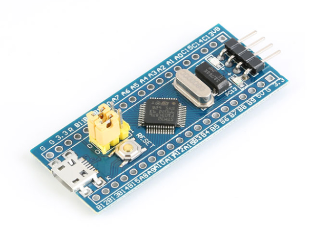
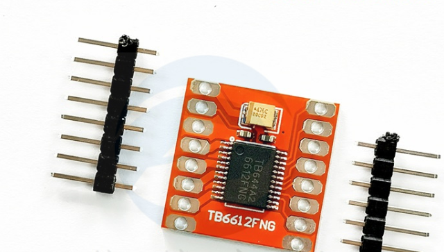
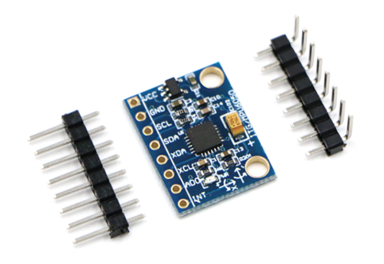
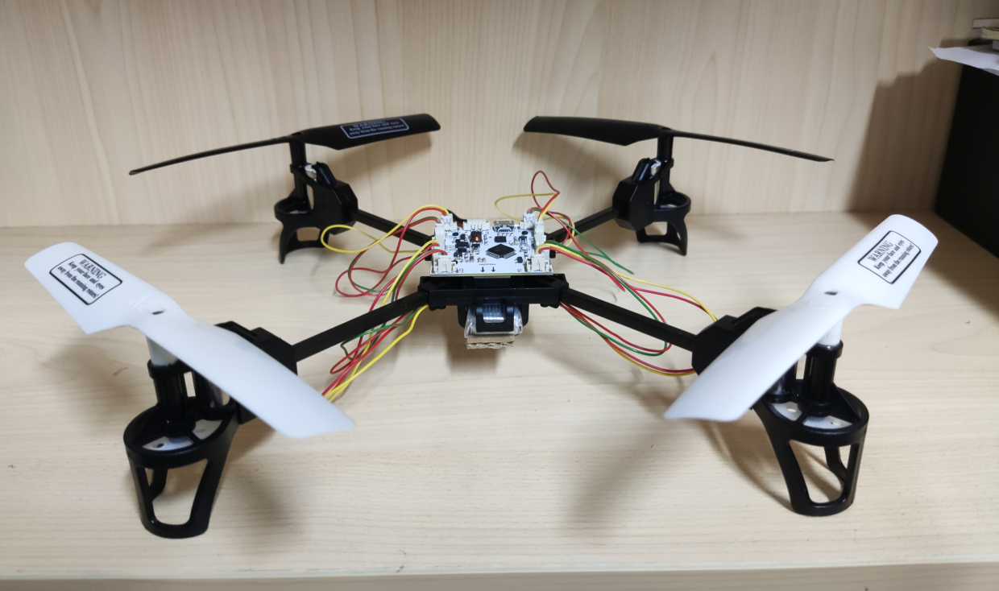

---
title: 四轴无人机项目
author: 尚硅谷研究院
date: '版本: V1.0'
...

# 项目简介

四轴无人机，也被称为四旋翼飞行器，是一种利用四个螺旋桨提供升力和控制飞行状态的无人机。通过精确控制四个螺旋桨的转速，无人机可以实现上升、下降、前进、后退、左右移动以及原地旋转等复杂的飞行动作。

# 市场产品和前景

四轴无人机在多个领域都有广泛的应用，包括航拍、物流配送、农业喷洒、环境监测等。随着无人机技术的不断发展，四轴无人机的市场前景十分广阔。未来，四轴无人机将在更多领域发挥重要作用，比如城市交通、公共安全、灾害救援等。

# 项目架构说明

本项目主要使用的技术包括STM32F103C8T6微控制器、MPU6050六轴陀螺仪/加速度计、蓝牙模块以及PID控制算法。

- STM32F103C8T6：作为主控制器，负责数据处理和控制指令的发送。
- MPU6050：用于检测无人机的姿态和加速度。
- 蓝牙模块：用于接收用户的控制指令。
- PID控制算法：用于实现对无人机姿态的精确控制。

# 项目模块

STM32F103C8T6

蓝牙模块

电机模块

六轴陀螺仪

# 设计思路

设计四轴无人机首先需要确定硬件架构，包括选择微控制器、陀螺仪/加速度计、电机和螺旋桨等。然后是软件设计，主要包括数据处理、PID控制算法的实现以及与用户的交互接口。在硬件和软件设计完成后，需要进行联调测试，不断调整参数以优化飞行性能。

# 所用的技术栈

- 硬件：STM32F103C8T6、MPU6050、蓝牙模块
- 软件：C语言、PID控制算法
- 工具：Keil uVision5、Proteus仿真软件等等

# 项目中可以体现的个人技能

- 熟练使用STM32微控制器和MPU6050陀螺仪/加速度计。
- 熟悉无线通信技术和蓝牙模块的使用。
- 掌握PID控制算法和其在飞行器控制中的应用。
- 能够进行硬件设计和软件编程。
- 具备良好的问题解决能力和创新思维。

# 项目成品

