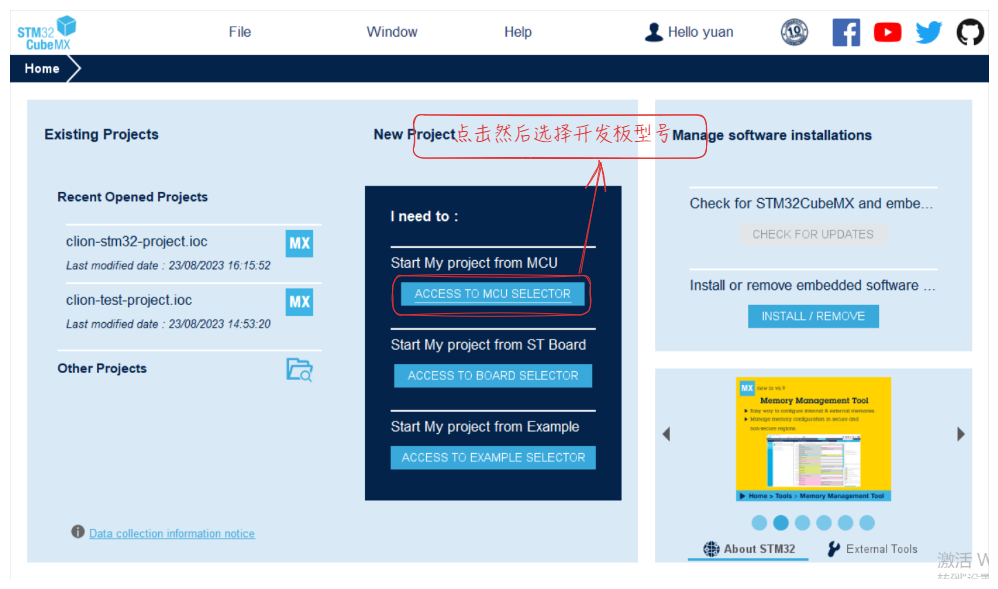
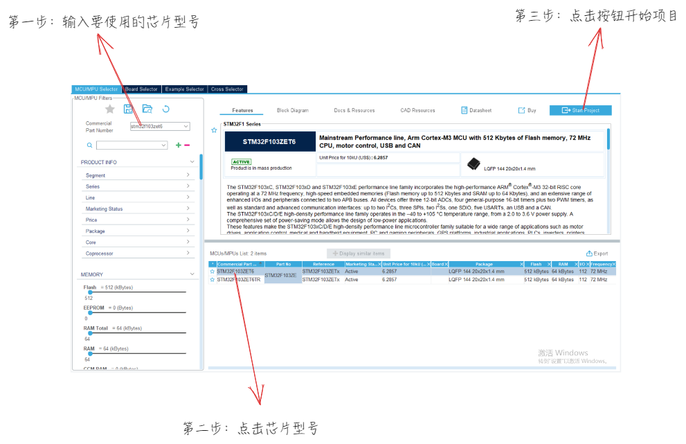
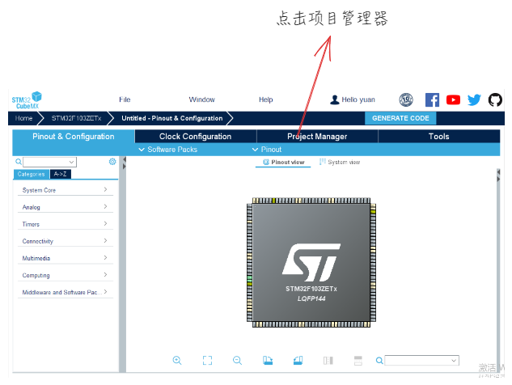
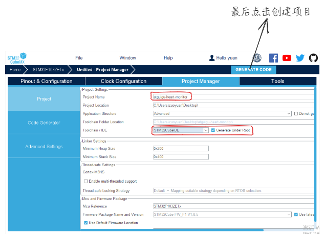
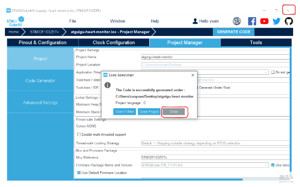
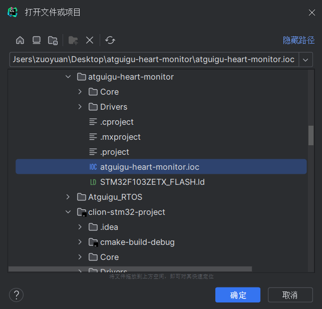
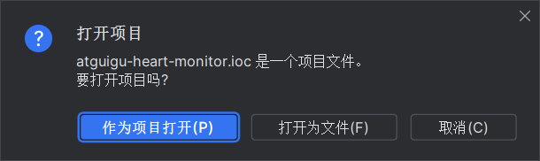
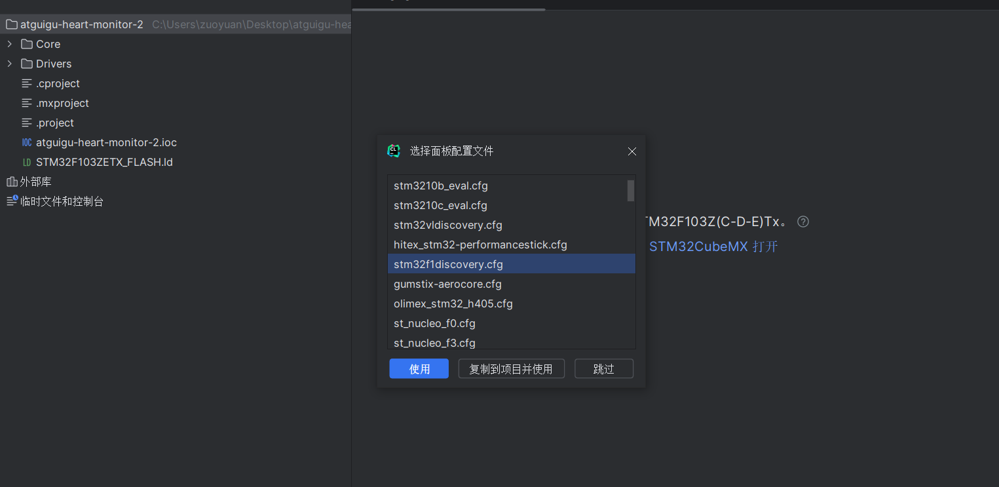
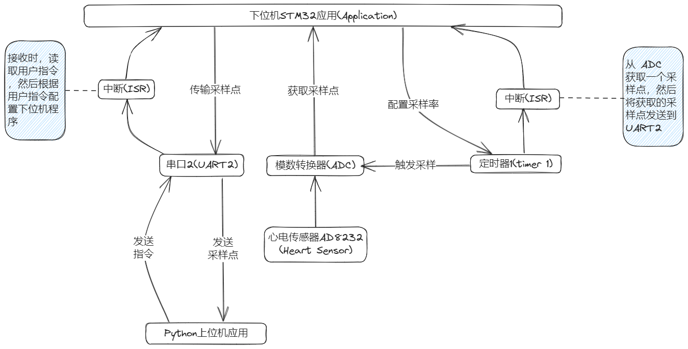

# 使用 STM32F103 开发心电监测仪

## 构建开发工具链

传统的 STM32 开发工具一般使用 Keil MDK-ARM IDE 来进行。但 Keil IDE 的编码体验不是很好。所以我们自己搭建一套开发体验（代码补全，高亮，提示，代码格式化等等）丝滑的工具链。选用的工具如下：

- STM32CubeMX：用来产生包含了 ST 官方 HAL 库的样板代码。非常的方便，基本上是开发 STM32 单片机程序的必备工具。[下载链接](https://www.st.com/zh/development-tools/stm32cubemx.html#overview)
- Clion：JetBrains 公司提供的 C\C++ IDE。[下载链接](https://www.jetbrains.com/clion/)
- openocd：开源的单片机程序烧写工具。[下载链接](https://gnutoolchains.com/arm-eabi/openocd/)。下载完解压之后，注意将 `bin` 文件夹的绝对路径添加到环境变量中。打开 PowerShell ，然后输入 `openocd -v` 确认安装成功。
- gcc-arm-none-eabi：开源的 ARM 指令集编译器。[下载链接](https://developer.arm.com/-/media/Files/downloads/gnu-rm/10.3-2021.10/gcc-arm-none-eabi-10.3-2021.10-win32.exe?rev=29bb46cfa0434fbda93abb33c1d480e6&hash=B2C5AAE07841929A0D0BF460896D6E52)。安装完之后，找到安装路径。然后将 `bin` 文件夹的绝对路径添加到环境变量中。打开 PowerShell ，然后输入 `arm-none-eabi-gcc.exe -v` 确认安装成功。
- Anaconda：Python集成工具包。用来编写 PC 端的上位机程序。[下载链接](https://www.anaconda.com/download)

## 使用 STM32CubeMX 创建 STM32F103 项目

1. 打开 STM32CubeMX



2. 选择要使用的芯片



3. 创建项目



然后输入项目名称，并创建项目



4. 关闭 STM32CubeMX



## 编写烧写工具配置文件

我们使用的仿真器是 `cmsis-dap` 协议的仿真器。

在路径 `解压openocd的绝对路径\openocd-20230712\OpenOCD-20230712-0.12.0\share\openocd\scripts\board` 文件夹中新建文件 `stm32f1discovery.cfg` 文件，在里面写入以下内容：

```cfg
source [find interface/cmsis-dap.cfg]

transport select swd

# 待烧写单片机是 stm32f1x 型号
source [find target/stm32f1x.cfg]

# 设置调试器,最大速度为24MHz
adapter speed 12000
```

## 使用 Clion 打开 STM32CubeMX 创建的项目

使用 Clion 打开创建的项目中的 `.ioc` 文件，注意要 **作为项目打开** 。







此时会弹出选择 openocd 配置文件的面板，选择 `stm32f1discovery.cfg` 。

然后就可以愉快的写代码了。点击运行看一下样板代码是否可以烧写成功。

## 心电监测仪项目架构图

### 硬件架构图



