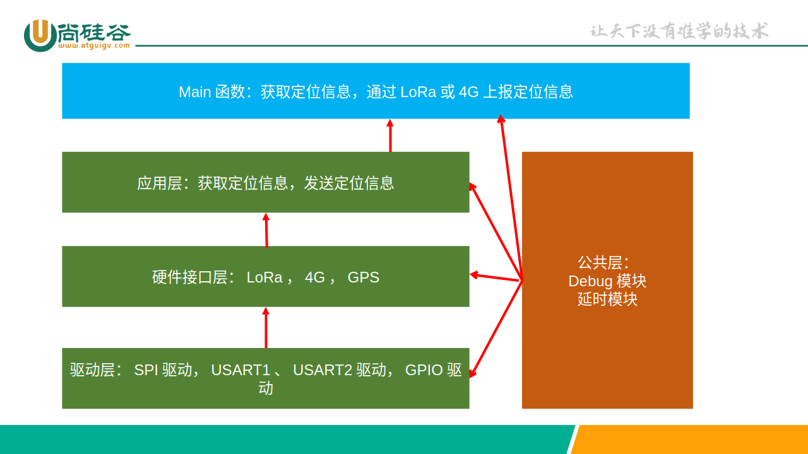

# 尚硅谷嵌入式项目之水质水位监测（HAL库版本）

## 第 1 章 项目需求

### 1.1 项目概述

宠物定位器可用于获取宠物的当前位置。防止宠物丢失。此项目可以拓展至老人定位等需求。

### 1.2 功能描述

#### 1.2.1 宠物身上绑定定位器

宠物身上绑定定位器，主控芯片为 STM32F103C8T6 ，定位器开发板上的主要功能模块是：LoRa模块和4G-GPS模块。

工作流程：

1. 宠物通过4G-GPS模块获取自身的GPS定位信息。
2. 将GPS定位信息通过LoRa模块发送到主人身上的开发板。
3. 如果成功将定位信息发送到了主人身上携带的开发板，则主人身上携带的开发板可以通过蓝牙将定位信息发送到主人的手机上面并进行显示。
4. 如果通过LoRa模块发送定位信息失败，则通过4G将定位信息上传至服务器。同样可在主人的手机上显示定位信息。

#### 1.2.2 主人身上绑定定位信息接收器

定位信息接收器的主控芯片为 STM32F103ZET6 ，定位信息接收器上的主要功能模块是：LoRa模块和蓝牙模块。

工作流程：

1. 接收器接收来自宠物定位器的定位信息。
2. 接收器通过蓝牙将定位信息发送给手机并可视化。

### 1.3 系统总体设计


## 第 2 章 硬件架构

### 2.1 硬件选型

#### 2.1.1 宠物定位器硬件选型

- STM32F103C8T6
- LoRa模块(LLCC68)
- 4G-GPS模块(FS-MCore-F800E)

#### 2.1.2 定位信息接收器选型

- STM32F103ZET6
- LoRa模块(LLCC68)
- ESP32蓝牙模块

## 第 3 章 软件架构

### 3.1 宠物定位器软件架构



### 3.2 定位信息接收器软件架构


## 第 4 章 背景知识

### 4.1 GPS定位原理

设GPS接收机的坐标信息是 $(x, y, z, t)$ 。卫星1的坐标信息是 $(x_1, y_1, z_1, t_1)$ 。卫星2的坐标信息是 $(x_2, y_2, z_2, t_2)$ 。卫星3的坐标信息是 $(x_3, y_3, z_3, t_3)$ 。卫星4的坐标信息是 $(x_4, y_4, z_4, t_4)$ 。

其中， $t_1, t_2, t_3, t_4$ 为各个卫星自身原子钟的时间。以下是方程组：

$$
c(t - t_1) = \sqrt{(x-x_1)^2+(y-y_1)^2+(z-z_1)^2}
$$

$$
c(t - t_2) = \sqrt{(x-x_2)^2+(y-y_2)^2+(z-z_2)^2}
$$

$$
c(t - t_3) = \sqrt{(x-x_3)^2+(y-y_3)^2+(z-z_3)^2}
$$

$$
c(t - t_4) = \sqrt{(x-x_4)^2+(y-y_4)^2+(z-z_4)^2}
$$

可以解出 4 个未知数： $(x,y,z,t)$ 。

方程组中每个方程的原理是：卫星和GPS接收机之间的距离使用欧几里得距离。同时也等于光速 $c$ 乘以 $(t-t_1)$ ，因为卫星在向GPS接收机发送信息时，自身的时间是 $t_1$ ，信息发送至GPS接收机时，GPS接收机自身的时间是： $t$ 。那么 $c(t-t_1)$ 自然就是卫星1和GPS接收机的距离。

所以想要获取精确的定位信息，需要4颗卫星。如果不计算时间 $t$ 。那么也需要3颗卫星。

由于要搜索卫星，所以需要在户外。这样才能搜索到卫星，从而计算出准确的定位信息。

> 大多数人会觉得，爱因斯坦相对论主要应用于高速状态、微观世界和宇观世界，离我们的日常生活似乎很遥远。其实不然，它也有贴近我们生活的一面，其中一个著名的例子就是全球定位系统（GPS）。GPS的误差来源里有一项是相对论效应的影响，通过修正相对论效应可以得到更准确的定位结果。
> 
> 爱因斯坦的时间和空间一体化理论表明，卫星钟和接收机所处的状态(运动速度和重力位)不同，会造成卫星钟和接收机钟之间的相对误差。由于GPS定位是依靠卫星上面的原子钟提供的精确时间来实现的，而导航定位的精度取决于原子钟的准确度，所以要提供精确的卫星定位服务就需要考虑相对论效应。
> 
> 狭义相对论认为高速移动物体的时间流逝得比静止的要慢。每个GPS卫星时速为1.4万千米，根据狭义相对论，它的星载原子钟每天要比地球上的钟慢7微秒。另一方面，广义相对论认为引力对时间施加的影响更大，GPS卫星位于距离地面大约2万千米的太空中，由于GPS卫星的原子钟比在地球表面的原子钟重力位高，星载时钟每天要快45微秒。两者综合的结果是，星载时钟每天大约比地面钟快38微秒。
> 
> 这个时差看似微不足道，但如果我们考虑到GPS系统要求纳秒级的时间精度，这个误差就非常可观了。38微秒等于38000纳秒，如果不加以校正的话，GPS系统每天将累积大约10千米的定位误差，这会大大影响人们的正常使用。因此，为了得到准确的GPS数据，将星载时钟每天拨回38微秒的修正项必须计算在内。
> 
> 为此，在GPS卫星发射前，要先把其时钟的走动频率调慢。此外，GPS卫星的运行轨道并非完美的圆形，有的时候离地心近，有的时候离地心远，考虑到重力位的波动，GPS导航仪在定位时还必须根据相对论进行计算，纠正这一误差。
> 
> 一般说来，GPS接受器准确度在30米之内就意味着它已经利用了相对论效应。
> 
> 由于广域增强系统依赖从地面基站发出的额外信号，以地面时间为基准，与卫星钟时间无关。因此配备了这种系统的GPS接收器，就不存在相对论效应了。
> 
> 由此可见，GPS的使用既离不开狭义相对论，也离不开广义相对论。早在1955年就有物理学家提出可以通过在卫星上放置原子钟来验证广义相对论，GPS实现了这一设想，并让普通人也能亲身体验到相对论的威力。

### 4.2 4G 基本原理

无线电传输信息靠的是电磁波。电磁波的波形可以用幅度，相位和频率来描述。要发射某个频率的电磁波，必须使用和电磁波波长同样长度的天线，才能将电磁波发送出去。

举个例子，人的声音的频率范围在300Hz~3400Hz。那么根据波长的计算公式： $波长 = 光速 \div 频率$ 。人的声音的波长的范围是 $3^5米～3^6米$ 。那么为了将人声发送出去，发射天线的长度需要是30万米，这显然是不现实的。

所以需要将人的声音搬运到更高的频段，这样需要的发射天线长度就会更短。这个过程叫做“调制”。

当接收机接收到电磁波信号时，再将人声信号从高频段搬运到原来的频段。这个过程叫做“解调”。

> 注意：频率越高，电磁波越容易被大气、水吸收，也越容易被建筑物遮挡，所以传播距离短。

#### 4.2.1 模拟调制


动图中显示了调频（FM）和调幅（AM）的原理。

#### 4.2.2 数字调制

数字调制的目的是如何使用电磁波将0101这样的二进制数发送出去。

这里我们举一个LoRa模块中使用的FSK为例子。FSK（Frequency-shift keying，频移键控）使用不同的频率来表示 0 和 1 。


从上到下分别为信号，载波，调制以后的信号。

## 第 5 章 项目实现

### 5.1 硬件接线

主人的定位信息接收器使用尚硅谷核心板和扩展板。

宠物定位器的开发板使用的是STM32F103C8T6，需要使用CubeMX开启：串口1（USART1，调试串口）和串口2（USART2，连接4G-GPS模块），以及SPI1（连接LoRa模块）。还有一些GPIO引脚如下：

```c
#define LoRa_CS_Pin GPIO_PIN_4
#define LoRa_CS_GPIO_Port GPIOA
#define LoRa_RST_Pin GPIO_PIN_0
#define LoRa_RST_GPIO_Port GPIOB
#define LoRa_BUSY_Pin GPIO_PIN_1
#define LoRa_BUSY_GPIO_Port GPIOB
#define LoRa_TxEN_Pin GPIO_PIN_2
#define LoRa_TxEN_GPIO_Port GPIOB
#define LoRa_RxEN_Pin GPIO_PIN_12
#define LoRa_RxEN_GPIO_Port GPIOB
```

除了引脚改变了，引脚的配置和之前LoRa教学中的一致。

### 5.2 软件实现

由于之前已经学习过LoRa相关的编程，所以我们着重于4G-GPS模块的使用。此模块的使用非常简单。STM32和模块通过串口2进行通讯，通讯方式为AT指令。

此模块的AT指令有很多，我们只使用我们需要的AT指令，其他指令可以看手册说明。使用方法基本雷同。

主程序的流程如下：

```c
int main(void) {
    初始化LoRa并启动();

    设置GPS为冷启动模式();
    设置GPS为使能();

    设置SOCKET相关参数(); // ip地址，端口号，通信协议为TCP协议
    禁用SOCKET的SSL功能();

    保存4G-GPS模块配置并重新启动();

    while (1) {
        获取GPS定位信息();
        通过LoRa发送GPS定位信息();
        if (通过LoRa发送失败()) {
            通过4G发送GPS定位信息();
        }
        HAL_Delay(5000);
    }
}
```