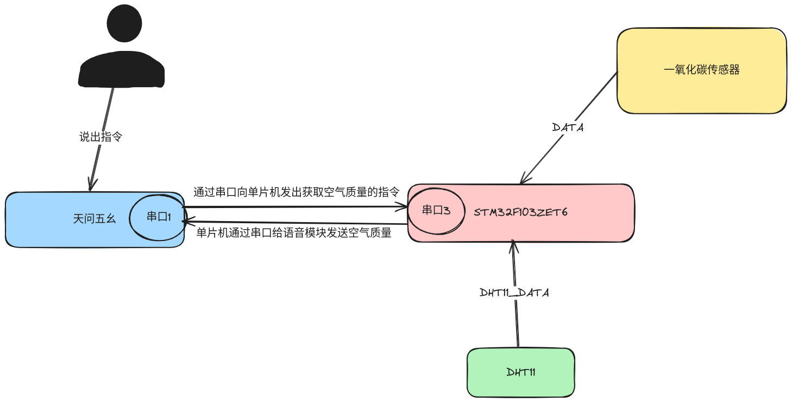
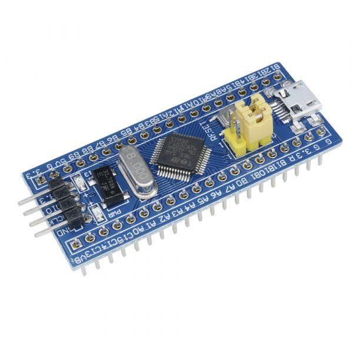
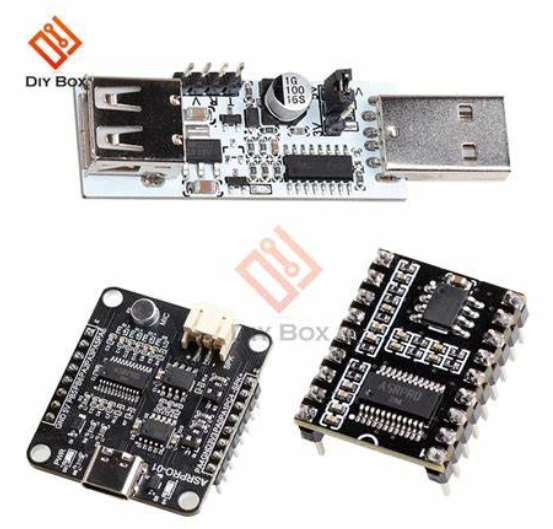
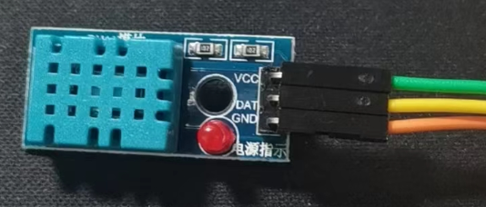
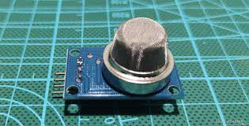
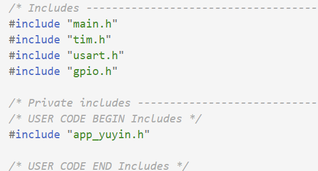

# 空气质量项目文档

## 一，项目简介

测温模块和烟雾传感器应用广泛，可用于暖通空调、除湿器、农业、冷链仓储、测试及检测设备、消费品、汽车、自动控制、数据记录器、气象站、家电、湿度调节器、医疗、其他相关湿度检测控制等方面。

### 1. 概述

我们通过说话和天问五幺芯片进行通讯，天问五幺芯片对 `STM32` 下发指令，`STM32` 和 `DHT11` 模块以及烟雾传感器模块进行通讯，`STM32` 再和天问五幺通讯语音播报。我们使用了以下设备：

`ASR-PRO-2M`

天问五幺使用天问系列中的 `ASR-PRO-2M` 。

`ASR-PRO-2M` 是一个自动语音识别（`ASR`）系统的组件，用于将语音转换为文本。其特点如下：

- 先进的[语音识别技术](coco://sendMessage?ext={"s%24wiki_link"%3A"https%3A%2F%2Fm.baike.com%2Fwikiid%2F6328681314513021312"}&msg=语音识别技术)：采用深度学习模型，通过大量的训练数据进行训练和优化，以提供高质量的语音识别结果。
- 广泛的应用领域：可广泛应用于语音转写、语音助手、语音命令识别等领域，为用户提供便捷的语音交互体验。

`DHT11`

`DHT11` 温湿度传感器模块是以 `DHT11` 温湿度传感器为核心，含有校准数字信号，可测量环境温度、相对湿度，具有极高的可靠性与长期稳定性。该模块主要特点如下：

- 测量相对湿度范围：`5%-95%RH` 。
- 测量温度范围：`-20-60℃` 。
- 支持 `3.3V-5.5V` 工作电压。
- 带有电源指示灯。

`MQ Gas Sensor`

首先来认识 `MQ-7` 模块，`MQ-7` 可以检测空气中的一氧化碳（`CO`）浓度。它采用半导体气敏元件来检测 `CO` 的气体浓度，其灵敏度高、反应速度快、响应时间短、成本低廉等特点使得它被广泛应用于智能家居、工业自动化、环保检测等领域。

`MQ-7` 模块的工作原理基于半导体材料在气体作用下发生电学性质的变化，通过测量这种变化来检测气体浓度。具体来说，`MQ-7` 烟雾传感器内部有一块小小的加热器，通过电流加热，使得传感器的工作环境温度升高，同时加速气体分子的运动。模块中的半导体气敏元件表面涂有一层特殊的金属氧化物，当在特定温度下，空气中的 `CO` 气体与金属氧化物接触时，会发生氧化还原反应，使得金属氧化物表面的电阻发生变化，当空气中的 `CO` 浓度增加时，电阻减小，从而输出一个模拟信号。 

回到 `MQ-7` 模块上，`MQ-7` 一共有4个引脚，分别是 `GND`、`DO`、`AO` 和 `VCC` 。`VCC` 是电源引脚，用于给模块供电，可以理解为正极，一般接 `3.3V` 或者 `5V` 。`GND` 连接模块的地线，可以理解为是负极，通常是 `0V` 。`DO` 是数字输出引脚，用于输出数字信号。`AO` 是模拟输出引脚，用于输出模拟信号。我们一般使用 `AO` 引脚也就是读取模块输出的模拟信号。

`32` 单片机则是可以通过模数转换器（`ADC`）读取传感器输出的模拟电压信号，而我们需要做的则是根据传感器特性曲线函数将电压值转换为一氧化碳浓度值。

`STM32103ZET6`

猜你想了解的是 `STM32103ZET6`，这是一款基于 `ARM Cortex-M3` 内核的32位闪存微控制器。其主要特点如下：

- 工作频率：`72MHz`。
- 闪存：高达 `1MB`。
- `SRAM`：高达 `96KB`。
- 电源：`2V` 至 `3.6V` 。
- 温度范围：`-40` 至 `+85°C` 或 `-40` 至 `+105°C` 。
- 32位 `RISC`：具有一个易于使用的 `STM32` 平台，可用于包括电动机驱动、PC和游戏、`HVAC` 和工业应用在内的应用。
- 引脚到引脚软件兼容：与 `STM32` 系列的其他产品兼容。
- 低功率、低电压：结合了实时功能，具有极佳的性能。

### 2. 准备工作

硬件:

- 一款天问五幺 `ASR-PRO-2M` 开发板
- 一款 `STM32` 开发板
- 一款 `DHT11` 测温芯片
- 一款 `MQ Gas Sensor` 烟雾传感器

软件:

- 天问Block
- `MDK-ARM Keil`

## 二，项目框架



我们人主动向天问51说出指令，天问51通过串口向 `STM32` 发送指令，当 `STM32` 接收到指令后向 `DHT11` 发送起始信号，再由 `DHT11` 向 `STM32` 发送 `40` 位的数据，我们在 `STM32` 中解析出**温度，湿度**，`STM32`再由串口3发送给天问51的串口1，天问51收到数据后语音播报。

>注意：当没有下发指令时，`DHT11` 是不需要测量数据的！

## 三，项目模块

1. `STM32F103ZET6` 开发板



2. 天问51开发板 `ASR-PRO-2M`



3. `DHT11`



4. `MQ Gas Sensor`



## 四，项目实现功能

读懂 `DHT11` 自己的时序。

使用 `STM32` 自带的 `ADC` 模数转换器读取 `Gas Sensor` 烟雾传感器的数据。

熟练使用天问51和 `STM32` 的串口通讯。

## 五，项目技能

- C语言编程
- 天问编程
- `DHT11` 基础知识和驱动模块的编写
- `STM32` 开发板熟练掌握

## 六，项目代码

### 1，`STM32` 代码

#### 接口层

`DHT11` 接口的实现：

##### `Inf_DHT11.c`

```c
#include "Inf_DHT11.h"

// 微秒延时
void Delay_us(uint16_t us)
{
    uint16_t differ = 0xffff - us - 5;
    __HAL_TIM_SET_COUNTER(&htim1, differ); // 设定TIM1计数器起始值
    HAL_TIM_Base_Start(&htim1);            // 启动定时器
    while (differ < 0xffff - 5)
    {                                           // 判断
        differ = __HAL_TIM_GET_COUNTER(&htim1); // 查询计数器的计数值
    }
    HAL_TIM_Base_Stop(&htim1);
}


//读取温度
uint8_t Inf_DHT11_ReadingTemperature(uint8_t *data)
{
    //初始化串口二,DHT11和32通讯
    // MX_USART2_UART_Init();
    /**
     * 起始信号
     * 
     */
    HAL_GPIO_WritePin(GPIOA, GPIO_PIN_5, GPIO_PIN_RESET); // 主机拉低DHT11的数据线
    HAL_Delay(20);                                        // 主机拉低18ms
    HAL_GPIO_WritePin(GPIOA, GPIO_PIN_5, GPIO_PIN_SET);   // 主机拉高DHT11的数据线
    Delay_us(30); 
    
    if (HAL_GPIO_ReadPin(GPIOA, GPIO_PIN_5) == GPIO_PIN_RESET)
    {
        while (HAL_GPIO_ReadPin(GPIOA, GPIO_PIN_5) == GPIO_PIN_RESET)
        {
            // 等待DHT11拉低80ms
        }
        while (HAL_GPIO_ReadPin(GPIOA, GPIO_PIN_5) == GPIO_PIN_SET)
        {
            // 等待DHT11拉高80ms
        }

        /* 数据格式5*8bit,一次完整的数据传输为40bit,高位先出。
        数据格式:8bit湿度整数数据+8bit湿度小数数据+8bi温度整数数据+8bit温度小数数据+8bit校验和数据
        传送正确时校验和数据等于“8bit湿度整数数据+8bit湿度小数数据+8bi温度整数数据+8bit温度小数数据” 所得结果的末8位。 */
        for (uint8_t i = 0; i < 5; i++)
        {
            data[i] = 0;
            for (uint8_t j = 0; j < 8; j++)
            {
                // 开始接收数据(总线为低电平说明dht11发送响应信号)
                while (HAL_GPIO_ReadPin(GPIOA, GPIO_PIN_5) == GPIO_PIN_RESET)
                {
                    // 等待DHT11拉低50us操作结束（每1bit都以50us低电平开始）
                }
                Delay_us(30); // 等待DHT11拉高30us之后如果还是高电平则说明是1，否则是0
                if (HAL_GPIO_ReadPin(GPIOA, GPIO_PIN_5) == GPIO_PIN_SET)
                {
                    data[i] |= (1 << (7 - j)); // 从高位开始存储数据
                }
                while (HAL_GPIO_ReadPin(GPIOA, GPIO_PIN_5) == GPIO_PIN_SET)
                {
                    // 等待DHT11拉低
                }
            }
        }
    }
    // 检查校验和
    if (data[4] == data[0] + data[1] + data[2] + data[3])
    {
        return 1;
    }
    else
    {
        return 0;
    }                                          // 主机拉高20-40us
}
```

##### `Inf_DHT11.h`

```c
#ifndef __INF_DHT11_H_
#define __INF_DHT11_H_

#include "stm32f103xe.h"
#include "tim.h"
#include "usart.h"
#include "Common_Debug.h"

void Delay_us(uint16_t us);

uint8_t Inf_DHT11_ReadingTemperature(uint8_t *data);

#endif
```

`MQ Gas Sensor` 接口的实现：

##### `Inf_MQ_Gas_Sensor.h`

```c
#ifndef _INF_MQ_GAS_SENSOR_H_
#define _INF_MQ_GAS_SENSOR_H_
 
//C文件中需要的其他的头文件
#include <stm32f103xe.h>
#include "usart.h"
#include "Common_Debug.h"
 
#define SMOG_PIN46_R	1000			//烟雾传感器管脚4、6接出到地的电阻值
#define CO_READ_TIMES	10				//定义CO传感器读取次数,读这么多次,然后取平均值
 
//C文件中定义的函数的声明
uint16_t Inf_CO_ADC1_Average_Data(void);
float Inf_CO_Get_Vol(void);
//float MQ7_PPM_Calibration();
float Inf_CO_MQ7_GetPPM(void);

#endif
```

##### `Inf_MQ_Gas_Sensor.c`

```c
#include "Inf_MQ_Gas_Sensor.h"

#define CAL_PPM 10 // 校准环境中PPM值
#define RL 10      // RL阻值
#define R0 16      // R0阻值

uint16_t MQ7_Buffer[4];

// 计算平均值
uint16_t Inf_CO_ADC1_Average_Data(void)
{
    uint16_t temp_val = 0;
    uint8_t t;
    for (t = 0; t < CO_READ_TIMES; t++) // #define CO_READ_TIMES	10	定义烟雾传感器读取次数,读这么多次,然后取平均值

    {
        temp_val += HAL_ADC_GetValue(&hadc1); // 读取ADC值
        HAL_Delay(5);
    }
    temp_val /= CO_READ_TIMES; // 得到平均值
    return (uint16_t)temp_val;      // 返回算出的ADC平均值
}

// float voltage = adc_value * (3.3 / 4096.0);  将ADC值转换为电压

/***********************************
        计算Rs的两种公式
float Rs = (3.3 * RL) / voltage - RL; 计算传感器的电阻  RL：负载电阻阻值
float RS = (3.3f - voltage) / voltage * RL;
************************************/

// float co_ppm = a * pow(Rs/R0, b); 使用校准曲线计算一氧化碳浓度
// a, b是MQ-7传感器模块校准曲线的系数.其值来源于MQ7的手册资料，a = 98.322, b = -1.458
// R0是器件在洁净空气中的电阻值，来自于MQ-7灵敏度特性曲线，R0 = RS / pow(CAL_PPM / 98.322, 1 / -1.458f);

// 读取MQ7传感器的电压值
float Inf_CO_Get_Vol()
{
    uint16_t adc_value = 0; // 这是从MQ-7传感器模块电压输出的ADC转换中获得的原始数字值，该值的范围为0到4095，将模拟电压表示为数字值
    float voltage = 0; // MQ-7传感器模块的电压输出，与一氧化碳的浓度成正比

    adc_value = Inf_CO_ADC1_Average_Data();
    HAL_Delay(5);

    voltage = (3.3 / 4096.0) * (adc_value);

    return voltage;
}

/*********************
// 传感器校准函数，根据当前环境PPM值与测得的RS电压值，反推出R0值。
// 经过个人测试，在空气中测出R0为16
float MQ7_PPM_Calibration()
{
    float RS = 0;
    float R0 = 0;
    RS = (3.3f - Smog_Get_Vol()) / Smog_Get_Vol() * RL;//RL	10  // RL阻值
    R0 = RS / pow(CAL_PPM / 98.322, 1 / -1.458f);//CAL_PPM  10  // 校准环境中PPM值
    return R0;
}
**********************/

// 根据公式计算CO_ppm
float Inf_CO_MQ7_GetPPM()
{
    float RS = (3.3f - CO_Get_Vol()) / CO_Get_Vol() * RL;
    float ppm = 98.322f * pow(RS / R0, -1.458f);
    return ppm;
}
```

#### 公共层

##### `Common_Debug.c`

```c
#include "Common_Debug.h"

void Common_Debug_Init(void)
{
    MX_USART1_UART_Init();
}

int fputc(int c, FILE *file)
{
    HAL_UART_Transmit(&huart1, (uint8_t *)&c, 1, 1000);
    return c;
}
```

##### `Common_Debug.h`

```c
#ifndef __COMMON_DEBUG
#define __COMMON_DEBUG

#include "usart.h"
#include "string.h"
#include "stdio.h"
/* 
    当调试代码的时候,定义宏 DEBUG.
    当不需要调试的时候,去掉宏定义 DEBUG
 */
#define DEBUG

#ifdef DEBUG

#define debug_init() Common_Debug_Init()
#define FILENAME (strrchr(__FILE__, '\\') ? strrchr(__FILE__, '\\') + 1 : __FILE__)
#define debug_printf(format, ...) printf("[%s:%d]--" format, FILENAME, __LINE__, ##__VA_ARGS__)
#define debug_printfln(format, ...) printf("[%s:%d]--" format "\r\n", FILENAME, __LINE__, ##__VA_ARGS__)

#else

#define debug_init()  
#define debug_printf(format, ...)    
#define debug_printfln(format, ...)   

#endif

void Common_Debug_Init(void);

#endif
```

#### 应用层

##### `app_yuyin.c`

```c
#include "app_yuyin.h"

// 串口二缓冲区
uint8_t UART_Buff[10];    // 串口2接收缓冲区
uint16_t UART_Buff_len = 0; // 串口2接收缓冲区长度

uint8_t ZT = 0; // 判断来数据是测温度还是湿度

uint8_t humidity_str[10]; // 假设足够存储湿度字符串

uint8_t temperature_str[10]; // 假设足够存储温度字符串

/*
void HAL_UARTEx_RxEventCallback(UART_HandleTypeDef *huart, uint16_t size)
{
    if (huart->Instance == USART2)
    {
        UART_Buff_len = size;
        debug_printfln("串口接收到数据");
        HAL_UARTEx_ReceiveToIdle_IT(&huart3, UART_Buff, 128);
    }
}
*/

// App初始化
void App_Init(void)
{
    //初始化串口
    // MX_USART3_UART_Init();
    // 初始化串口读取语音模块发来的数据
    // HAL_UARTEx_ReceiveToIdle_IT(&huart3, UART_Buff, 128);
    //轮询接收串口二来的数据
    HAL_UART_Receive(&huart3, UART_Buff, 5, 1000);
}

void App_Communication(void)
{
    if (strlen(UART_Buff) == 0)
    {
        return;
    }

    if (strstr(UART_Buff, "1"))
    {
        debug_printfln("%s",UART_Buff);
        //清除缓冲区
        memset(UART_Buff,0,strlen(UART_Buff));
        ZT = 1; // 等于1时候为湿度
    }
    if (strstr(UART_Buff, "2"))
    {
        debug_printfln("%s",UART_Buff);
        //清除缓冲区
        memset(UART_Buff,0,strlen(UART_Buff));
        ZT = 2; // 等于2时候为温度
    }
}

void App_Send(uint8_t *data)
{
    memset(data,0,5);

    if (ZT==0)
    {
        return;
    }
    
    // 读取温度湿度
    if (Inf_DHT11_ReadingTemperature(data))
    {
        debug_printfln("湿度：%d.%d%%\r\n", data[0], data[1]);
        debug_printfln("温度：%d.%d℃\r\n", data[2], data[3]);
    }
    else
    {
        debug_printfln("获取失败\r\n");
    }

    // 发送温度湿度
    if (ZT == 1)
    {
        sprintf(humidity_str, "%u.%u", data[0], data[1]);
        HAL_UART_Transmit(&huart3, humidity_str, 10, 2000);
        ZT = 0;
        debug_printfln("读取湿度\r\n");
    }
    if (ZT == 2)
    {
        sprintf(temperature_str, "%u.%u", data[2], data[3]);
        HAL_UART_Transmit(&huart3, temperature_str, 10, 2000);
        ZT = 0;
        debug_printfln("读取温度\r\n");
    }
}

```

##### `app_yuyin.h`

```c
#ifndef __APP_YUYIN_H_
#define __APP_YUYIN_H_

#include "Inf_DHT11.h"
#include "string.h"

void App_Init(void);

void App_Communication(void);

void App_Send(uint8_t *data);

#endif
```

#### 主函数



```c
/* Private user code ---------------------------------------------------------*/
/* USER CODE BEGIN 0 */
uint8_t data[5] = {0, 0, 0, 0, 0};
/* USER CODE END 0 */

/**
  * @brief  The application entry point.
  * @retval int
  */
int main(void)
{
  HAL_Init();

  SystemClock_Config();

  MX_GPIO_Init();
  MX_TIM1_Init();
  MX_ADC1_Init();
  // MX_USART1_UART_Init();
  MX_USART3_UART_Init();
  /* USER CODE BEGIN 2 */

  /* USER CODE END 2 */

  /* Infinite loop */
  /* USER CODE BEGIN WHILE */
  Common_Debug_Init();
  debug_printfln("DHT11测试模块");
  // app初始化

  while (1)
  {
    App_Init();
    // debug_printfln("循环\r\n");
    // HAL_Delay(2000);
      
    // 判断状态
    App_Communication();

    // 读取函数
    App_Send(data);

    /* USER CODE END WHILE */
    float CO_ppm = MQ7_GetPPM();
    debug_printfln("%f", CO_ppm);

    /* USER CODE BEGIN 3 */
  }
  /* USER CODE END 3 */
}
```

### 2，天问51代码

```c++
/// `.cpp`文件 c plus plus

#include "asr.h"
extern "C"{ void * __dso_handle = 0 ;}
#include "setup.h"
#include "HardwareSerial.h"
#include "myLib/asr_event.h"

uint32_t snid;
/// String 是cpp中的字符串类
String SD;
String WD;
/// 温度 `num1.num2`
/// 湿度 `num3.num4`
uint8_t num1,num2,num3,num4;
void ASR_CODE();

//{speak:阿栋-浑厚男声,vol:2,speed:10,platform:haohaodada}
//{playid:10001,voice:欢迎使用语音助手，用贾维斯唤醒我。}
//{playid:10002,voice:我退下了，用贾维斯唤醒我}

/*描述该功能...
*/
void ASR_CODE(){
  //本函数是语音识别成功钩子程序
  //运行时间越短越好，复杂控制启动新线程运行
  //唤醒时间设置必须在ASR_CODE中才有效
  set_state_enter_wakeup(100000);
  //用switch分支选择，根据不同的识别成功的ID执行相应动作，点击switch左上齿轮
  //可以增加分支项
  switch (snid) {
    /// 当说“当前温度”，进入以下case语句
   case 2:
   {
   //发送标志
   /// 通过天问51的串口1发送指令给STM32的串口3，STM32接收到指令之后就会返回DHT11的温度数据
    Serial1.println("+2+\r\n");
    delay(2000);
    
    /// 通过天问51的串口0向上位机发送调试信息
    Serial.println("进入接收函数2\r\n");
    
    //死循环，用来接收STM32返回的温度数据字符串
    while(1)
    {
      /// 如果天问51的串口1收到来自STM32的温度数据
      if(Serial1.available() > 0)
      {
        /// 将从STM32读取的温度数据字符串赋值给WD字符串对象
        WD = Serial1.readString();
        Serial.println("出接收函数2\r\n");
    
        // 将从STM32读取的温度数据字符串赋值发送给上位机
        Serial.println(WD);
        
        /// 将CPP中的字符串对象WD强制类型转换成C语言中的字符串类型
        const char * WDD = WD.c_str();
        //{playid:10500,voice:当前温度为}
        play_audio(10500);
        
        //上位机打印
        Serial.println(WD);
        
        //拆解字符中的数字
        /// 比如WDD是"3.4" => num1 = 3; num2 = 4
        sscanf(WDD,"%d.%d",&num1,&num2);
        
        //播报num1
        play_num((int64_t)(num1 * 100), 1);
        
        //{playid:10511,voice:点}
        play_audio(10511);
        
        //播报num2
        play_num((int64_t)(num2 * 100), 1);
        //{playid:10501,voice:摄氏度}
        play_audio(10501);
        delay(2000);
        break;
      }
    }
    
    
   }
   break;
   case 1:
   {
   //发送标志
    Serial1.println("+1+\r\n");
    delay(2000);
    
    Serial.println("进入接收函数1\r\n");
    
    //接收字符串
    while(1)
    {
      // t--;
      
      if(Serial1.available() > 0)
      {
        
        SD = Serial1.readString();
        Serial.println("出接收函数1\r\n");
      
        //上位机打印
        Serial.println(SD);
        const char * _SD = SD.c_str();
        //{playid:10502,voice:当前湿度为}
        play_audio(10502);
        
        //上位机打印
        // Serial.println(SD);
        
        //拆解字符中的数字
        sscanf(_SD,"%d.%d",&num3,&num4);
        
        play_num((int64_t)(num3 * 100), 1);
        play_audio(10511);
        play_num((int64_t)(num4 * 100), 1);
        
        delay(2000);
        break;
      }
    }
   }
   break;
  }

}

void hardware_init(){
  //需要操作系统启动后初始化的内容
  //音量范围1-7
  setPinFun(2,FORTH_FUNCTION);
  setPinFun(3,FORTH_FUNCTION);
  Serial1.begin(115200);
  setPinFun(13,SECOND_FUNCTION);
  setPinFun(14,SECOND_FUNCTION);
  Serial.begin(115200);
  vol_set(6);
  delay(2000);
  vTaskDelete(NULL);
}

void setup()
{
  //需要操作系统启动前初始化的内容
  //播报音下拉菜单可以选择，合成音量是指TTS生成文件的音量
  //欢迎词指开机提示音，可以为空
  //退出语音是指休眠时提示音，可以为空
  //休眠后用唤醒词唤醒后才能执行命令，唤醒词最多5个。回复语可以空。ID范围为0-9999
  //{ID:0,keyword:"唤醒词",ASR:"贾维斯",ASRTO:"我在"}
  //{ID:1,keyword:"命令词",ASR:"当前湿度",ASRTO:"好的"}
  //{ID:2,keyword:"命令词",ASR:"当前温度",ASRTO:"好的"}
  //{ID:5,keyword:"命令词",ASR:"和我说再见",ASRTO:"好的,再见"}

  //{playid:10084,voice:零}
  //{playid:10085,voice:一}
  //{playid:10086,voice:二}
  //{playid:10087,voice:三}
  //{playid:10088,voice:四}
  //{playid:10089,voice:五}
  //{playid:10090,voice:六}
  //{playid:10091,voice:七}
  //{playid:10092,voice:八}
  //{playid:10093,voice:九}
  //{playid:10094,voice:十}
  //{playid:10095,voice:百}
  //{playid:10096,voice:千}
  //{playid:10097,voice:万}
  //{playid:10098,voice:亿}
  //{playid:10099,voice:负}
  //{playid:10100,voice:点}
}
```